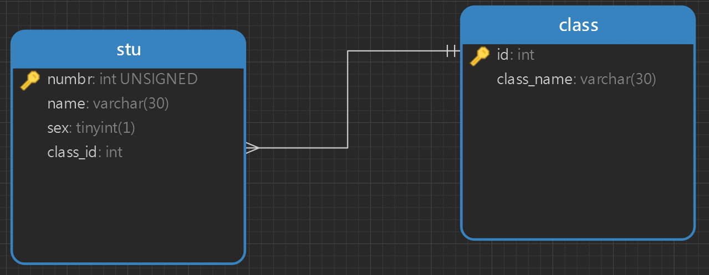
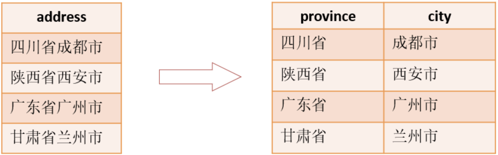
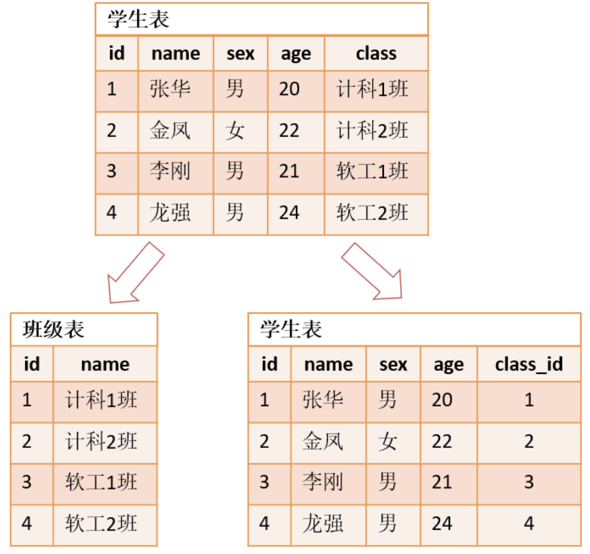
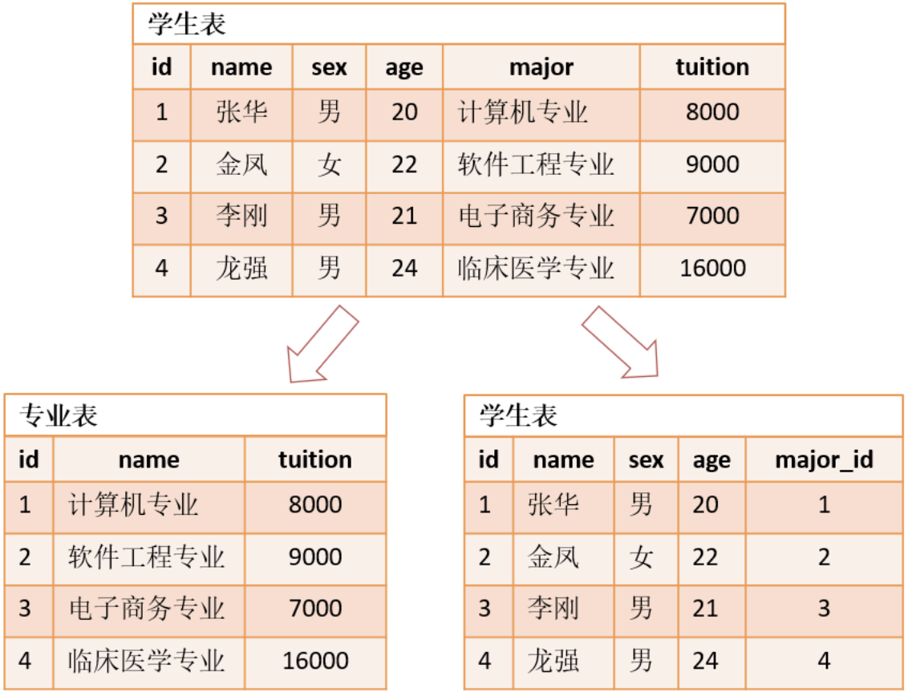

# 数据库设计
## 第一节 设计数据库
### 1. 什么是实体？
实体就是软件开发过程中所涉及到的事物，通常都是一类数据对象的个体。

### 2. 什么是数据库设计？
数据库设计就是将实体与实体之间的关系进行规划和结构化的过程

### 3. 为什么要对数据库进行设计?
当存储的数据比较少的时候，当然不需要对数据库进行设计。但是，当对数据的需求量越来越大时，对数据库的设计就很有必要性了！如果数据库的设计不当，会造成数据冗余、修改复杂、操作数据异常等问题。而好的数据库设计，则可以减少不必要的数据冗余，通过合理的数据规划提高系统的性能

### 4. 如何设计数据库
- 收集信息
    - 在确定客户要做什么之后，收集一切相关的信息，尽量不遗漏任何信息
- 标识实体
    - 实体一般是名词，每个实体只描述一件事情，不能重复出现含义相同的实体
- 标识实体的详细属性
    - 标识每个实体需要存储的详细信息
- 标识实体之间的关系
    - 理清实体与实体之间的关系

## 第二节 ER图
### 1. 什么是ER图
ER = Entity Relational （实体关系）

ER图就是实体关系图

### 2. 如何绘制ER图

| ##container## |
|:--:|
||

示例

## 第三节 数据库模型图
### 1. 什么是关系模式
实体关系的描述称为关系模式，关系模式通常使用二维表的形式表示

示例:

学生（学号，姓名，性别，年龄，所属班级） 
班级（班级编号， 班级名称）

### 2. 关系模式转为数据库模型图
将关系模式使用Navicat工具转换为数据库模型图，转换步骤如下：
- 将各实体转换为对应的表，将各属性转换为各表对应的列
- 标识每个表的主键列
- 在表之间建立主外键，体现实体

示例

| ##container## |
|:--:|
||

## 第四节 数据库三大范式
### 1. 第一范式
第一范式是最基本的范式，确保每列保持原子性，也就是每列不可再分。

示例

### 2. 第二范式

第二范式是在第一范式的基础上，每张表的属性完全依赖于主键，也就是每张表只描述一件事情

示例

### 3. 第三范式
第三范式是在第二范式的基础上，确保每列都直接依赖于主键，而不是间接依赖于主键，也就是不能存在传递依赖。比如A依赖于B，B依赖于C，这样A间接依赖于C。

练习

假设某建筑公司要设计一个数据库。公司的业务规则概括说明如下：
- 公司承担多个工程项目，每一项工程有：工程号、工程名称、施工人员等
- 公司有多名职工，每一名职工有：职工号、姓名、性别、职务（工程师、技术员）等
- 公司按照工时和小时工资率支付工资，小时工资率由职工的职务决定（例如，技术员的小时工资率与工程师不同）

分析
1. 找出实体（工程、员工、职务、工时）
2. 找出实体关系
3. 绘制ER图，然后将ER图转换为数据库模型图
4. 使用三大范式规范数据库设计

注意：在实际开发过程中，为了满足性能的需要，数据库的设计可能会打破数据库三大范式的约束。

以空间换时间：当数据库中存储的数据越来越多时，查询效率下降，为了提升了查询效率，可能会在表中增加新的字段，此时，数据库的设计就不再满足三大范式