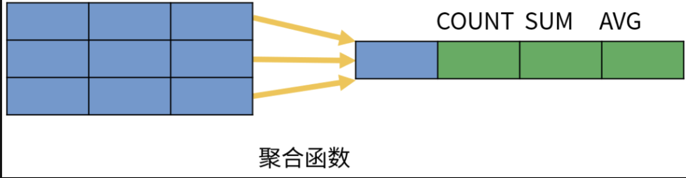
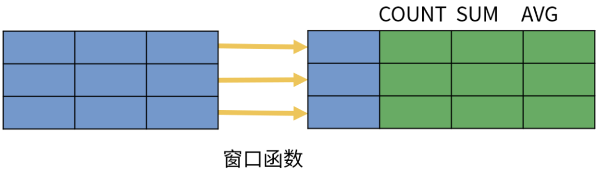
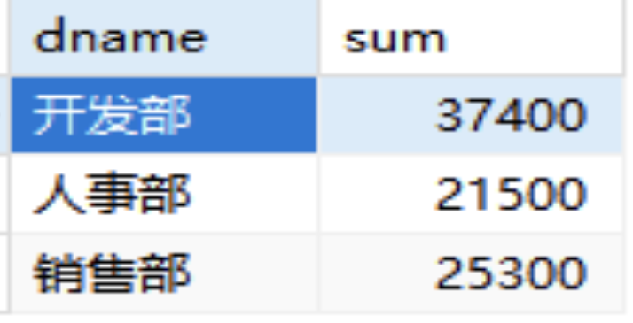
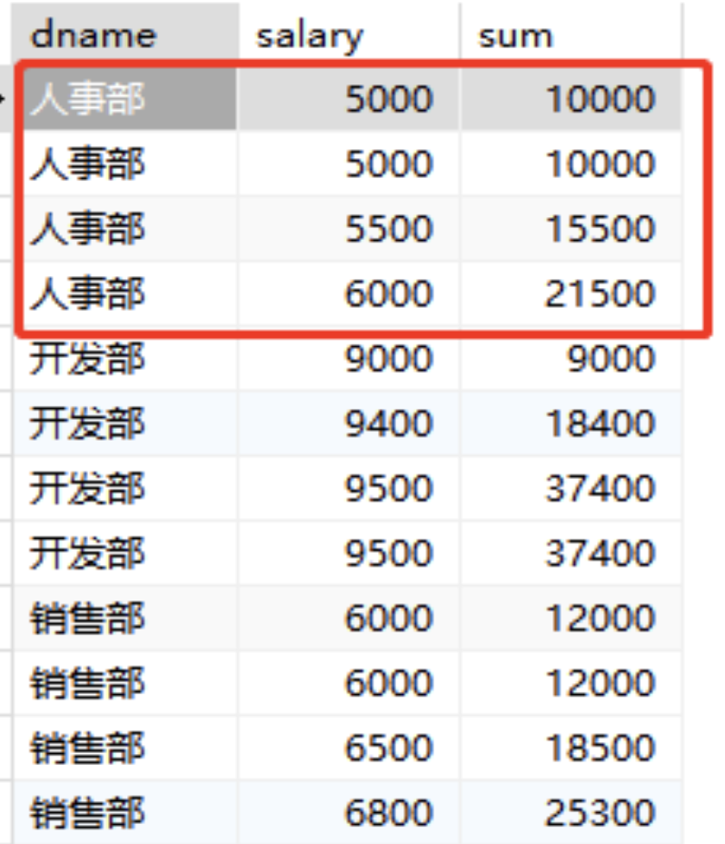
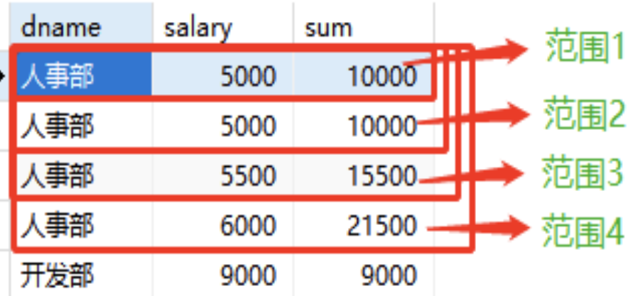
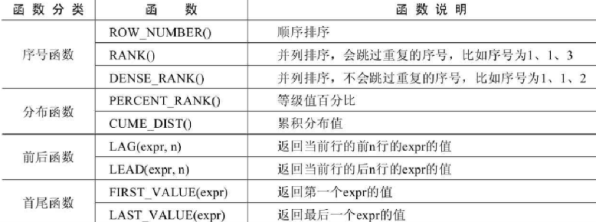
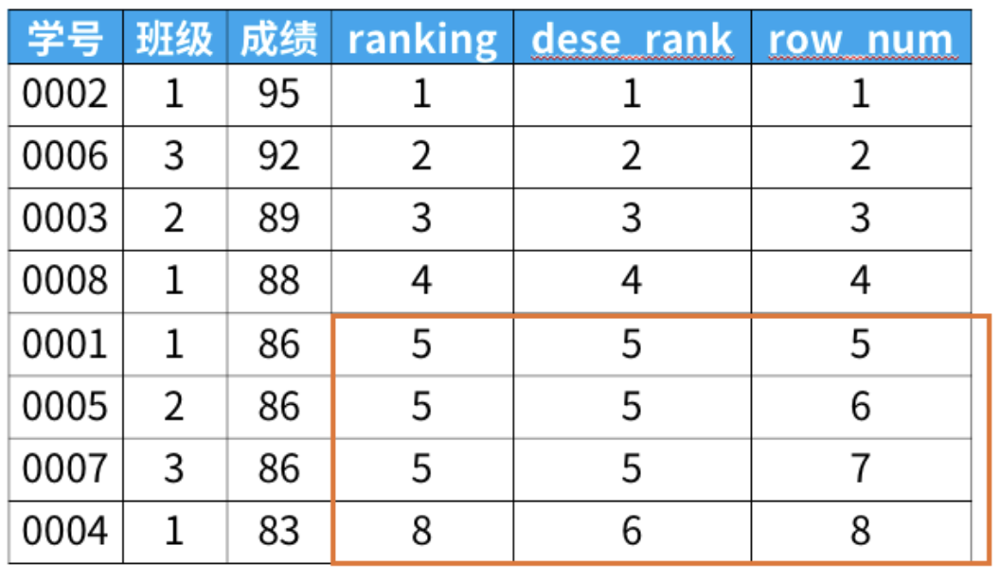

# 窗口函数
## 前言
窗口函数是`MySQL8.0`新增的内容!

## 一、什么是窗口函数
### 1、怎么理解窗口?
搞清楚窗口代表着啥，才知道什么时候该用它。

窗口函数是相对于聚合函数来说的。
- 聚合函数是对一组数据计算后返回单个值（即分组）。
- 非聚合函数一次只会处理一行数据。
- 而窗口函数在行记录上计算某个字段的结果时，可将窗口范围内的数据输入到聚合函数中，并不改变行数。

| ##container## |
|:--:|
|<br>|

准备以下数据:

```sql
-- 员工表
create table if not exists sql_niukewang.`employee`
(
    `eid` int not null auto_increment comment '员工id' primary key,
    `ename` varchar(20) not null comment '员工名称',
    `dname` varchar(50) not null comment '部门名称',
    `hiredate` date not null comment '入职日期',
    `salary` double null comment '薪资'
) comment '员工表';

-- 插入
insert into sql_niukewang.`employee` (`ename`, `dname`, `hiredate`, `salary`) values ('傅嘉熙', '开发部', '2022-08-20 12:00:04', 9000);
insert into sql_niukewang.`employee` (`ename`, `dname`, `hiredate`, `salary`) values ('武晟睿', '开发部', '2022-06-12 13:54:12', 9500);
insert into sql_niukewang.`employee` (`ename`, `dname`, `hiredate`, `salary`) values ('孙弘文', '开发部', '2022-10-16 08:27:06', 9400);
insert into sql_niukewang.`employee` (`ename`, `dname`, `hiredate`, `salary`) values ('潘乐驹', '开发部', '2022-04-22 03:56:11', 9500);
insert into sql_niukewang.`employee` (`ename`, `dname`, `hiredate`, `salary`) values ('潘昊焱', '人事部', '2022-02-24 03:40:02', 5000);
insert into sql_niukewang.`employee` (`ename`, `dname`, `hiredate`, `salary`) values ('沈涛', '人事部', '2022-12-14 09:16:37', 6000);
insert into sql_niukewang.`employee` (`ename`, `dname`, `hiredate`, `salary`) values ('江峻熙', '人事部', '2022-05-12 01:17:48', 5000);
insert into sql_niukewang.`employee` (`ename`, `dname`, `hiredate`, `salary`) values ('陆远航', '人事部', '2022-04-14 03:35:57', 5500);
insert into sql_niukewang.`employee` (`ename`, `dname`, `hiredate`, `salary`) values ('姜煜祺', '销售部', '2022-03-23 03:21:05', 6000);
insert into sql_niukewang.`employee` (`ename`, `dname`, `hiredate`, `salary`) values ('邹明', '销售部', '2022-11-23 23:10:06', 6800);
insert into sql_niukewang.`employee` (`ename`, `dname`, `hiredate`, `salary`) values ('董擎苍', '销售部', '2022-02-12 07:54:32', 6500);
insert into sql_niukewang.`employee` (`ename`, `dname`, `hiredate`, `salary`) values ('钟俊驰', '销售部', '2022-04-10 12:17:06', 6000);
```

我们举个例子：分别使用聚合函数`sum()`和窗口函数`sum()`来根据部门求和看下两者区别

```sql
select
dname,sum(salary) sum 
from employee group by dname;
```

结果:
| ##container## |
|:--:|
||


```sql
select
dname,salary,
sum(salary) over(partition by dname order by salary) sum
from employee;
```

| ##container## |
|:--:|
||

通过观察，正如之前所说，窗口函数相对聚合函数，`聚合函数`是将一组数据计算后返回单个值，而`窗口函数`在行记录上计算某个字段的结果时，可将窗口范围内的数据输入到聚合函数中，并不改变行数，就好比如我们刚刚根据部门开窗求和`salary`薪资，每一行的`sum`数据是将前面范围内的数据都聚合到当前结果中。

所以可见，`窗口就是范围的意思`，可以理解为一些记录（行）的集合；窗口函数也就是在`满足某种条件的记录集合上执行计算`的特殊函数。

| ##container## |
|:--:|
||

### 2、什么是窗口函数
窗口函数也叫OLAP函数（Online Anallytical Processing），可以对数据进行实时分析处理。

#### 1. 基本语法：

```sql
<窗口函数> OVER (
    [PARTITION BY <用于分组的列名>]
    [ORDER BY <用于排序的列名>]
);
-- over关键字用于指定函数的窗口范围，
-- partition by 用于对表分组，
-- order by子句用于对分组后的结果进行排序。
```

> [!TIP]
> 注意：窗口函数是对where或者group by子句处理后的结果再进行二次操作，因此会按照SQL语句的运行顺序，窗口函数一般放在select子句中（from前）

#### 2. 窗口函数多用在什么场景？主要有以下两类：

- 排名问题，例如：每个部门的薪资排名；
- TOPN问题，例如：查每个部门薪资排名第一、前N等；

我们常见的窗口函数和聚合函数有这些：
- 专用窗口函数：rank()，dense_rank()，row_number()
- 聚合函数：max()，min()，count()，sum()，avg()

| ##container## |
|:--:|
||

特别是`序号函数`, 真的非常常用:


```sql
select *,
   rank() over (order by 成绩 desc) as ranking,
   dense_rank() over (order by 成绩 desc) as dese_rank,
   row_number() over (order by 成绩 desc) as row_num
from 班级;
```

| ##container## |
|:--:|
||
|*图片来源: [猴子数据分析-图解SQL面试题：经典TOPN问题](https://leetcode.cn/problems/department-top-three-salaries/solutions/73890/tu-jie-sqlmian-shi-ti-jing-dian-topnwen-ti-by-houz/)*|


```sql
-- topN问题 sql模板
select *
from (
   select *, 
          row_number() over (partition by 要分组的列名 -- 此处的函数要灵活选择
                       order by 要排序的列名 desc) as 排名
   from 表名) as a
where 排名 <= N;

-- 作者：猴子数据分析
-- 链接：https://leetcode.cn/problems/department-top-three-salaries/solutions/73890/tu-jie-sqlmian-shi-ti-jing-dian-topnwen-ti-by-houz/
-- 来源：力扣（LeetCode）
-- 著作权归作者所有。商业转载请联系作者获得授权，非商业转载请注明出处。
```


#### 4. 窗口函数和普通聚合函数的区别？
因为聚合函数也可以放在窗口函数中使用，因此窗口函数和普通聚合函数也很容易被混淆，二者区别如下：

- 聚合函数是将多条记录聚合为一条；而窗口函数是每条记录都会执行，有几条记录执行完还是几条。
- 聚合函数也可以用于窗口函数中。

# 2.0

> 学习: [讲解并改进评论区大佬用到的窗口函数法](https://leetcode.cn/problems/restaurant-growth/solutions/1047332/jiang-jie-bing-gai-jin-ping-lun-qu-da-la-34xv)

**首先还是简要地理解一下窗口函数该怎么写，不过这次要多加一点点东西**

```sql
[你要的操作] OVER ( PARTITION BY  <用于分组的列名>
                    ORDER BY <按序叠加的列名> 
                    ROWS <窗口滑动的数据范围> )
```

**<窗口滑动的数据范围> 用来限定 [你要的操作] 所运用的数据的范围，具体有如下这些：**

```sql
当前行 - current row
之前的行 - preceding
之后的行 - following
无界限 - unbounded
表示从前面的起点 - unbounded preceding
表示到后面的终点 - unbounded following
```

举例

```sql
取当前行和前五行：ROWS between 5 preceding and current row --共6行
取当前行和后五行：ROWS between current row and 5 following --共6行
取前五行和后五行：ROWS between 5 preceding and 5 folowing --共11行
```
