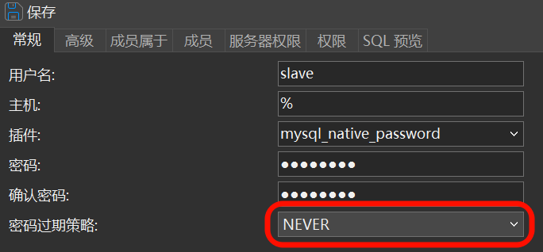
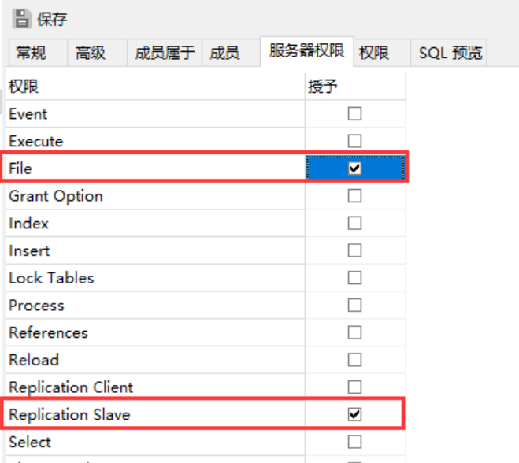

# 配置主从复制

> [!TIP]
> 由于我害怕云服务器跑路, 因此需要保险.
>
> 正好win上面有一个mysql (专门安装了版本和云服务器一样的(mysql8.0))

## 1. 配置主服务器
### 1.1 配置文件
修改云服务器配置文件, 如果在docker里面, 那么可以使用`docker cp`将它复制出来

一般在`/etc/my.cnf`这个

添加以下内容:

```sh
[mysqld]
log-bin=mysql-bin
# id, 需要和[从服务器]id不一样就可以了
server-id=84
# 不记录指定库的更新
binlog-ignore-db=information_schema
# 需要复制的库
binlog-do-db=test
```

重启mysql, docker就重启容器.

### 1.2 新建同步账号
为了职责清晰, 我们新建一个账号, 也方便管理~

| ##container## |
|:--:|
||

主机写: `%`就是允许所有的连接

然后是服务器权限:

| ##container## |
|:--:|
||

然后保存.

可以本地远程连接测试一下, 能不能连接成功: `"C:\Program Files\MySQL\MySQL Server 8.0\bin\mysql.exe" -u[用户名] -h[ip] -P[端口] -p`

## 2. 从服务器
### 2.1 配置文件

```sh
[mysqld]
log-bin=mysql-bin
# 要求和主服务器不一样 (就是唯一的啦)
server-id=3308
binlog-ignore-db=information_schema
# 同步的库
replicate-do-db=test
replicate-ignore-db=mysql
log-slave-updates
slave-skip-errors=all
slave-net-timeout=60
```

### 2.2 开始同步

```sql
stop slave;
change master to 
    master_host='127.0.0.1',    -- 目标服务器ip
    master_port=3307,           -- 目标服务器端口
    master_user='slave',        -- 目标账号
    master_password='slave123', -- 密码
    master_log_file='mysql-bin.000001', 
    master_log_pos=0, 
    get_master_public_key=1;    -- 设置如果需要SSL证书什么的就握手
start slave;
```

其中`master_log_file`可以通过:

```sql
show master status;
```

查询.

然后就可以通过:

```sql
SHOW SLAVE STATUS \G;
```

查看状态了, 有两个YES就没问题了~