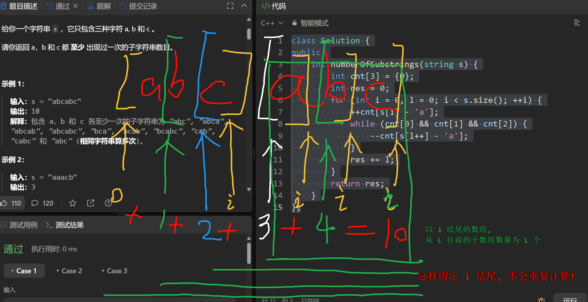

# 1358. 包含所有三种字符的子字符串数目
链接: [1358. 包含所有三种字符的子字符串数目](https://leetcode.cn/problems/number-of-substrings-containing-all-three-characters/)

算术评级: 5 | 第 20 场双周赛 Q3 | `1646`

给你一个字符串 s ，它只包含三种字符 a, b 和 c 。

请你返回 a，b 和 c 都 至少 出现过一次的子字符串数目。

提示:
- 3 <= s.length <= 5 x 10^4
- s 只包含字符 a，b 和 c 。

# 题解
## 滑动窗口

```C++
class Solution {
public:
    int numberOfSubstrings(string s) {
        int cnt[3] = {0};
        int res = 0;
        for (int i = 0, l = 0; i < s.size(); ++i) {
            ++cnt[s[i] - 'a'];
            while (cnt[0] && cnt[1] && cnt[2]) {
                --cnt[s[l++] - 'a'];
            }
            res += l;
        }
        return res;
    }
};
```

### 如何计算子数组数量


