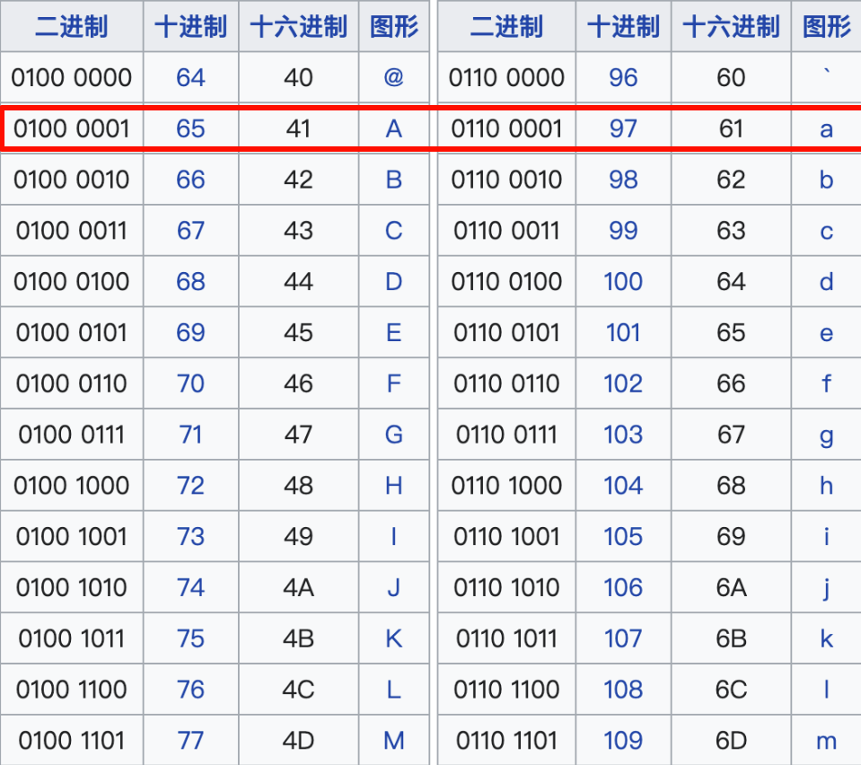

# 3120. 统计特殊字母的数量 I
给你一个字符串 word。如果 word 中同时存在某个字母的小写形式和大写形式，则称这个字母为 **特殊字母** 。

返回 word 中 特殊字母 的数量。

 
```
示例 1:
输入：word = "aaAbcBC"
输出：3
解释：
word 中的特殊字母是 'a'、'b' 和 'c'。

示例 2:
输入：word = "abc"
输出：0
解释：
word 中不存在大小写形式同时出现的字母。

示例 3:
输入：word = "abBCab"
输出：1
解释：
word 中唯一的特殊字母是 'b'。
```
 
提示：
```
1 <= word.length <= 50
word 仅由小写和大写英文字母组成。
```

# 题解
## 我的

使用两个哈希表, 分别统计字符, 当那个字符同时出现, 方表示为特殊字符:

```C++
class Solution {
public:
    int numberOfSpecialChars(string word) {
        vector<int> arrx(26);
        vector<int> arrd(26);

        for (char& it : word) {
            if (it >= 'A' && it <= 'Z')
                ++arrd[it - 'A'];
            else
                ++arrx[it - 'a'];
        }
        
        int res = 0;
        for (int i = 0; i < 26; ++i)
            if (arrd[i] && arrx[i])
                ++res;
        return res;
    }
};
```

## 0x3f

| ##container## |
|:--:|
||

观察`ASCII`码表, 可以首先我们知道`a-z`, `A-Z`是连续的,

其次, 它们的二进制`低五位`是一样, 比如`a - A`的低五位, 他们只是相差一个`第6位`的1而已!!

- 因此我们可以通过`字母 & 31`来得到他的第5位 (注意是`1 ~ 26`的数), 
- 而大小写我们可以通过`第6位`是否是`1`来判断是否是大写

即:
```C++
for (char& it : str) {
	cout << it << "是 "
	if ((it >> 5) & 1) {
    	cout << "大写";
    } else {
    	cout << "小写";
    }

	cout << " 是字母表的第 " << (it & 31) << " 个字母\n";
}
```

而这里就可以使用二进制集合来表示数组, 分别使用一个`int`来表示(int 可以表示 31个数, 而 字母只需要有 26 个位置, 1 就是有这个字母, 重复也不怕)

故有:
```C++
class Solution {
public:
    int numberOfSpecialChars(string word) {
        int bitSet[2] = {0};
        for (char c : word) {
            bitSet[(c >> 5) & 1] |= 1 << (c & 31);
        }

        return __builtin_popcount(bitSet[0] & bitSet[1]); // 求交集, 得所有的特殊字母
    }
};
```

此处再写一个小技巧, 快速大小写转换: 大写变小写, 小写变大写:

```C++
char c = 'A';
c ^= ' ';  // 空格的ASCII为 32
cout << c; // 'a'
```

演示

```C++
 0100 0001 // 'a' 的二进制
^0010 0000 // ' ' (空格)的二进制, 异或: 不同为1
----------
 0110 0001 // 'A'

/* 根据异或的性质, 原数为1 和 0, 还是得 1, 因为只有 控制大小写的位会被影响! */
```
