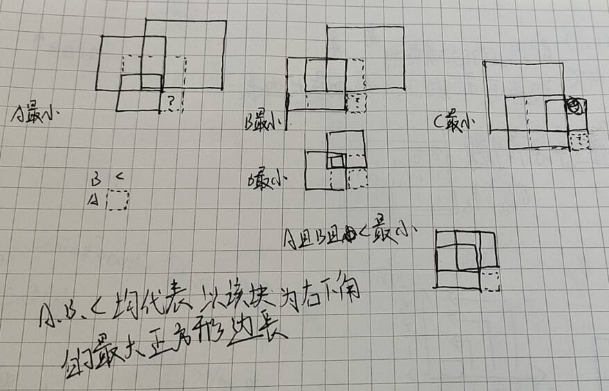

# 221. 最大正方形
原题: [221. 最大正方形](https://leetcode.cn/problems/maximal-square/description/)

中等

在一个由 '0' 和 '1' 组成的二维矩阵内，找到只包含 '1' 的最大正方形，并返回其面积。

## 示例 1：


输入：matrix = [["1","0","1","0","0"],["1","0","1","1","1"],["1","1","1","1","1"],["1","0","0","1","0"]]

输出：4
## 示例 2：


输入：matrix = [["0","1"],["1","0"]]

输出：1
## 示例 3：

输入：matrix = [["0"]]

输出：0
 
## 提示：
m == matrix.length<br>
n == matrix[i].length<br>
1 <= m, n <= 300<br>
matrix[i][j] 为 '0' 或 '1'<br>
# 代码
## 1) 超时 <暴力遍历 O(N^3)>
```C++
class Solution {
public:
    int maximalSquare(vector<vector<char>>& matrix) {
        const int coSize = matrix.size();
        const int size = matrix[0].size();
        int res = 0;

        for (int i = 0; i < coSize; ++i)
        {
            for (int j = 0; j < size; ++j)
            {
                // 外层为回溯
                int len = 1;
                while (1)
                {
                    // y向下遍历(包含)
                    for (int y = i; y < i + len; ++y)
                    {
                        if (matrix[y][j + len - 1] == '0')
                            goto END;
                    }

                    // x向右遍历(不包含)
                    for (int x = j; x < j + len - 1; ++x)
                    {
                        if (matrix[i + len - 1][x] == '0')
                            goto END;
                    }

                    ++len;
                    if (i + len > coSize || j + len > size)
                        goto END;
                }

                END:
                res = max(res, len - 1);
            }
        }

        return res * res;
    }
};
```

## 2) 削边法

### 1. 越界

```C++
class Solution {
public:
    int maximalSquare(vector<vector<char>>& matrix) {
        int sizeY = matrix.size();
        int sizeX = matrix[0].size();
        int ox = 0, oy = 0;
        bool tag;
        do
        {
            tag = 0;
            printf("%d %d %d %d\n", ox, oy, sizeX, sizeY);
            // 上
            for (int i = ox; i < sizeX; ++i)
            {
                if (matrix[oy][i] == '0')
                {
                    ++oy;
                    tag = 1;
                    break;
                }
            }

            // 下
            for (int i = ox; i < sizeX; ++i)
            {
                if (matrix[sizeY - 1][i] == '0')
                {
                    --sizeY;
                    tag = 1;
                    break;
                }
            }

            // 左
            for (int i = oy + 1; i < sizeY - 1; ++i)
            {
                if (matrix[i][ox] == '0')
                {
                    ++oy;
                    tag = 1;
                    break;
                }
            }

            // 右
            for (int i = oy + 1; i < sizeY - 1; ++i)
            {
                if (matrix[i][sizeX - 1] == '0')
                {
                    --sizeX;
                    tag = 1;
                    break;
                }
            }

        } while (tag);

        return (sizeX - ox) * (sizeY - oy);
    }
};
```

## ..

```C++
class Solution {
public:
    int maximalSquare(vector<vector<char>>& matrix) {
        int sY = 0, sX = 0;
        int eY = matrix.size() - 1, eX = matrix[0].size() - 1;
        // xy点没有决定权!? 反直觉!
        while (1)
        {
            bool tag = 1;
            printf("(%d, %d), (%d, %d)\n", sX, sY, eX, eY);
            for (int i = sX + 1; i < eX; ++i)
                if (matrix[sY][i] == '0') {
                    while (matrix[sY][i] == '0') {
                        ++sY;
                        tag = 0;
                    }
                    break;
                }

            for (int i = sY + 1; i < eY; ++i)
                if (matrix[i][eX] == '0') {
                    while (matrix[i][eX] == '0') {
                        --eX;
                        tag = 0;
                    }
                    break;
                }

            for (int i = eX - 1; i > sX; --i)
                if (matrix[eY][i] == '0') {
                    while (matrix[eY][i] == '0') {
                        --eY;
                        tag = 0;
                    }
                    break;
                }

            for (int i = eY - 1; i > sY; --i)
                if (matrix[i][sX] == '0') {
                    while (matrix[i][sX] == '0') {
                        ++sX;
                        tag = 0;
                    }
                    break;
                }

            if (tag)
                break;
        }

        return pow(min(eY - sY, eX - sX), 2);
    }
};
```

有时候是需要, 有时候不是!...

# 题解

## 1. 暴力遍历
超时的, 不用看了...

```C++
class Solution {
public:
    int maximalSquare(vector<vector<char>>& matrix) {
        if (matrix.size() == 0 || matrix[0].size() == 0) {
            return 0;
        }
        int maxSide = 0;
        int rows = matrix.size(), columns = matrix[0].size();
        for (int i = 0; i < rows; i++) {
            for (int j = 0; j < columns; j++) {
                if (matrix[i][j] == '1') {
                    // 遇到一个 1 作为正方形的左上角
                    maxSide = max(maxSide, 1);
                    // 计算可能的最大正方形边长
                    int currentMaxSide = min(rows - i, columns - j);
                    for (int k = 1; k < currentMaxSide; k++) {
                        // 判断新增的一行一列是否均为 1
                        bool flag = true;
                        if (matrix[i + k][j + k] == '0') {
                            break;
                        }
                        for (int m = 0; m < k; m++) {
                            if (matrix[i + k][j + m] == '0' || matrix[i + m][j + k] == '0') {
                                flag = false;
                                break;
                            }
                        }
                        if (flag) {
                            maxSide = max(maxSide, k + 1);
                        } else {
                            break;
                        }
                    }
                }
            }
        }
        int maxSquare = maxSide * maxSide;
        return maxSquare;
    }
};

/* 贴个官方题解, 我的遍历还是太普通人了...
作者：力扣官方题解
链接：https://leetcode.cn/problems/maximal-square/solutions/234964/zui-da-zheng-fang-xing-by-leetcode-solution/
来源：力扣（LeetCode）
*/
```

## 2. 动态规划

### 确定状态与状态转移方程

说实话, 我看了很多题解, 上来就是状态转移方程, 就算说了状态, 也不细说是怎么思路转过来的. (怎么想到的?!, 我不太可以理解, 所以我愿意称这个是一类新的题目...即, **反正都理解不了, 为什么不先把它记住, 多用几次, 内化于自己的思想, 到时候说不定就变成: `不这样还能这样?` の自分想法**(反正我现在就是画了一下, 似乎有点get了, 但是讲不出来... 但是它还有类似的同类题可以练手: [1277. 统计全为 1 的正方形子矩阵](../018-统计全为的正方形子矩阵/index.md)))

> 如言:
> 对于这个题目，可以使用动态规划来解决。 (这个是GPT-3.5说的)
>
> 首先，我们定义一个二维数组dp，其中dp[i][j]表示以位置(i, j)为右下角的正方形的边长。如果matrix[i][j]为'1'，那么dp[i][j]的值就是其左侧、上方和左上方三个位置的dp值的最小值加1，<b style="color:red">因为这三个位置都是以当前位置为右下角的正方形的一部分</b>。如果matrix[i][j]为'0'，那么dp[i][j]的值就是0，因为以该位置为右下角的正方形不存在。

| ##container## |
|:--:|
||

参考题解: [理解 三者取最小 +1](https://leetcode.cn/problems/maximal-square/solutions/44586/li-jie-san-zhe-qu-zui-xiao-1-by-lzhlyle)

### 写代码

// dp size + 1 是为了防止越界(处理边界的情况, 顺便初始化为 0)

```C++
class Solution {
public:
    int maximalSquare(vector<vector<char>>& matrix) {
        // 使用暴力遍历 --> 发现有重叠子问题 -->dp
        // 情况 1. arr[i][j] == '0', 则 dp(i ,j) = 0;
        // 否则, dp(i, j) = min(dp(i - 1, j), dp(i - 1, j - 1), dp(i, j - 1)) + 1
        const int coSiez = matrix.size();
        const int size = matrix[0].size();
        vector<vector<int>> dp(coSiez + 1, vector<int>(size + 1));
        int max = 0;
        for (int i = 0; i < coSiez; ++i) {
            for (int j = 0; j < size; ++j) {
                if (matrix[i][j] == '1') {
                    dp[i + 1][j + 1] = min(min(dp[i][j + 1], dp[i][j]), dp[i + 1][j]) + 1; // min只能传两个参数!
                    if (max < dp[i + 1][j + 1]) {
                        max = dp[i + 1][j + 1];
                    }
                }
                else {
                    dp[i + 1][j + 1] = 0;
                }
            }
        }
        return max * max;
    }
};
```
如果不理二维矩阵初始化请重新学习: [声明时初始化二维向量](../../../../002-程序语言/001-C++/002-tmp丶C++丶memo/002-STL库/005-声明时初始化二维向量/index.md)