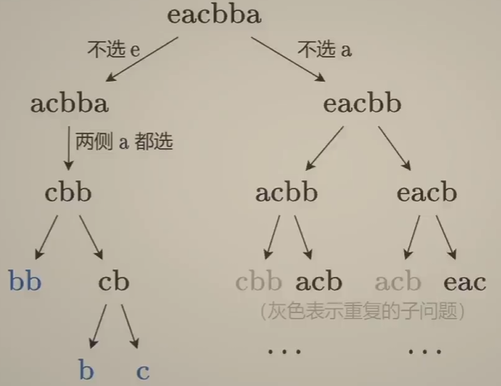
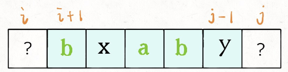
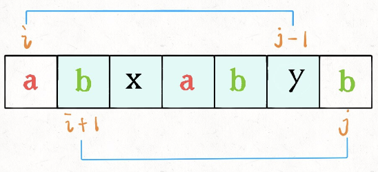
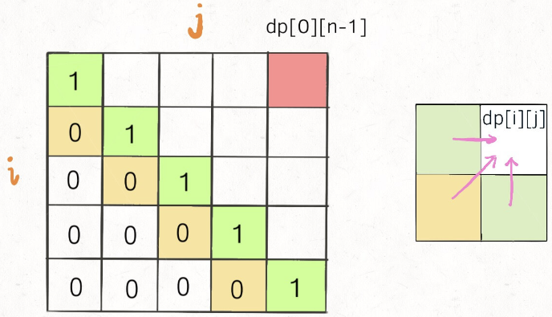

# 516. 最长回文子序列
原题链接: [516. 最长回文子序列](https://leetcode.cn/problems/longest-palindromic-subsequence/description/)

给你一个字符串 s ，找出其中最长的回文子序列，并返回该序列的长度。

子序列定义为：不改变剩余字符顺序的情况下，删除某些字符或者不删除任何字符形成的一个序列。

## 示例 1：

输入：s = "bbbab"<br>
输出：4<br>
解释：一个可能的最长回文子序列为 "bbbb" 。
## 示例 2：

输入：s = "cbbd"<br>
输出：2<br>
解释：一个可能的最长回文子序列为 "bb" 。
 

## 提示：

1 <= s.length <= 1000<br>
s 仅由小写英文字母组成

# 题解
## 思路1 [转换]
因为是找回文序列, 即 `正着读` 和 `反着读` 是一样的, 故我们可以 将s翻转, 然后就是 [1143. 最长公共子序列](../016-最长公共子序列/index.md)

```C++
class Solution {
public:
    int longestPalindromeSubseq(string s) {
        int n = s.size();
        string s_2("");
        for (int i = n - 1; i >= 0; --i)
            s_2 += s[i];
        
        vector<vector<int>> dp(n + 1, vector<int>(n + 1));

        for (int i = 0; i < n; ++i) {
            for (int j = 0; j < n; ++j) {
                if (s[i] == s_2[j])
                    dp[i + 1][j + 1] = dp[i][j] + 1;
                else
                    dp[i + 1][j + 1] = max(dp[i][j + 1], dp[i + 1][j]);
            }
        }

        return dp[n][n];
    }
};
```

## 思路2 [选或不选]
```markmap##h300
# 区间DP
## 区别
### 线性DP: 一般是在前/后缀上转移
### 区间DP: 从小区间转移到大区间
## 选或不选
### 从两侧向内缩小问题规模
### 本题
## 枚举选哪个
### 分割成多个规模更小的子问题
### 1039.
```

选或不选: 从两侧向内缩小问题规模

| ##container## |
|:--:|
||

故可有状态: `dp[i][j]` 即 `s[i,...,j]` 的最长回文子序列长度

思考转移:

已知 dp[i + 1][j - 1] 可以求 dp[i][j] 吗?

| ##container## |
|:--:|
||

显然是可以的, 即 若 `s[i] == s[j]` 那么 `dp[i][j] = dp[i + 1][j - 1] + 2`;

否则, 则说明它俩**不可能同时出现**在 `s[i..j]` 的最长回文子序列中，那么把它俩**分别**加入 `s[i+1..j-1]` 中，看看哪个子串产生的回文子序列更长即可:

| ##container## |
|:--:|
||

## 代码
### 记忆化搜索

```C++
class Solution {
public:
    int BFS(int i, int j, string& s, vector<vector<int>>& memo) {
        if (i > j)
            return 0;

        if (i == j)
            return 1;

        if (memo[i][j])
            return memo[i][j];
        
        if (s[i] == s[j])
            memo[i][j] = BFS(i + 1, j - 1, s, memo) + 2;
        else
            memo[i][j] = max(BFS(i + 1, j, s, memo), BFS(i, j - 1, s, memo));
        
        return memo[i][j];
    }

    int longestPalindromeSubseq(string s) {
        vector<vector<int>> memo(s.size(), vector<int>(s.size()));
        return BFS(0, s.size() - 1, s, memo);
    }
};
```

### 动态规划

```C++
class Solution {
public:
    int longestPalindromeSubseq(string s) {
        int n = s.size();
        vector<vector<int>> dp(n, vector<int>(n));

        // 值得注意的是, 遍历的顺序是 从 左下 到 右上 的
        for (int i = n - 1; i >= 0; i--) {
            dp[i][i] = 1;
            for (int j = i + 1; j < n; j++) {
                if (s[i] == s[j]) {
                    dp[i][j] = dp[i + 1][j - 1] + 2;
                }
                else {
                    dp[i][j] = max(
                        dp[i + 1][j],
                        dp[i][j - 1]
                    );
                }
            }
        }

        return dp[0][n - 1];
    }
};
```

对于为什么是从左下到右上的遍历:

| ##container## |
|:--:|
||
|如图, 并且要保证 **i < j**, 然后是需要优先知道`dp[i + 1][j - 1]`的数值|

## 动态规划状态压缩至空间复杂度O(N)
不会!

## 参考链接
```bilibili ##BV1Gs4y1E7EU##w500##
```

1. [【视频】教你一步步思考动态规划！（Python/Java/C++/Go）](https://leetcode.cn/problems/longest-palindromic-subsequence/solutions/2203001/shi-pin-jiao-ni-yi-bu-bu-si-kao-dong-tai-kgkg)
2. [子序列问题通用思路|最长回文子序列](https://leetcode.cn/problems/longest-palindromic-subsequence/solutions/67456/zi-xu-lie-wen-ti-tong-yong-si-lu-zui-chang-hui-wen)