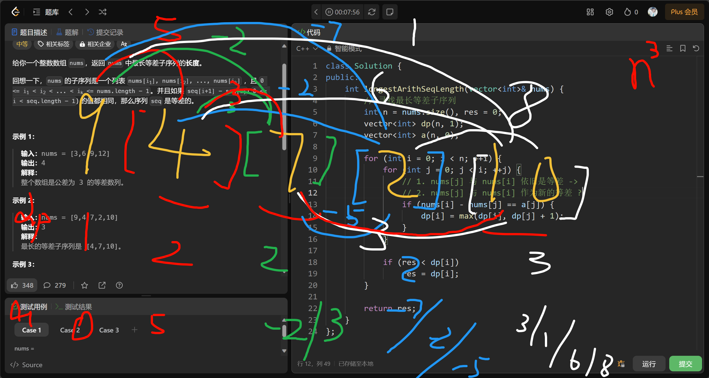

# 1027. 最长等差数列
原题: [1027. 最长等差数列](https://leetcode.cn/problems/longest-arithmetic-subsequence/description/)

给你一个整数数组 `nums`，返回 `nums` 中最长等差子序列的长度。

回想一下，`nums` 的子序列是一个列表 nums[$i_1$], nums[$i_2$], ..., nums[$i_k$],

且 0 <= $i_1$ < $i_2$ < ... < $i_k$ <= nums.length - 1。并且如果 seq[i+1] - seq[i]( 0 <= i < seq.length - 1) 的值都相同，那么序列 `seq` 是**等差**的。

## 示例 1：

输入：nums = [3,6,9,12]<br>
输出：4<br>
解释：<br>
整个数组是公差为 3 的等差数列。<br>

## 示例 2：
输入：nums = [9,4,7,2,10]<br>
输出：3<br>
解释：<br>
最长的等差子序列是 [4,7,10]。<br>

## 示例 3：
输入：nums = [20,1,15,3,10,5,8]<br>
输出：4<br>
解释：<br>
最长的等差子序列是 [20,15,10,5]。<br>

## 提示：
$2 <= nums.length <= 1000$<br>
$0 <= nums[i] <= 500$ <br>

# 代码
## 我的
### V1.0.0 n字典
| ##container## |
|:--:|
||

通过上面的 `a`(对于nums[j] 到 nums[i] 的差) 数组 与 `dp`(以nums[i]结尾最长序列长度) 数组

反正可以想到: 将其**等差数**进行记录, 顺便记录最大的长度,

我抽象 出 `vector<map<int, int>> a(n, map<int,int>());` a[i] 表示以 `i` 结尾. 然后是字典`<等差数, 该序列长度>`.

然后有以下代码:

因为计算 `之差` 需要 O(N) 的时间复杂度.
遍历全部数需要 O(N) 的时间复杂度.
寻找差需要 O(logN) 时间复杂度 (C++普通字典是红黑树为底层)

故时间复杂度为 $O(N^2*logN)$. 空间复杂度为 $O(N * 字典)$

```C++
class Solution {
public:
    int longestArithSeqLength(vector<int>& nums) {
        // 寻找最长等差子序列
        int n = nums.size(), res = 2;
        // 差 - 长度
        vector<map<int, int>> a(n, map<int,int>());

        for (int i = 0; i < n; ++i) {
            for (int j = 0; j < i; ++j) {
                if (a[j].find(nums[i] - nums[j]) != a[j].end()) {
                    if (a[i].find(nums[i] - nums[j]) != a[i].end()) {
                        a[i][nums[i] - nums[j]] = max(a[i][nums[i] - nums[j]], a[j].find(nums[i] - nums[j])->second + 1);
                    } else {
                        a[i].insert(pair(nums[i] - nums[j], a[j].find(nums[i] - nums[j])->second + 1));
                    }

                    if (res < a[i].find(nums[i] - nums[j])->second)
                        res = a[i].find(nums[i] - nums[j])->second;
                } else {
                    a[i].insert(pair(nums[i] - nums[j], 2));
                }
            }
        }

        return res;
    }
};
```

### V2.0.0 简单红黑树 -> 直接哈希
因为数据范围是 0 - 500, 所以可以使用哈希表 [1001] (可以表示正负数[-500, 500])

这样就优化到:
时间复杂度为 $O(N^2)$. 空间复杂度为 $O(N^2)$

```C++
class Solution {
public:
    int longestArithSeqLength(vector<int>& nums) {
        // 寻找最长等差子序列
        int n = nums.size(), res = 2;
        // 差 - 长度
        vector<vector<int>> a(n, vector<int>(1001, 0));

        for (int i = 0; i < n; ++i) {
            for (int j = 0; j < i; ++j) {
                a[i][nums[i] - nums[j] + 500] = max(a[j][nums[i] - nums[j] + 500] + 1, 2);
                if (res < a[i][nums[i] - nums[j] + 500])
                    res = a[i][nums[i] - nums[j] + 500];
            }
        }

        return res;
    }
};
```

直接从 2s -> 99ms