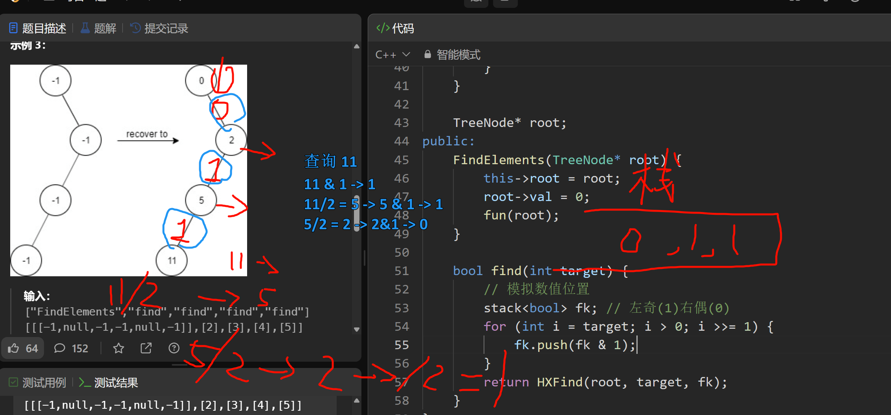
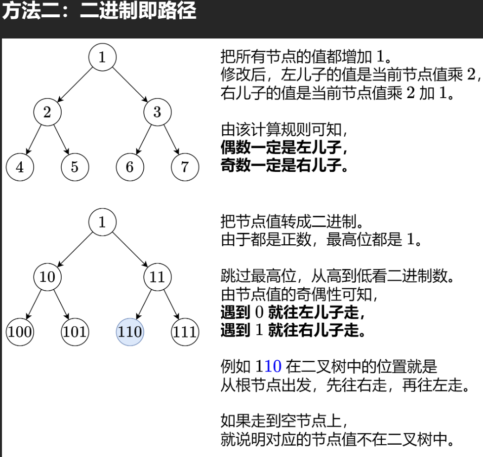

# 1261. 在受污染的二叉树中查找元素
链接: [1261. 在受污染的二叉树中查找元素](https://leetcode.cn/problems/find-elements-in-a-contaminated-binary-tree/description/) 

第 163 场周赛 Q2 1440 [中等]
## 题目

给出一个满足下述规则的二叉树：

- `root.val == 0`

- 如果 `treeNode.val == x` 且 `treeNode.left != null`，那么 `treeNode.left.val == 2 * x + 1`

- 如果 `treeNode.val == x` 且 `treeNode.right != null`，那么 `treeNode.right.val == 2 * x + 2`

现在这个二叉树受到「污染」，所有的 treeNode.val 都变成了 -1。

请你先还原二叉树，然后实现 FindElements 类：

FindElements(TreeNode* root) 用受污染的二叉树初始化对象，你需要先把它还原。
bool find(int target) 判断目标值 target 是否存在于还原后的二叉树中并返回结果。
 
```c in
示例 1：

输入：
["FindElements","find","find"]
[[[-1,null,-1]],[1],[2]]
输出：
[null,false,true]
解释：
FindElements findElements = new FindElements([-1,null,-1]); 
findElements.find(1); // return False 
findElements.find(2); // return True 

示例 2：

输入：
["FindElements","find","find","find"]
[[[-1,-1,-1,-1,-1]],[1],[3],[5]]
输出：
[null,true,true,false]
解释：
FindElements findElements = new FindElements([-1,-1,-1,-1,-1]);
findElements.find(1); // return True
findElements.find(3); // return True
findElements.find(5); // return False

示例 3：

输入：
["FindElements","find","find","find","find"]
[[[-1,null,-1,-1,null,-1]],[2],[3],[4],[5]]
输出：
[null,true,false,false,true]
解释：
FindElements findElements = new FindElements([-1,null,-1,-1,null,-1]);
findElements.find(2); // return True
findElements.find(3); // return False
findElements.find(4); // return False
findElements.find(5); // return True
```

提示：

$
TreeNode.val == -1\\
二叉树的高度不超过 20\\
节点的总数在 [1, 10^4] 之间\\
调用 find() 的总次数在 [1, 10^4] 之间\\
0 <= target <= 10^6\\
$

# 题解
## 我的思路

把注释的哈希表(set)去掉注释, 就是O(logN)的查询解法(你要换哈希表, 而不是红黑树实现的set)

当然, 我这个解法也是 $O(NlogN)$ 但空间复杂度是 $O(log(target))$ (临时栈的空间, 即 `target` 搞的高度)

我发现: 可以这样:

| ##container## |
|:--:|
||

但是实际上有个问题, 就是其实它的关系应该是 `i = (i - 1或者2) / 2` 因为构建的时候是这样! 综上, 有:

```C++
/**
 * Definition for a binary tree node.
 * struct TreeNode {
 *     int val;
 *     TreeNode *left;
 *     TreeNode *right;
 *     TreeNode() : val(0), left(nullptr), right(nullptr) {}
 *     TreeNode(int x) : val(x), left(nullptr), right(nullptr) {}
 *     TreeNode(int x, TreeNode *left, TreeNode *right) : val(x), left(left), right(right) {}
 * };
 */
class FindElements {
    void fun(TreeNode* node) {
        // haxh.insert(node->val);
        if (node->left) {
            node->left->val = node->val * 2 + 1;
            fun(node->left);
        }

        if (node->right) {
            node->right->val = node->val * 2 + 2;
            fun(node->right);
        }
    }

    // set<int> haxh;

    // 左边是奇数, 右边是偶数
    bool HXFind(TreeNode* node, int target, stack<bool>& fk) {
        if (!node)
            return 0;

        if (node->val == target)
            return 1;

        if (fk.size() == 0)
            return 0;

        // 左奇(1)右偶(0)
        bool tag = fk.top();
        fk.pop();
        if (tag) {
            // 奇数
            return HXFind(node->left, target, fk);
        }
        else {
            // 偶数
            return HXFind(node->right, target, fk);
        }
    }

    TreeNode* root;
public:
    FindElements(TreeNode* root) {
        this->root = root;
        root->val = 0;
        fun(root);
    }
    
    bool find(int target) {
        // return haxh.find(target) != haxh.end();

        if (!target)
            return 1;

        // 模拟数值位置
        stack<bool> fk; // 左奇(1)右偶(0)
        for (int i = target; i >= 1; i = (i - !(i&1) - 1) >> 1) {
            fk.push(i & 1);
        }

        if (fk.size() == 0)
            return 0;

        return HXFind(root, target, fk);
    }
};

/**
 * Your FindElements object will be instantiated and called as such:
 * FindElements* obj = new FindElements(root);
 * bool param_1 = obj->find(target);
 */
```

当然也可以看看题解区的位运算, 也嘎嘎牛逼!

| ##container## |
|:--:|
||
|来自: [两种方法：哈希表/位运算（Python/Java/C++/Go/JS/Rust）](https://leetcode.cn/problems/find-elements-in-a-contaminated-binary-tree/solutions/2681672/liang-chong-fang-fa-ha-xi-biao-wei-yun-s-6m7w/?envType=daily-question&envId=2024-03-12)|