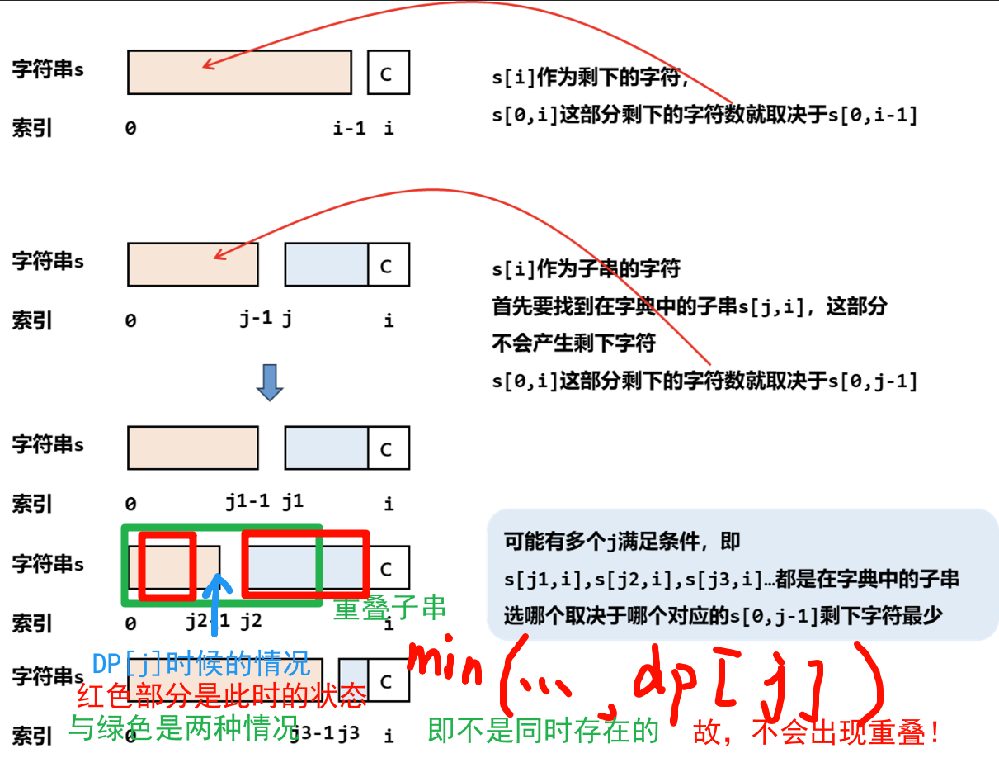

# 2707. 字符串中的额外字符
原题: [2707. 字符串中的额外字符](https://leetcode.cn/problems/extra-characters-in-a-string/description/)

给你一个下标从 **0** 开始的字符串 `s` 和一个单词字典 `dictionary` 。你需要将 `s` 分割成若干个 **互不重叠**<sup>[1]</sup> 的子字符串，每个子字符串都在 `dictionary` 中出现过。`s` 中可能会有一些 **额外的字符** 不在任何子字符串中。

请你采取最优策略分割 `s` ，使剩下的字符 **最少** 。

 

### 示例 1:

输入:
```
s = "leetscode", dictionary = ["leet","code","leetcode"]
```
输出:
```
1
```
解释:将 s 分成两个子字符串:下标从 0 到 3 的 "leet" 和下标从 5 到 8 的 "code" 。只有 1 个字符没有使用（下标为 4），所以我们返回 1 。

### 示例 2:

输入:
```
s = "sayhelloworld", dictionary = ["hello","world"]
```
输出:
```
3
```
解释:将 s 分成两个子字符串:下标从 3 到 7 的 "hello" 和下标从 8 到 12 的 "world" 。下标为 0 ，1 和 2 的字符没有使用，所以我们返回 3 。
 

提示:

$1 <= s.length <= 50$

$1 <= dictionary.length <= 50$

$1 <= dictionary[i].length <= 50$

dictionary[i] 和 s 只包含小写英文字母。

dictionary 中的单词互不相同。

---

### 额外示例:

```
"ecolloycollotkvzqpdaumuqgs"
```

```
["flbri","uaaz","numy","laper","ioqyt","tkvz","ndjb","gmg","gdpbo","x","collo","vuh","qhozp","iwk","paqgn","m","mhx","jgren","qqshd","qr","qpdau","oeeuq","c","qkot","uxqvx","lhgid","vchsk","drqx","keaua","yaru","mla","shz","lby","vdxlv","xyai","lxtgl","inz","brhi","iukt","f","lbjou","vb","sz","ilkra","izwk","muqgs","gom","je"]
```

```
2
```

#### [1]
```
"leetscode"
```

```
["leet","code","leetcode", "leetsc"]
```

```预期结果
1
```

解释: `leetsc` 不能与 `code` 重叠产生: 结果 = 0

# 作答
## 尝试1:
```C++
class Solution {
public:
    int DPindex[51] = {0};
    int DPres[51] = {0};

    int ifResMin(const string& s, vector<string>& dictionary, bool& do_fuck) {
        // 剩下字符返回子串最少字符数
        int minRes = 100;
        bool tmp = 0;
        for (auto& it : dictionary) {
            tmp = 0;
            if (s.size() >= it.size()) {
                int a = ifStrInSLen(s, it, tmp);
                if (a <= minRes) {
                    minRes = a;
                    if (tmp)
                        do_fuck = true;
                }
            }
        }

        return minRes;
    }

    int ifStrInSLen(const string& s, string& str, bool& tmp) {
        // 判断子串s 有多少个字符在父串str中
        int res = 0;
        int i = 0;
        int j = 0;
        const int len = s.size();
        const int strLen = str.size();
        while (i < len) {
            j = 0;
            while (s[i + j] == str[j]) {
                ++j;
                if (j == strLen) {
                    tmp = 1;
                    return s.size() - str.size();
                }
            }
            ++i;
        }

        return len;
    }

    int minExtraChar(string s, vector<string>& dictionary) {
        // 题目要求: 输出剩下的字符个数
        const int len = s.size();
        bool do_fuck = 0, tmp;
        // 动态规划: 实际上就是索引为 i 的位置分割与不分割的问题
        // 所以定义[状态]为: 第 i 个 位置是否分割 (分割后 当前数是算前面字符串的)
        // 取 DP[i] = min(分割(判断是否为子串后剩余的字符数) + DPindex[i - 1], 不分割(判断是否为子串后剩余的字符数))
        for (int i = 1; i <= len; ++i) {
            // 分割则更新 DPindex[i]
            do_fuck = 0;
            int fg = ifResMin(s.substr(DPindex[i - 1], i - DPindex[i - 1]), dictionary, do_fuck) + DPres[DPindex[i - 1]];
            int no_fg = ifResMin(s.substr(0, i), dictionary, tmp);
            printf("分割出 %s :%d 不分割:%d ", s.substr(DPindex[i - 1], i - DPindex[i - 1]).c_str(), fg, no_fg);
            if (fg < no_fg || (fg == no_fg && do_fuck)) {
                DPres[i] = fg;
                DPindex[i] = i;
                printf("哥吧~\n");
            } else {
                DPres[i] = no_fg;
                DPindex[i] = DPindex[i - 1];
                printf("no\n");
            }
        }

        return DPres[len];
    }
};
```

## 作废2:
```C++
class Solution {
public:
    int ifResMin(const string& s, vector<string>& dictionary, bool& do_fuck) {
        // 剩下字符返回子串最少字符数
        int minRes = 100;
        bool tmp = 0;
        for (auto& it : dictionary) {
            tmp = 0;
            if (s.size() >= it.size()) {
                int a = ifStrInSLen(s, it, tmp);
                if (a <= minRes) {
                    minRes = a;
                    if (tmp)
                        do_fuck = true;
                }
            }
        }

        return minRes;
    }

    int ifStrInSLen(const string& s, string& str, bool& tmp) {
        // 判断子串s 有多少个字符在父串str中
        int res = 0;
        int i = 0;
        int j = 0;
        const int len = s.size();
        const int strLen = str.size();
        while (i < len) {
            j = 0;
            while (s[i + j] == str[j]) {
                ++j;
                if (j == strLen) {
                    tmp = 1;
                    return s.size() - str.size();
                }
            }
            ++i;
        }

        return len;
    }

    int BFS(int now_i, const string& s, vector<string>& dictionary, vector<int>& DP) {
        if (now_i < 0)
            return 100;
        
        // if (DP[now_i] != -1)
        //     return DP[now_i];

        // 不割
        bool do_fuck = 0;
        int res = ifResMin(s, dictionary, do_fuck);
        // 割
        for (int i = now_i - 1, j; i > 0; --i) {
            j = printf("左"), BFS(i, s.substr(0, i), dictionary, DP)
              + printf("[右, %d / %d]", i - 1, s.size()), BFS(i, s.substr(i - 1), dictionary, DP);
            if (j < res || j == res && do_fuck) {
                res = j;
            }
        }

        printf("%s --> %d\n", s.c_str(), res);
        DP[now_i] = res;
        return DP[now_i];
    }

    int minExtraChar(string s, vector<string>& dictionary) {
        // 题目要求: 输出剩下的字符个数
        // 动态规划: 实际上就是索引为 i 的位置分割与不分割的问题
        // 所以定义[状态]为: 第 i 个 位置是否分割 (分割后 当前数是算前面字符串的)
        // 取 DP[i] = min(分割(判断是否为子串后剩余的字符数) + DPindex[i - 1], 不分割(判断是否为子串后剩余的字符数))
        vector<int> DP(51, -1);

        return BFS(s.size(), s, dictionary, DP);
    }
};
```

## 噓だねぇ、これ・・・？

状态想错了。。。

## 题解见后:

优异题解: [[Java/Python3/C++]动态规划 + 哈希表:枚举每个字符是否参与到子串中【图解】](https://leetcode.cn/problems/extra-characters-in-a-string/solutions/2596765/javapython3cdong-tai-gui-hua-ha-xi-biao-zcvh6/)

学习到了: **"不要再用传统的c式眼光看待字符串了！"**

-- 现在的字符串不是字符串!而是字典--> $哈希索引$ !!!

```C++
// unordered_set<string> haxi(dictionary) 注意需要使用迭代器进行初始化!
unordered_set<string> haxi(dictionary.begin(), dictionary.end());
```

```C++
class Solution {
public:
    int minExtraChar(string s, vector<string>& dictionary) {
        const int len = s.size();
        vector<int> dp(len + 1);
        unordered_set<string> haxi(dictionary.begin(), dictionary.end());
        // 状态 DP[i] 即 i 从 [0, i] 的最优剩下字符数
        // 情况:
        // 1. 没有子串, 则作为剩下的字符串
        // 2. 有子串, 则 寻找其中最小的最优剩下字符数 即遍历 [0, i - j] (j 为子串长度)
        for (int i = 0; i < len; ++i) {
            dp[i + 1] = dp[i] + 1; // 为 [情况1]
            for (int j = 0; j <= i; ++j) {
                // 若有 [情况2]
                if (haxi.find(s.substr(j, i - j + 1)) != haxi.end())
                    dp[i + 1] = min(dp[i + 1], dp[j]);
            }
        }

        return dp[len];
    }
};
```

特别解析: [1] 为什么这样不会产生 **重叠子串**?

| ##container## |
|:--:|
||

解释:

1. `unordered_set<type>` 是 哈希函数实现的无序集合 访问使用 `.find()` 查找, 如果有则返回该位置的迭代器.

2. `.substr(a, b)`方法是 将一个字符串 分割其索引 [a, b) 位置的内容进行分割

> [!TIP]
> 形式: s.substr(pos, len)
> 
> 返回值: `string`，包含s中从pos开始的len个字符的拷贝（pos的默认值是0，len的默认值是`s.size() - pos`，即不加参数会默认拷贝整个s）
> 
> 异常: 若`pos`的值超过了string的大小，则substr函数会抛出一个out_of_range异常；若pos+n的值超过了string的大小，则substr会调整n的值，只拷贝到string的末尾