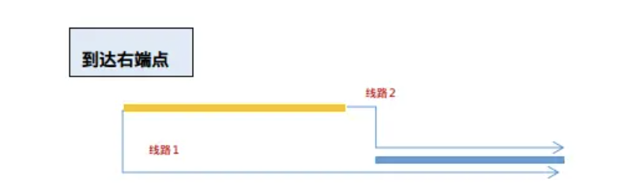
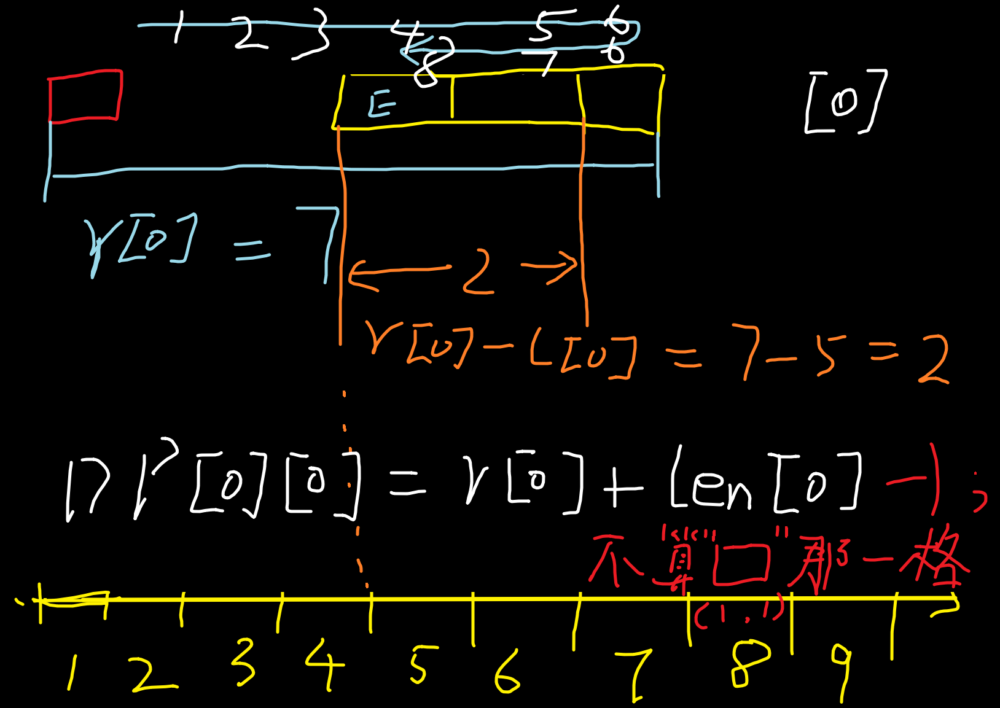
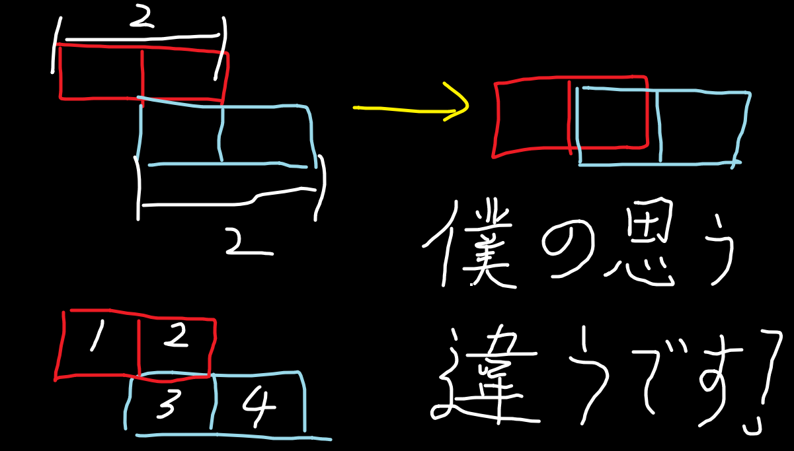
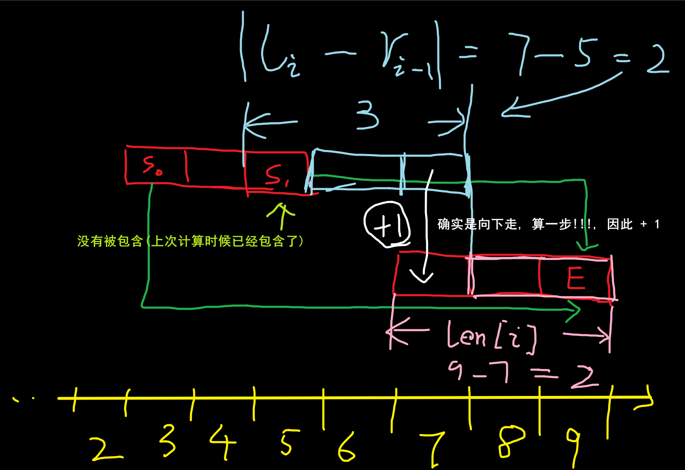

# [TJOI2007] 线段

## 题目描述

在一个 $n \times n$ 的平面上，在每一行中有一条线段，第 $i$ 行的线段的左端点是 $(i, L_{i})$，右端点是 $(i, R_{i})$。

你从 $(1,1)$ 点出发，要求沿途走过所有的线段，最终到达 $(n,n)$ 点，且所走的路程长度要尽量短。

更具体一些说，你在任何时候只能选择向下走一步（行数增加 $1$ ）、向左走一步（列数减少 $1$ ）或是向右走一步（列数增加 $1$ ）。当然，由于你不能向上行走，因此在从任何一行向下走到另一行的时候，你必须保证已经走完本行的那条线段。

## 输入格式

第一行有一个整数 $n$。

以下 $n$ 行，在第 $i$ 行（总第 $(i+1)$ 行）的两个整数表示 $L_i$ 和 $R_i$。

## 输出格式

仅包含一个整数，你选择的最短路程的长度。

## 样例 #1

### 样例输入 #1

```
6
2 6
3 4
1 3
1 2
3 6
4 5
```

### 样例输出 #1

```
24
```

## 提示

我们选择的路线是

```
 (1, 1) (1, 6)
 (2, 6) (2, 3)
 (3, 3) (3, 1)
 (4, 1) (4, 2)
 (5, 2) (5, 6)
 (6, 6) (6, 4) (6, 6)
```
不难计算得到，路程的总长度是 $24$。 

对于 $ 100\%$ 的数据中, $n \le 2 \times 10^4$，$1 \le L_i \le R_i \le n$。

# 作答
> ~~你以后就不能拿笔在纸上画一下吗, 靠截图然后脑补啊! 坐标你都对不齐!~~
## 大错特错!!!<sup>[1]</sup>
我直接根据 *样例*, 然后就画图, 然后就是模拟嘛~ ~~(有点像`贪心`)~~, 输出也正确, 但是14分...

```C++
void nodp_13(void)
{
    int n;
    scanf("%d", &n);
    int len = 0;
    int now_x = 1;
    for (int i = 0; i < n; ++i)
    {
        int l, r;
        scanf("%d %d", &l, &r);

        if (now_x <= l)
        {
            len += r - now_x + 1;
            now_x = r;
        }
        else if (now_x >= r)
        {
            len += now_x - l + 1;
            now_x = l;
        }
        else if (now_x < (l + r) / 2)
        {
            len += now_x - l;
            len += r - l;
            now_x = r;
        }
        else // (now_x >= ((r - l) >> 1) + l)
        {
            len += r - now_x;
            len += r - l;
            now_x = l;
        }
    }
    printf("%d", len + 1);
}
```

我无法理解! 当务之急就是寻找反例, 证明不能上面这样做. ~~(贪心 目光短浅)~~

图 好像一时之间画不出来, 但是你需要明白, 你当前的选择是会影响后续的...



> [!TIP]
> 这里指出一个误区：明明线路2比线路1要优秀，为什么还要考虑呢？其实很简单，f[0][i－1]可能要比f[1][i - 1]小很多，而不是f[1][i－1]一定大于f[0][i-1], 所以f[0][i－1] + abs(r[i] - [i－1])（从上一行左端点到这一行右端点）可能小于f[1][i－1]+αbs(r[i－1]－r[i]）（从上一行右端点到这行右端点)

> 更加详细的解析请看: [P3842 [TJOI2007]线段 图文题解](https://www.luogu.com.cn/blog/aakennes/solution-p3842), 下面也是~~发癫~~, 直接看解析得了, 艹

题解看上面的足够了!
## ~~正经题解~~
*我也是参考了别人的思路的, 才写得出来的. 艹*

通过`提示`或者自己实际上也发现, 在第i行 移动的结束一点是在线段的端点, 不然无法保证走完该行的线段.

所以可以设计**状态**: `DP[?][0或1]`, ~~? 还没有定,~~ `0或者1`是指在左端点还是又端点, 而DP[?][?]的值就是 从 $(1,1)$ 到 $(?, arr[?][0 或 1])$ 的最短距离.

### 状态

1. 上一行在左端点，下一行走到左端点；
2. 上一行在左端点，下一行走到右端点；
3. 上一行在右端点，下一行走到左端点；
4. 上一行在右端点，下一行走到右端点；

### 状态转移方程


> ##yellow##
> 🟡 <span style="color:red">注意: 我们不需要用而外变量来记录当前位置, 然后像上面的方式一样作差</span>

> ##green##
> 🟢 实际上, 完全可以从上一个状态的结果计算出当前的状态!, ~~你... 这是DP哇难道不是吗?!~~


```C++
f[i][1]=min(f[i-1][1]+abs(l[i]-r[i-1])+r[i]-l[i]+1,f[i-1][0]+abs(l[i]-l[i-1])+r[i]-l[i]+1);//本行走到右端点，上一行走到左/右端点，取最小值
f[i][0]=min(f[i-1][1]+abs(r[i]-r[i-1])+r[i]-l[i]+1,f[i-1][0]+abs(r[i]-l[i-1])+r[i]-l[i]+1);//本行走到左端点，上一行走到左/右端点，取最小值
```

### 初始化状态

走完然后在左端点:

$DP[0][0] = r[0] + len[0] - 1;$

即:



走完然后在右端点:

$DP[0][1] = r[0] - 1;$

过程同理, 减一是因为不算 点 $(1,1)$.

### 代码

```C++
void dp_13_02(void)
{
    int n;
    scanf("%d", &n);
    int* l = new int[n];
    int* r = new int[n];
    int* len = new int[n];
    int** DP = new int* [n + 1];
    for (int i = 0; i < n; ++i)
    {
        scanf("%d %d", &l[i], &r[i]);
        DP[i] = new int[2];
        len[i] = r[i] - l[i];
    }

    // 状态: 规定是 DP[i][0] 即 走完第i行, 位于左端点的 状况
    // 初始化
    DP[0][0] = r[0] + len[0] - 1;
    DP[0][1] = r[0] - 1; // 减一 和 下面的加一 是为什么呢?^[2]

    for (int i = 1; i < n; ++i)
    {
        DP[i][0] = getMin(DP[i - 1][0] + abs(r[i] - l[i - 1]), DP[i - 1][1] + abs(r[i] - r[i - 1])) + len[i] + 1;
        DP[i][1] = getMin(DP[i - 1][0] + abs(l[i] - l[i - 1]), DP[i - 1][1] + abs(r[i - 1] - l[i])) + len[i] + 1;
    }

    // 注意, 还需要计算 从该端点 到达 (n, n) 点的距离
    printf("%d", getMin(DP[n - 1][0] + n - l[n - 1], DP[n - 1][1] + n - r[n - 1]));
}
```
## 注解
### [1]
#### 继续错
~~已经看了(喵了)解析了,艹~~

我还是觉得这个思路好像也没有问题, 就是过不了...
```C++
void dp_13(void)
{
    int n;
    scanf("%d", &n);
    int* l = new int[n];
    int* r = new int[n];
    int** DP = new int* [n + 1];
    for (int i = 0; i < n; ++i)
    {
        scanf("%d %d", &l[i], &r[i]);
        DP[i] = new int[2];
        DP[i][0] = 0;
        DP[i][1] = 0;
    }

    // 初始化状态
    DP[0][0] = l[0]; // 左端点
    DP[0][1] = r[0]; // 右端点

    // 此处的状态转移方程是错误的, 思路是设计: 假设上一个状态没有完成, 就走完上一个状态, 然后到达本状态的端点
    // DP
    for (int i = 1; i < n; ++i)
    {
        DP[i][0] = getMin(DP[i - 1][0] + (r[i - 1] - l[i - 1]) + abs(r[i - 1] - l[i]), DP[i - 1][1] + (r[i - 1] - l[i - 1]) + abs(r[i - 1] - r[i])) + 1;
        DP[i][1] = getMin(DP[i - 1][0] + (r[i - 1] - l[i - 1]) + abs(l[i - 1] - l[i]), DP[i - 1][1] + (r[i - 1] - r[i - 1]) + abs(l[i - 1] - r[i])) + 1;
    }

    // 第n行还没有走过!
    printf("%d", getMin(DP[n - 1][0] + (n - l[n - 1]), DP[n - 1][1] + (r[n - 1] - l[n - 1] + 1 + (n - l[n - 1]))));
}
```
### [2]
为什么需要`加一`的解释!, 因为确实向下走算一步, ~~// 抱歉, 之前以为格子贴在一起了, 就不用算向下那一步了, 实际上是错误的! (向下走导致 x坐标没有变化, 但是步数+1)~~



