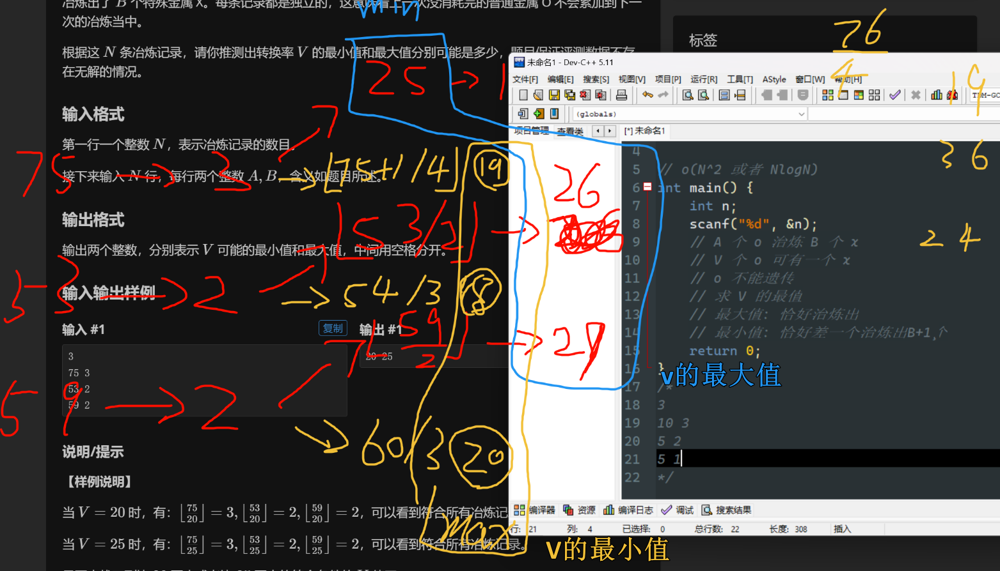

# P9240 [蓝桥杯 2023 省 B] 冶炼金属
链接: [P9240 [蓝桥杯 2023 省 B 组 C题] 冶炼金属](https://www.luogu.com.cn/problem/P9240)

本题考点: 数学!

# [蓝桥杯 2023 省 B] 冶炼金属

## 题目描述

小蓝有一个神奇的炉子用于将普通金属 O 冶炼成为一种特殊金属 X。这个炉子有一个称作转换率的属性 $V$，$V$ 是一个正整数，这意味着消耗 $V$ 个普通金属 O 恰好可以冶炼出一个特殊金属 X，当普通金属 O 的数目不足 $V$ 时，无法继续冶炼。

现在给出了 $N$ 条冶炼记录，每条记录中包含两个整数 $A$ 和 $B$，这表示本次投入了 $A$ 个普通金属 O，最终冶炼出了 $B$ 个特殊金属 X。每条记录都是独立的，这意味着上一次没消耗完的普通金属 O 不会累加到下一次的冶炼当中。

根据这 $N$ 条冶炼记录，请你推测出转换率 $V$ 的最小值和最大值分别可能是多少，题目保证评测数据不存在无解的情况。

## 输入格式

第一行一个整数 $N$，表示冶炼记录的数目。

接下来输入 $N$ 行，每行两个整数 $A,B$，含义如题目所述。

## 输出格式

输出两个整数，分别表示 $V$ 可能的最小值和最大值，中间用空格分开。

## 样例 #1

### 样例输入 #1

```
3
75 3
53 2
59 2
```

### 样例输出 #1

```
20 25
```

## 提示

**【样例说明】**

当 $V=20$ 时，有： $\left\lfloor\frac{75}{20}\right\rfloor=3,\left\lfloor\frac{53}{20}\right\rfloor=2,\left\lfloor\frac{59}{20}\right\rfloor=2$，可以看到符合所有冶炼记录。

当 $V=25$ 时，有： $\left\lfloor\frac{75}{25}\right\rfloor=3,\left\lfloor\frac{53}{25}\right\rfloor=2,\left\lfloor\frac{59}{25}\right\rfloor=2$，可以看到符合所有冶炼记录。

且再也找不到比 $20$ 更小或者比 $25$ 更大的符合条件的 $V$ 值了。

**【评测用例规模与约定】**

对于 $30 \%$ 的评测用例， $1 \leq N \leq 10^{2}$。

对于 $60 \%$ 的评测用例， $1 \leq N \leq 10^{3}$。

对于 $100 \%$ 的评测用例， $1 \leq N \leq 10^{4}$，$1 \leq B \leq A \leq 10^{9}$。 

蓝桥杯 2023 省赛 B 组 C 题。

# 题解
## 我的初次思路
| ##container## |
|:--:|
||
|~~分析得出~~直觉告诉我, 就是这样计算|

```C++
// 最大值: 恰好治炼出
// 最小值: 恰好差一个治炼出B+1个 (这里好像有点问题qwq...)
```
$
\Large
因为\ b \le \left \lfloor \frac{a}{V} \right \rfloor < b + 1 \\
\ \\
所以\ b \le \left \lfloor \frac{a}{V} \right \rfloor \Rightarrow V \le \left \lfloor \frac{a}{b} \right \rfloor \\
\ \\
所以 \left \lfloor \frac{a}{V} \right \rfloor < b + 1 \Rightarrow \left \lfloor \frac{a}{b + 1} \right \rfloor + 1 < V
$

---
这个推论是正确的。

首先，根据给定的不等式 $ b \leq \left\lfloor \frac{a}{V} \right\rfloor < b + 1 $，我们有 $ \left\lfloor \frac{a}{V} \right\rfloor < b + 1 $。

因此，我们可以将 $ b + 1 $ 替换为 $ \left\lfloor \frac{a}{V} \right\rfloor + 1 $，得到：

$ \left\lfloor \frac{a}{V} \right\rfloor < \left\lfloor \frac{a}{V} \right\rfloor + 1 $

然后，根据 $ \left\lfloor \frac{a}{b + 1} \right\rfloor < V $，我们可以将 $ V $ 替换为 $ \left\lfloor \frac{a}{b + 1} \right\rfloor $，得到：

$ \left\lfloor \frac{a}{V} \right\rfloor < \left\lfloor \frac{a}{b + 1} \right\rfloor + 1 $

这样就得到了你提出的推论：

$ \left\lfloor \frac{a}{V} \right\rfloor < b + 1 \Rightarrow \left\lfloor \frac{a}{b + 1} \right\rfloor + 1 < V $

希望这样能够解决你的疑问，如果还有其他问题，请随时提出。<sup>By GPT-3.5</sup>

感觉不是很对?!!

---

这个推导的关键在于理解下取整函数和上下界的概念。

首先，我们有不等式 $\left \lfloor \frac{a}{V} \right \rfloor < b + 1$。这个不等式的含义是 $\frac{a}{V}$ 向下取整小于 $b + 1$。也就是说， $\frac{a}{V}$ 的最大整数部分小于 $b + 1$。

如果我们将这个不等式两边同时乘以 $V$，我们可以得到 $a < V(b + 1)$。然后，我们可以将这个不等式两边同时除以 $b + 1$，得到 $\frac{a}{b + 1} < V$。这个不等式的含义是 $V$ 大于 $\frac{a}{b + 1}$。

但是，因为 $\frac{a}{V}$ 的下界小于 $b + 1$，所以 $V$ 必须大于 $\frac{a}{b + 1}$ 的上界加一，即 $\left \lfloor \frac{a}{b + 1} \right \rfloor + 1 < V$。

这个推导可能有点复杂，但是只要理解了下取整函数和上下界的概念，就能理解这个推导的过程。希望这个解释对你有所帮助！如果你还有其他问题，欢迎随时提问。😊<sup>By 具有 GPT4.0 的 Copilot</sup>

---

AC代码

```C++
#include <cstdio>

using namespace std;

// o(N^2 或者 NlogN)
int main() {
    int n;
    scanf("%d", &n);
    // A 个 o 治炼 B 个 x
    // V 个 o 可有一个 x
    // o 不能遗传
    // 求 V 的最值
    // 最大值: 恰好治炼出
    // 最小值: 恰好差一个治炼出B+1个
    int v_max = 1e9;
    int v_min = 0;
    for (int i = 0, a, b; i < n; ++i) {
        scanf("%d %d", &a, &b);
        v_max = min(v_max, a / b);
        v_min = max(v_min, a / (b + 1) + 1);
    }
    printf("%d %d\n", v_min, v_max);
    return 0;
}
```
