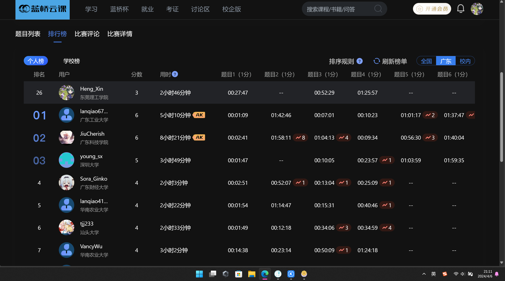

# 盖印章
链接: [盖印章](https://www.lanqiao.cn/problems/17160/learning/)

---

已知网格图被盖了印章后的形状, 并且一共使用了 $k$ 次印章, 问使用了几次印章 A、B ?


```C++
#include <iostream>
#include <string>

using namespace std;

int main() {
    // a + b == k
    int n, m, k;
    cin >> n >> m >> k;
    int sum = 0;
    for (int i = 0; i < n; ++i) {
        string tmp;
        cin >> tmp;
        for (int j = 0; j < m; ++j) {
            if (tmp[j] == '1')
                ++sum;
        }
    }

    // 解方程问题: 3a + 2b = sum
    // a + b = k
    // a = k - b
    // 3(k - b) + 2b = sum
    // 3k - b = sum
    // b = 3k - sum
    cout << k - (3 * k - sum) << " " << 3 * k - sum << endl;
    return 0;
}
```

## 第一次这么艹

| ##container## |
|:--:|
||
