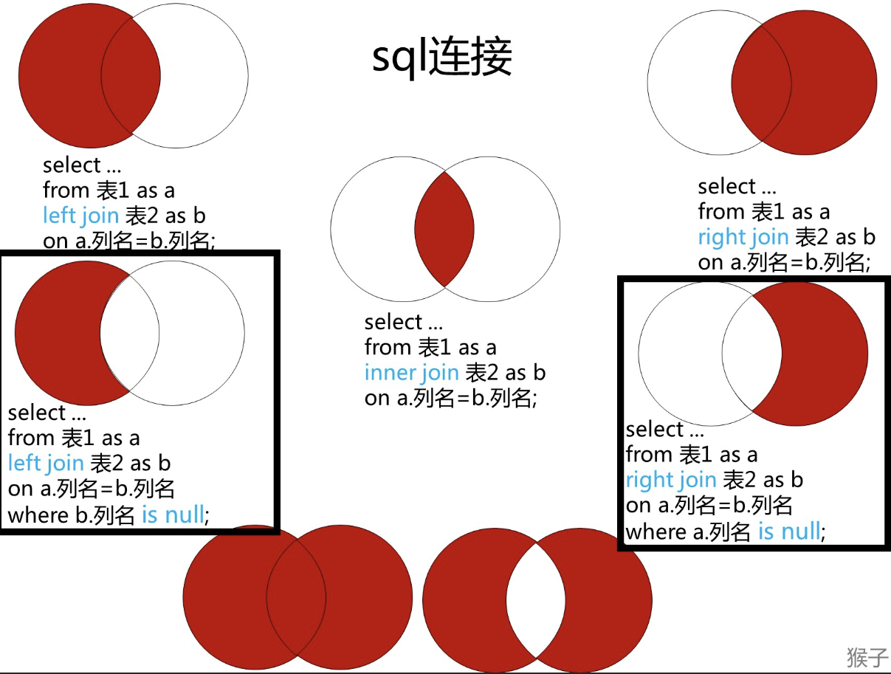

- [175. 组合两个表](https://leetcode.cn/problems/combine-two-tables/) (语法题)
- [176. 第二高的薪水](https://leetcode.cn/problems/second-highest-salary/) (查询出第一高的, 再查询出比第一高小的)
    ```sql
  select MAX(salary) as SecondHighestSalary from Employee where Employee.salary < (select MAX(salary) from Employee);
  ```

- [177. 第N高的薪水](https://leetcode.cn/problems/nth-highest-salary/) (分组(去重) + 排序 + 分页)
- [178. 分数排名](https://leetcode.cn/problems/rank-scores/) (窗口函数 / count+子查询)
  ```sql
  select s1.score, 
  (
      select count(distinct score) from Scores s2 where s1.score <= s2.score
  ) as `rank`
   from Scores s1 
   order by s1.score desc;

  -- 或
   select score, dense_rank() over (ORDER BY score desc) as `rank` from Scores;
  ```
- [181. 超过经理收入的员工](https://leetcode.cn/problems/employees-earning-more-than-their-managers/) (最好使用子查询, 而不是
  ```sql
  select e1.name Employee from Employee as e1
  where (select e2.salary from Employee as e2 
      where e1.managerId = e2.id) < e1.salary;

  -- 更快:
  select e1.name Employee from Employee as e1
  join Employee as e2
  where e1.managerId = e2.id AND e1.salary > e2.salary;
  ```
  )
- [180. 连续出现的数字](https://leetcode.cn/problems/consecutive-numbers/) (太坏了, 这类题: [拼多多面试题：如何找出连续出现N次的内容？](https://mp.weixin.qq.com/s?__biz=MzAxMTMwNTMxMQ==&mid=2649250661&idx=1&sn=b017344c701fbfa02a87a88a1a2207cd&chksm=835fd355b4285a43d6c55c593f83bbc7aea1bb370df8f52210bb3b3f7f5c5f304c272d863a04&token=546838497&lang=zh_CN#rd))
- [182. 查找重复的电子邮箱](https://leetcode.cn/problems/duplicate-emails/) (分组再按条件查询)
- [183. 从不订购的客户](https://leetcode.cn/problems/customers-who-never-order/) [图片来源](https://leetcode.cn/u/houzidata/)

  

  ```sql
  select c.name as Customers from Customers as c 
  LEFT join Orders as o
  on c.id = o.customerId
  where o.id is null;
  ```

- [184. 部门工资最高的员工](https://leetcode.cn/problems/department-highest-salary/)
  
  ```sql
  -- 查询每个组的最高工资, 先查询每个组(部门)的最高工资, 然后匹对
  select b.name as Department,
  a.name as Employee,
  a.salary as Salary
  from Employee as a
  join Department as b
  on a.departmentId = b.id
  join (select MAX(c.salary) as qian, c.departmentId from Employee as c
  group by c.departmentId) as d
  on d.departmentId = a.departmentId
  where a.salary = d.qian;
  ```
- [185. 部门工资前三高的所有员工](../002-部门工资前三高的所有员工/index.md) (困难!)
- [196. 删除重复的电子邮箱](https://leetcode.cn/problems/delete-duplicate-emails/)
- [197. 上升的温度](https://leetcode.cn/problems/rising-temperature/) (内连接+日期函数)
- [262. 行程和用户](../003-行程和用户/index.md)(复杂的关系)
- [511. 游戏玩法分析 I](https://leetcode.cn/problems/game-play-analysis-i/)
- [550. 游戏玩法分析 IV](../004-游戏玩法分析IV/index.md)(avg的妙用)
- [570. 至少有5名直接下属的经理](https://leetcode.cn/problems/managers-with-at-least-5-direct-reports/)
- [577. 员工奖金](https://leetcode.cn/problems/employee-bonus/)
- [584. 寻找用户推荐人](https://leetcode.cn/problems/find-customer-referee/) (简单但又有坑)

    <=> 操作符和 = 操作符类似，不过 <=> 可以用来判断 NULL 值，具体语法规则为： 当两个操作数均为 NULL 时，其返回值为 1 而不为 NULL； 而当一个操作数为 NULL 时，其返回值为 0 而不为 NULL。
  ```sql
  -- select name from Customer where referee_id != 2 or referee_id is null;
  select name from Customer where NOT referee_id <=> 2;
  ```
- [585. 2016年的投资](https://leetcode.cn/problems/investments-in-2016/) (添加略复杂, 使用窗口函数更好)
  
  ```sql
  -- tiv_2016 所有满足下述条件金额 之和
  -- 他在 2015 年的投保额 (tiv_2015) 至少跟一个其他投保人在 2015 年的投保额相同。
  -- 他所在的城市必须与其他投保人都不同（也就是说 (lat, lon) 不能跟其他任何一个投保人完全相同）。
  -- tiv_2016 四舍五入的 两位小数
  
  select
      ROUND(SUM(a.tiv_2016), 2) as tiv_2016 
  from
      Insurance as a
  where (
      select
          COUNT(b.tiv_2015)
      from
          Insurance as b
      where
          a.pid != b.pid 
          AND a.tiv_2015 = b.tiv_2015
      ) >= 1
      AND (
          select
              COUNT(c.pid)
          from
              Insurance as c
          where
              a.pid != c.pid
              AND a.lat = c.lat
              AND a.lon = c.lon
      ) = 0;
  ```
- [586. 订单最多的客户](https://leetcode.cn/problems/customer-placing-the-largest-number-of-orders/) (我觉得这个不是简单题qwq, 首先是语文要仔细看题...)

  ```sql
  -- 查找下了 最多订单 的客户的 customer_number 。
  -- 测试用例生成后， 恰好有一个客户 比任何其他客户下了更多的订单。
  
  select 
      c.num as customer_number -- 一开始有输出null但是题目要求不能这样输出, 所以专门判断一次... (但是实际上现在可以去掉这层了, 因为没事了qwq)
  from (
          select -- 查找点订单的最大值
              a.m as mm,
              a.num as num
          from 
              (
                  select -- 查找订单数量
                      COUNT(b.customer_number) as m,
                      b.customer_number as num
                  from
                      Orders as b
                  group by
                      b.customer_number
              ) as a
          group by a.num
          ORDER BY a.m DESC
          LIMIT 0, 1
      ) as c
  where c.mm is not null;
  ```
- [595. 大的国家](https://leetcode.cn/problems/big-countries/)
- [596. 超过5名学生的课](https://leetcode.cn/problems/classes-more-than-5-students/)
- [601. 体育馆的人流量](../005-体育馆的人流量/index.md)(能过!=可移植!=最优)
- [602. 好友申请 II ：谁有最多的好友](../006-好友申请II：谁有最多的好友/index.md)(合并: 行转列)
- [607. 销售员](https://leetcode.cn/problems/sales-person/)(<<简单>>~~(誰家簡單題三個表啊?)~~)
- [608. 树节点](https://leetcode.cn/problems/tree-node/solutions/2692668/left-join-zi-cha-xun-if-bu-shi-yong-in-b-by3t/)
- [610. 判断三角形](https://leetcode.cn/problems/triangle-judgement/)
- [619. 只出现一次的最大数字](https://leetcode.cn/problems/biggest-single-number/)
- [620. 有趣的电影](https://leetcode.cn/problems/not-boring-movies/)
- [626. 换座位](https://leetcode.cn/problems/exchange-seats/)
- [627. 变更性别](https://leetcode.cn/problems/swap-salary/)
- [1045. 买下所有产品的客户](https://leetcode.cn/problems/customers-who-bought-all-products/)
- [1050. 合作过至少三次的演员和导演](https://leetcode.cn/problems/actors-and-directors-who-cooperated-at-least-three-times/)
- [1068. 产品销售分析 I](https://leetcode.cn/problems/product-sales-analysis-i/)
- [1070. 产品销售分析 III](https://leetcode.cn/problems/product-sales-analysis-iii/) (真坑, 同一年有多条数据, 也要输出)
- [1075. 项目员工 I](https://leetcode.cn/problems/project-employees-i/)
- [1084. 销售分析III](https://leetcode.cn/problems/sales-analysis-iii/) (having夹逼)
- [1141. 查询近30天活跃用户数](https://leetcode.cn/problems/user-activity-for-the-past-30-days-i/) (日期区间)
- [1148. 文章浏览 I](https://leetcode.cn/problems/article-views-i/)
- [1158. 市场分析 I](https://leetcode.cn/problems/market-analysis-i/)(略有小坑)
- [1164. 指定日期的产品价格](https://leetcode.cn/problems/product-price-at-a-given-date/)
- [1174. 即时食物配送 II](https://leetcode.cn/problems/immediate-food-delivery-ii/)
- [1211. 查询结果的质量和占比](https://leetcode.cn/problems/queries-quality-and-percentage/) (怎么会有人的名字叫`null`)
- [1179. 重新格式化部门表](https://leetcode.cn/problems/reformat-department-table/) ((列转行)最需要英语的一集)
- [1193. 每月交易 I](https://leetcode.cn/problems/monthly-transactions-i/) (mysql的`group by`可以分类字段的别名)
- [1204. 最后一个能进入巴士的人](https://leetcode.cn/problems/last-person-to-fit-in-the-bus/) (窗口函数/自定义变量/自连接)
- [1251. 平均售价](https://leetcode.cn/problems/average-selling-price/) (这?简单题)
- [1280. 学生们参加各科测试的次数](https://leetcode.cn/problems/students-and-examinations/) (笛卡尔积, 这tm简单题?)
- [1321. 餐馆营业额变化增长](https://leetcode.cn/problems/restaurant-growth/) (窗口)
- [1341. 电影评分](https://leetcode.cn/problems/movie-rating/) (十分综合! 注: 评分要avg求..)
- [1393. 股票的资本损益](https://leetcode.cn/problems/capital-gainloss/) (sum(if(,,)))
- [1407. 排名靠前的旅行者](https://leetcode.cn/problems/top-travellers/) (排序)
- [1484. 按日期分组销售产品](https://leetcode.cn/problems/group-sold-products-by-the-date/) (`GROUP_CONCAT()` 需要api: [mysql 字符串拼接的几种方式](https://blog.csdn.net/syslbjjly/article/details/90640975))
- [1517. 查找拥有有效邮箱的用户](https://leetcode.cn/problems/find-users-with-valid-e-mails/) (正则表达式)
- [1527. 患某种疾病的患者](https://leetcode.cn/problems/patients-with-a-condition/) (正则表达式/like)
- [1581. 进店却未进行过交易的顾客](https://leetcode.cn/problems/customer-who-visited-but-did-not-make-any-transactions/) (纯纯tm的阅读理解)
- [1587. 银行账户概要 II](https://leetcode.cn/problems/bank-account-summary-ii/)
- [1633. 各赛事的用户注册率](https://leetcode.cn/problems/percentage-of-users-attended-a-contest/)
- [1661. 每台机器的进程平均运行时间](https://leetcode.cn/problems/average-time-of-process-per-machine/)
- [1667. 修复表中的名字](https://leetcode.cn/problems/fix-names-in-a-table/) (首字母大写(考察字符串函数))
- [1683. 无效的推文](https://leetcode.cn/problems/invalid-tweets/)(字符个数`CHAR_LENGTH`, 字节个数`LENGTH`)
- [1693. 每天的领导和合伙人](https://leetcode.cn/problems/daily-leads-and-partners/)
- [1729. 求关注者的数量](https://leetcode.cn/problems/find-followers-count/)
- [1731. 每位经理的下属员工数量](https://leetcode.cn/problems/the-number-of-employees-which-report-to-each-employee/)
- [1741. 查找每个员工花费的总时间](https://leetcode.cn/problems/find-total-time-spent-by-each-employee/)
- [1757. 可回收且低脂的产品](https://leetcode.cn/problems/recyclable-and-low-fat-products/)
- [1789. 员工的直属部门](https://leetcode.cn/problems/primary-department-for-each-employee/) (可以窗口函数,但是我看不懂, 也可以`union`, 但是我直接`left join + if`)
- [1795. 每个产品在不同商店的价格](https://leetcode.cn/problems/rearrange-products-table/) (`UNION all`)
- [1873. 计算特殊奖金](https://leetcode.cn/problems/calculate-special-bonus/)
- [1890. 2020年最后一次登录](https://leetcode.cn/problems/the-latest-login-in-2020/)
- [1907. 按分类统计薪水](https://leetcode.cn/problems/count-salary-categories/) (`UNION all`)
- [1934. 确认率](https://leetcode.cn/problems/confirmation-rate/)
- [1965. 丢失信息的雇员](https://leetcode.cn/problems/employees-with-missing-information/) (`left join + union / 数学计数`)
- [1978. 上级经理已离职的公司员工](https://leetcode.cn/problems/employees-whose-manager-left-the-company/)
- [2356. 每位教师所教授的科目种类的数量](https://leetcode.cn/problems/number-of-unique-subjects-taught-by-each-teacher/)