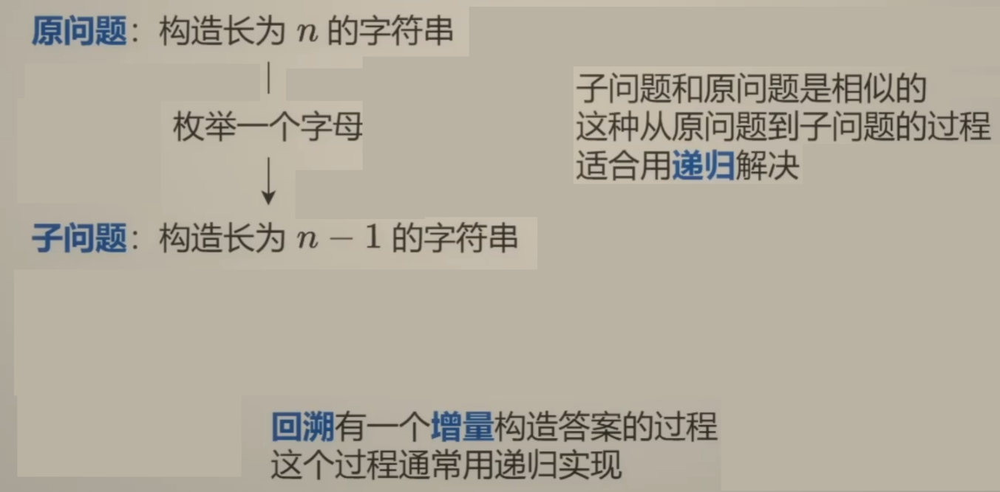
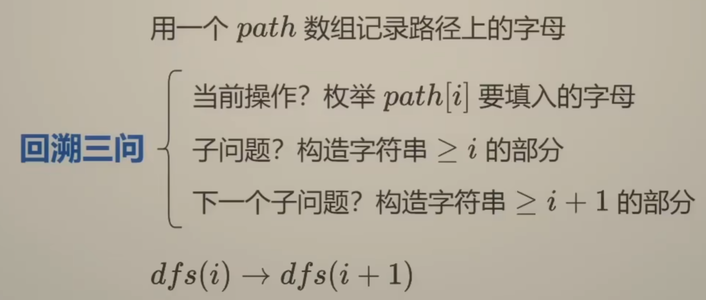
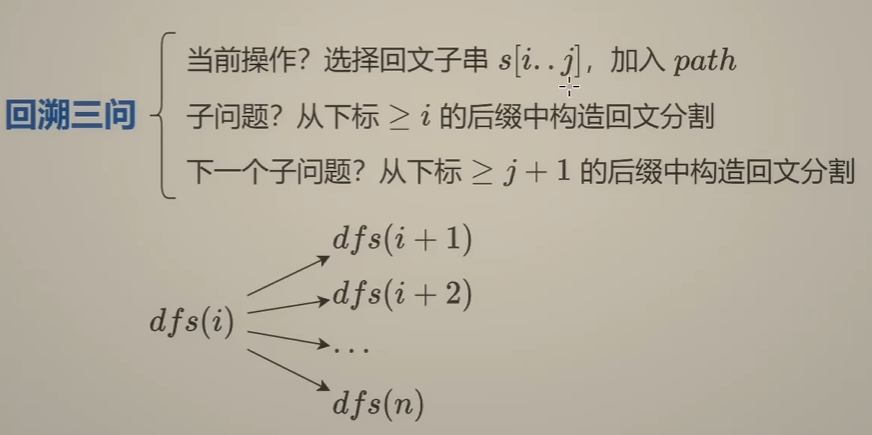
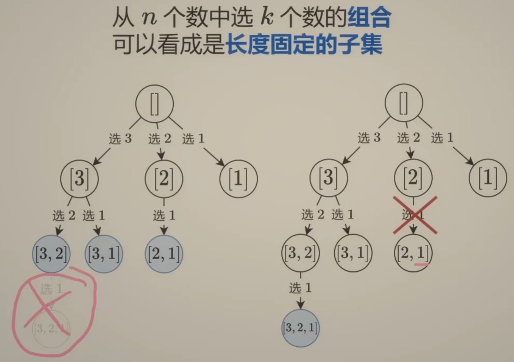
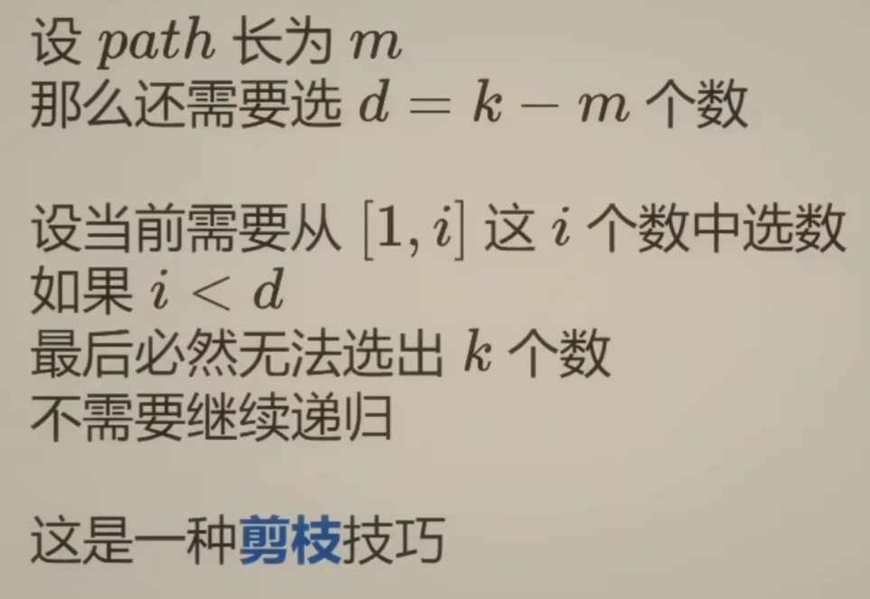

# 子集型回溯

学习视频: [回溯算法套路①子集型回溯【基础算法精讲 14】](https://www.bilibili.com/video/BV1mG4y1A7Gu/)

课上题目 + 多语言代码:
- [17. 电话号码的字母组合](https://leetcode.cn/problems/letter-combinations-of-a-phone-number/solutions/2059416/hui-su-bu-hui-xie-tao-lu-zai-ci-pythonja-3orv/)
- [78. 子集](https://leetcode.cn/problems/subsets/solutions/2059409/hui-su-bu-hui-xie-tao-lu-zai-ci-pythonja-8tkl/)
- [131. 分割回文串](../../002-力扣/003-未分类题解/002-分割回文串/index.md) （包含一种判断回文字符串的方法 双指针)

课后作业:
- [784. 字母大小写全排列](../../002-力扣/003-未分类题解/010-字母大小写全排列/index.md)
- [LCP 51. 烹饪料理](https://leetcode.cn/problems/UEcfPD/)
- [2397. 被列覆盖的最多行数](https://leetcode.cn/problems/maximum-rows-covered-by-columns/)
- [2151. 基于陈述统计最多好人数](https://leetcode.cn/problems/maximum-good-people-based-on-statements/)
- [1601. 最多可达成的换楼请求数目](https://leetcode.cn/problems/maximum-number-of-achievable-transfer-requests/)
- [306. 累加数](https://leetcode.cn/problems/additive-number/)
- [93. 复原 IP 地址](https://leetcode.cn/problems/restore-ip-addresses/)
- [2698. 求一个整数的惩罚数](https://leetcode.cn/problems/find-the-punishment-number-of-an-integer/)

---

**递归** $只要边界条件和非边界1条件写对$, 那么就不会出错, 剩下的交给数学归纳法就OK

| ##container## |
|:--:|
|<br><br>|

# 组合型回溯

> <span style="color:yellow"> 组合型回溯, 相当于在`子集型回溯`里面增添了一个**剪枝**操作.</span>

---

例如: [77. 组合](https://leetcode.cn/problems/combinations/description/)

给定两个整数`n`和`k`，返回范围`[1, n]`中所有可能的`k`个数的组合。

你可以按 **任何顺序** 返回答案。

**示例:**

```C++
输入：n = 4, k = 2
输出：
[
  [2,4],
  [3,4],
  [2,3],
  [1,2], // [1, 2] 和 [2, 1] 是同一种答案
  [1,3],
  [1,4],
]
```

- *注: 此处的组合和子集, 就类似于 $C_b^a$ 与 $A_b^a$ 的关系一样*

---

| ##container## |
|:--:|
|<br>|

代码:

**方法一：枚举下一个数选哪个** (枚举即有`for`)
```C++
class Solution {
public:
    vector<vector<int>> combine(int n, int k) {
        vector<vector<int>> res;
        vector<int> arr;
        function<void(int, int)> dfs =
        [&](int i, int len) {
            if (len == k) {
                res.push_back(arr);
                return;
            }

            if (i - k >= n)
                return;

            // 枚举
            for (int index = i; index < n; ++index) {
                arr.push_back(index + 1);
                dfs(index + 1, len + 1);
                arr.pop_back();
            }

        };

        dfs(0, 0);

        return res;
    }
};
```

**方法二：选或不选**

```C++
class Solution {
public:
    vector<vector<int>> combine(int n, int k) {
        /*
        选或者不选, ~~需要记录是否选择了~~ <--无需!
        */
        vector<vector<int>> res;
        vector<int> arr;
        function<void(int, int)> dfs =
        [&](int i, int len) {
            if (i - k >= n
            || i > n)
                return;

            if (len == k) {
                res.push_back(arr);
                return;
            }

            // 不选
            dfs(i + 1, len);

            // 选
            arr.push_back(i + 1);
            dfs(i + 1, len + 1);
            arr.pop_back();
        };

        dfs(0, 0);

        return res;
    }
};
```

学习视频: [回溯算法套路②组合型回溯+剪枝【基础算法精讲 15】](https://www.bilibili.com/video/BV1xG4y1F7nC/)

课后作业:

- [77. 组合](https://leetcode.cn/problems/combinations/)
- [216. 组合总和 III](https://leetcode.cn/problems/combination-sum-iii/)
- [22. 括号生成](https://leetcode.cn/problems/generate-parentheses/description/)

课后作业：
换一种写法完成上面三题。
- [301. 删除无效的括号](https://leetcode.cn/problems/remove-invalid-parentheses/)