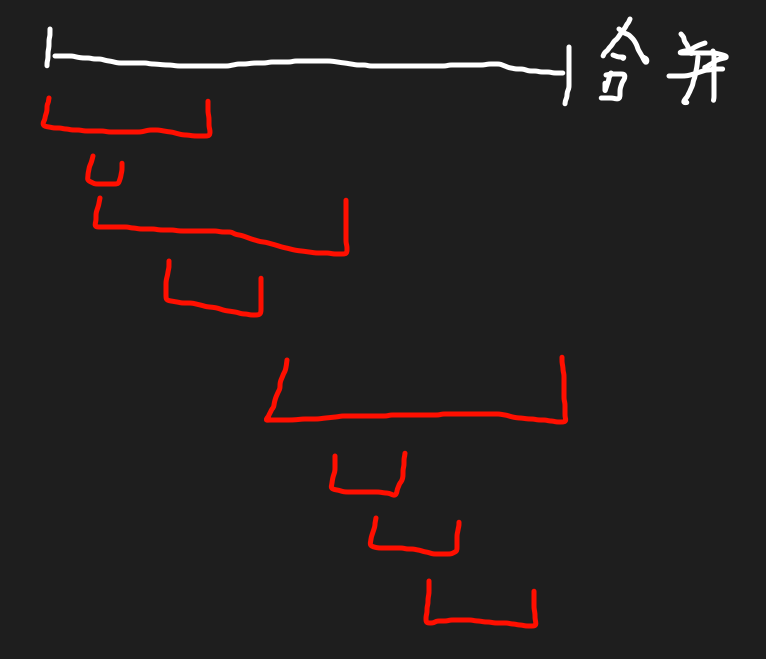

# 合并区间
> 起因: 今天的每日一题是: [2580. 统计将重叠区间合并成组的方案数](https://leetcode.cn/problems/count-ways-to-group-overlapping-ranges/description/) 我的做法是:
```C++
class Solution {
    const int mod = 1e9 + 7;
    long long hxpow(long long a, long long b) {
        long long res = 1;
        while (b) {
            if (b & 1)
                res = res * a % mod;
            a = a * a % mod;
            b >>= 1;
        }
        return res;
    }

    int findArr(int t, const vector<int>& arr) {
        // 返回第一个大于等于 t 的位置的索引
        int l = 0;
        int r = arr.size() - 1;
        while (l <= r) {
            int mid = l + ((r - l) >> 1);
            if (arr[mid] < t) {
                l = mid + 1;
            } else {
                r = mid - 1;
            }
        }
        return l;
    }
public:
    int countWays(vector<vector<int>>& ranges) {
        // 枚举有多少个重叠区域, 然后 return 重叠区域个数(n): 2^n % mod
        // 如何存放区域?
        // 原本是[a, b], 添加入 [x, y]
        // 如果 x <= a <= y 或者 x <= b <= y
        // 那么合并区间即可 [min(a, x), max(b, y)]
        // 但是如何快速查找到区间呢?
        // 使用一个新的数组? 采用二分查找, 
        // 定义 [arr[i], arr[i + 1]] i 为偶数, 为一个区间?
        // 最终 n = arr.size() >> 1;
        sort(ranges.begin(), ranges.end(), [](const vector<int>& a,
        const vector<int>& b){
            return a[0] < b[0];
        });

        vector<int> arr(ranges[0].begin(), ranges[0].end());
        for (int i = 1; i < ranges.size(); ++i) {
            int index = findArr(ranges[i][0], arr);
            if (index == arr.size()) {
                // 找不到, 即全部都比t小
                arr.push_back(ranges[i][0]);
                arr.push_back(ranges[i][1]);
            } else {
                if (index & 1) {
                    // 为后一个
                    --index;
                }
                // 判断是否有交集
                // if (arr[index] <= ranges[i][0]
                // && ranges[i][0] <= arr[index + 1]) {
                    arr[index] = min(arr[index], ranges[i][0]);
                    arr[index + 1] = max(arr[index + 1], ranges[i][1]);
                // }
                // else {
                //     // 没有交集
                //     if (index + 2 < arr.size()
                //     && ranges[i][1] < arr[index + 2]) {

                //     }
                // }
            }
        }

        return hxpow(2, (int)arr.size() >> 1);
    }
};
```
我发现我不太会 [合并区间], 甚至自己琢磨了一个数据结构(?<sup>*就一个有规则的数组罢了*</sup>)

然后看 03xf 大佬的代码居然这么短, 然后就学习了: [换根 DP【力扣双周赛 99】](https://www.bilibili.com/video/BV1dY4y1C77x/)的`Q3`

学习到:

对于混乱的区间数组`vector<vector<int>>& ranges`, 我们可以按照每一个区间的 **左端点** 进行排序:

| ##container## |
|:--:|
||

然后从 $i=0$ 开始, 依次加入`vector<vector<int>>res`中, 并且使用一个指针(使用`res.size() - 1`也可以)指向最后一个区间的位置, 对新的`ranges[i]`判断`ranges[i][0] <= res[res.size() - 1][1]`, 如果为真则合并区间, 否则就是一个新的区间, 中间有隔阂.

例题: [56. 合并区间](https://leetcode.cn/problems/merge-intervals/description/)

AC代码:
```C++
class Solution {
public:
    vector<vector<int>> merge(vector<vector<int>>& intervals) {
        vector<vector<int>> res;
        sort(intervals.begin(), intervals.end(), [](const vector<int>& a, const vector<int>& b){
            return a[0] < b[0];
        }); // 按照区间左端点排序

        res.push_back(intervals[0]);
        int resArrIndex = 0;
        for (int i = 1; i < intervals.size(); ++i) {
            if (res[resArrIndex][1] >= intervals[i][0]) {
                // 合并区间
                res[resArrIndex][1] = max(res[resArrIndex][1], intervals[i][1]);
            } else {
                // 无法合并
                res.push_back(intervals[i]);
                ++resArrIndex;
            }
        }
        return res;
    }
};
```
