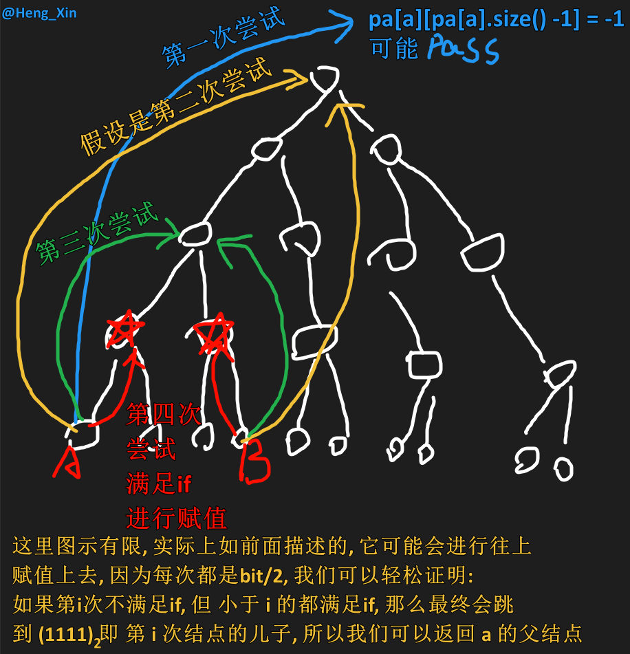

# 树上倍增算法
> 题目: [1483. 树节点的第 K 个祖先](https://leetcode.cn/problems/kth-ancestor-of-a-tree-node/description/) (又被每日一题干了)
>
> 学习: [【模板讲解】树上倍增算法（以及最近公共祖先）Python/Java/C++/Go](https://leetcode.cn/problems/kth-ancestor-of-a-tree-node/solutions/2305895/mo-ban-jiang-jie-shu-shang-bei-zeng-suan-v3rw)

## 题目
给你一棵树，树上有 $n$ 个节点，按从 $0$ 到 $n-1$ 编号。树以父节点数组的形式给出，其中`parent[i]`是节点`i`的父节点。树的根节点是编号为 $0$ 的节点。

树节点的第 $k$ 个祖先节点是从该节点到根节点路径上的第 $k$ 个节点。

实现 TreeAncestor 类：

- `TreeAncestor(int n， int[] parent)`对树和父数组中的节点数初始化对象。
- `getKthAncestor(int node, int k)`返回节点 $node$ 的第 $k$ 个祖先节点。如果不存在这样的祖先节点，返回 $-1$。

提示:

$
1 <= k <= n <= 5 * 10^4\\
parent[0] == -1 表示编号为 0 的节点是根节点。\\
对于所有的 0 < i < n ，0 <= parent[i] < n 总成立\\
0 <= node < n\\
至多查询 5 * 10^4 次\\ \ \\
$

---

*我的代码*

时间复杂度: $ 构建: O(n^2), 查询 O(1)$

空间复杂度: $O(n^2)$

```C++
class TreeAncestor {
    vector<vector<int>> res;
public:
    TreeAncestor(int n, vector<int>& parent) {
        // 拓扑排序, 得出 子结点的所有父节点的v
        res = vector<vector<int>>(n);
        vector<int> don(n); // 入度数组
        vector<vector<int>> G(n); // 临时构建图
        for (int i = 1; i < parent.size(); ++i) { // 除去根结点
            // p[i] 是 i 的父结点
            // 即 p[i] -> i
            G[parent[i]].push_back(i);
            ++don[i];
        }

        queue<int> Q;
        for (int i = 0; i < don.size(); ++i) {
            if (don[i] == 0) {
                Q.push(i);
            }
        }

        while (Q.size()) {
            int x = Q.front();
            Q.pop();

            for (int& it : G[x]) {
                if (--don[it] == 0) {
                    res[it].insert(res[it].end(), res[x].begin(), res[x].end());
                    res[it].push_back(x);
                    Q.push(it);
                }
            }
        }

        // for (int i = 0; i < res.size(); ++i) {
        //     cout << i << "的父结点有: ";
        //     for (int& it : res[i])
        //         cout << it << " ";
        //     cout << endl;
        // }
    }
    
    int getKthAncestor(int node, int k) {
        if (res[node].size() < k)
            return -1;
        // cout << node << "的第" << k << "个父结点是: " << res[node][res[node].size() - k] << endl;
        return res[node][res[node].size() - k];
    }
};

/**
 * Your TreeAncestor object will be instantiated and called as such:
 * TreeAncestor* obj = new TreeAncestor(n, parent);
 * int param_1 = obj->getKthAncestor(node,k);
 */
```

### 正解
#### 1. 思考
最暴力的做法是，从 $node$ 出发，一步一步地往上跳，即 $$node → parent[node] → parent[parent[node]] → ...$$ 需要跳 $k$ 次才能到达 $node$ 的第 $k$ 个祖先节点，时间复杂度为 $O(k)$。

如何优化这个暴力算法呢？

一个初步的想法是，预处理出每个节点的「爷爷节点」，即父节点的父节点，那么就可以两步两步地往上跳，从而减少一半的跳跃次数（循环次数）。

进一步地，再预处理出爷爷节点的爷爷节点，就可以四步四步地往上跳。

请你思考：一般地，要预处理出哪些节点呢？如何利用这些预处理出的节点，快速地找到第 $k$ 个祖先节点？

#### 2. 解惑
预处理出**每个节点**的第 $2^i$ 个祖先节点，即第 $1,2,4,8,...$ 个祖先节点（其中 $x$ 的第 $1$ 个祖先节点就是 $parent[x]$ ）。由于任意 $k$ 可以分解为若干不同的 $2$ 的幂（例如 $13 = 8 + 4 + 1$ ），所以只需要预处理出这些 $2^i$ 祖先节点，就可以快速地到达**任意**第 $k$ 个祖先节点。

据此，可以得到下面的算法。

自己写的: 这tm是tm的tm的动态规划?!
```C++
class TreeAncestor {
    vector<vector<int>> pb;
    // pb[n][2^i]
    // pb[?][0] 即 ? 的父结点
    // pb[?][1] 即 pb[pb[?][0]][0] 即 ? 的 父结点的父结点
    // => pb[?][2^i] == pb[pb[?][2^{i-1}]][2^{i-1}]

    // 获取 n 的位数, 例如 13 -> 1101 -> 4
    int findBit(int n) {
        int res = 0;
        while (n) {
            ++res;
            n >>= 1;
        }
        return res;
    }

public:
    TreeAncestor(int n, vector<int>& parent) {
        int len = findBit(n); // 寻找出 logn 的下取整
        pb = vector<vector<int>> (n, vector<int>(len, -1));
        // 预处理每个节点的父结点
        for (int i = 0; i < n; ++i)
            pb[i][0] = parent[i];
        
        // 再处理出每个结点的
        for (int b = 1; b < len; ++b) {
            for (int i = 0; i < n; ++i) {
                if (pb[i][b - 1] == -1)
                    continue;
                int tmp = pb[pb[i][b - 1]][b - 1];
                if (tmp != -1) {
                    pb[i][b] = tmp;
                }
            }
        }
    }
    
    int getKthAncestor(int node, int k) {
        // 把 k 解析
        // 例如 寻找 第 k=3 (11)_2 个祖先
        // = 父 -> 父父
        int b = 0;
        while (k) {
            if (k & 1) {
                node = pb[node][b];
                if (node == -1)
                    return -1;
            }
            ++b;
            k >>= 1;
        }
        return node;
    }
};

/**
 * Your TreeAncestor object will be instantiated and called as such:
 * TreeAncestor* obj = new TreeAncestor(n, parent);
 * int param_1 = obj->getKthAncestor(node,k);
 */
```

## 树上倍增的使用条件

<b style="color:yellow">一个点有一条指向另外一个节点的边</b>

这样我们就可以从底下的点, 上到更上的点, 类似于离散的点汇合在一起(根, (也可以成环))

注: *不是指出入度为`1`*, 例如上图, 是入度为一, 出度为可变

# 最近公共祖先

> 上题的拓展: 如何计算树上任意两点 $x$ 和 $y$ 的最近公共祖先 $(LCA)$ ?

## 性质

本节性质部分内容翻译自wcipeg，并做过修改。
1. $LCA({u}) = u$;
2. $u$ 是 $v$ 的祖先, 当且仅当 $LCA(u,v) =u$ ;
3. 如果不为的祖先并且不为的祖先，那么,分别处于 LCA(u,v)的两棵不同子树
中;
4. 前序遍历中, $LCA(S)$ 出现在所有 $S$ 中元素之前，后序遍历中 $LCA(S)$ 则出现在所有 $S$ 中元素之后;
5. 两点集并的最近公共祖先为两点集分别的最近公共祖先的最近公共祖先，即 $LCA(A U B) = LCA(LCA(A), LCA(B))$ ;
6. <d style="color:red">两点的最近公共祖先必定处在树上两点间的最短路上</d>；
7. $d(u,v) = h(u) + h(v) - 2h(LCA(u,v))$，其中 $d$ 是树上两点间的距离. $h$ 代表某点到树根的距离。<sup>[来源: [oi-wiki-lca](https://oi-wiki.org/graph/lca/)]</sup>

## 步骤
### 1. 计算深度数组

设节点 $i$ 的深度为 $depth[i]$。这可以通过一次 **DFS** 预处理出来。

### 2. 加倍寻辈

假设 $\operatorname{depth}[x] \leq \operatorname{depth}[y]$ (否则交换两点)。我们可以先把更靠下的 $y$ 更新为 $y$ 的第 $\operatorname{depth}[y]-\operatorname{depth}[x]$ 个祖先节点，这样 $x$ 和 $y$ 就处在同一深度了。

如果此时 $x=y$, 那么 $x$ 就是 $LCA$。否则说明 $LCA$ 在更上面，那么就把 $x$ 和 $y$ 一起往上跳。

由于不知道 $LCA$ 的具体位置，只能不断尝试，先尝试大步跳，再尝试小步跳。设 $i=\left\lfloor\log _{2} n\right\rfloor$, 循环直到 $i<0$。每次循环:
- 如果 $x$ 的第 $2^{i}$ 个祖先节点不存在，即 $pa[x][i]=-1$，说明步子迈大了，将 $i$ 减 $1$，继续循环。
- 如果 $x$ 的第 $2^{i}$ 个祖先节点存在，且 $pa[x][i]$ ≠ $pa[y][i]$, 说明 $LCA$ 在 $pa[x][i]$ 的上面，那么更新 $x$ 为 $pa[x][i]$, 更新 $y$ 为 $pa[y][i]$, 将 $i$ 减 $1$, 继续循环。否则，若 $pa[x][i]=pa[y][i]$, 那么 $LCA$ 可能在 $pa[x][i]$ 下面，由于无法向下跳，只能将 $i$ 减 $1$, 继续循环。

上述做法能跳就尽量跳，不会错过任何可以上跳的机会。所以循环结束时， $x$ 与 $LCA$ 只有一步之遥，即 $LAC=pa[x][0]$。

```C++
class TreeAncestor {
    vector<int> depth;
    vector<vector<int>> pa;
public:
    TreeAncestor(vector<pair<int, int>> &edges) {
        int n = edges.size() + 1;
        int m = 32 - __builtin_clz(n); // n 的二进制长度
        vector<vector<int>> g(n);
        for (auto [x, y]: edges) { // 节点编号从 0 开始
            g[x].push_back(y);
            g[y].push_back(x);
        }

        depth.resize(n);
        pa.resize(n, vector<int>(m, -1));
        function<void(int, int)> dfs = [&](int x, int fa) {
            pa[x][0] = fa;
            for (int y: g[x]) {
                if (y != fa) {
                    depth[y] = depth[x] + 1;
                    dfs(y, x);
                }
            }
        };
        dfs(0, -1);

        for (int i = 0; i < m - 1; i++)
            for (int x = 0; x < n; x++)
                if (int p = pa[x][i]; p != -1)
                    pa[x][i + 1] = pa[p][i];
    }

    int get_kth_ancestor(int node, int k) {
        for (; k; k &= k - 1)
            node = pa[node][__builtin_ctz(k)];
        return node;
    }

    // 返回 x 和 y 的最近公共祖先（节点编号从 0 开始）
    int get_lca(int x, int y) {
        if (depth[x] > depth[y])
            swap(x, y);
        // 使 y 和 x 在同一深度
        y = get_kth_ancestor(y, depth[y] - depth[x]);
        if (y == x)
            return x;
        for (int i = pa[x].size() - 1; i >= 0; i--) {
            int px = pa[x][i], py = pa[y][i];
            if (px != py) {
                x = px;
                y = py;
            }
        }
        return pa[x][0];
    }
};

// 作者：灵茶山艾府
// 链接：https://leetcode.cn/problems/kth-ancestor-of-a-tree-node/solutions/2305895/mo-ban-jiang-jie-shu-shang-bei-zeng-suan-v3rw/
// 来源：力扣（LeetCode）
// 著作权归作者所有。商业转载请联系作者获得授权，非商业转载请注明出处。
```

| ##container## |
|:--:|
||

所以才这样写:

```C++
for (int i = pa[x].size() - 1; i >= 0; i--) {
    int px = pa[x][i], py = pa[y][i];
    if (px != py) {
        x = px;
        y = py;
    }
}
```

## 练习
### [P3379 【模板】最近公共祖先（LCA）](https://www.luogu.com.cn/problem/P3379)

我的代码: 类似于临摹03xf大佬的代码...
```C++
#include <cstdio>
#include <vector>
#include <functional>

using namespace std;

using ll = long long;

int getBit(int x) {
    int res = 0;
    while (x) {
        ++res;
        x >>= 1;
    }
    return res;
}

int main() {
    int n, m, s;
    scanf("%d %d %d", &n, &m, &s);
    --s;
    vector<vector<int>> G(n);
    // 接收结点 
    // x --- y
    for (int i = 1; i < n; ++i) {
        int x, y;
        scanf("%d %d", &x, &y);
        --x, --y;
        G[x].push_back(y);
        G[y].push_back(x);
    }
    
    // 计算二进制位
    int bitN = getBit(n);
    
    vector<int> depth(n);
    vector<vector<int>> pa(n, vector<int>(bitN, -1));
    
    // i 当前树结点索引, fa 当前的父结点 
    function<void(int, int)> dfs = [&](int i, int fa) {
        pa[i][0] = fa; // 顺便预处理了父结点 
        
        for (int& it : G[i]) {
            if (it != fa) { // 不能往回走 fa -> i -> it (it != fa) 
                depth[it] = depth[i] + 1;
                dfs(it, i); // dfs, 因为是从树根开始往下递归, 所以不会往回走 
            }
        }
    };
    
    dfs(s, -1); // s 的深度是 0 
    
    // b 需要在外层, 需要等待所有的 pa[i][b-1] 算好父节点 才可以轮到 pa[i][b]
    for (int b = 1; b < bitN; ++b) {
        for (int i = 0; i < n; ++i) {
            int tmp = pa[i][b - 1];
            if (tmp == -1)
                continue;
            pa[i][b] = pa[tmp][b - 1];
        }
    }
    
    // --- 查询最近公共祖先 --- 
    function<int(int ,int)> lac = [&](int a, int b) {
        // 假设a是更加深的结点, 如果 b 更深, 则 交换他们 
        if (depth[a] < depth[b])
            swap(a, b);
            
        // 寻找 a 的 前 depth[a] - depth[b]个祖先 
        int k = depth[a] - depth[b];
        int bit = 0;
        while (k) { // a 的 前 k个祖先
            if (k & 1) {
                a = pa[a][bit];
                // 用不用判断 pa[a][b] 为 -1的情况?
                // 答: 不需要, 因为 b 是至少为根, 那么 a 和它同层, 也为根 
            }
            ++bit;
            k >>= 1;
        }
        
        if (a == b) // 如果 a == b, 那么说明 b 就是tmd lac 
            return b;
        
        // 否则二分查询:
        // 最大限度跳 
        for (int i = pa[a].size() - 1; i >= 0; --i) { // 最多也就跳 pa[a].size() - 1 步 
            int px = pa[a][i], py = pa[b][i];
            if (px != py) {
                a = px;
                b = py;
            }
        }

        return pa[a][0];
    };
    
    
    // 询问 
    for (int i = 0; i < m; ++i) {
        int a, b;
        scanf("%d %d", &a, &b);
        --a, --b;
        printf("%d\n", lac(a, b) + 1);
    }
    
    return 0;
}
```

### [蓝桥杯C/C++2023B组省赛 I题 景区导游](https://dashoj.com/d/lqbproblem/p/68)

蹭分: 多原点最短路径首选 $floyd$ 算法, 时间复杂度 $O(n^3)$

可惜数据量是 $10^5$, 直接爆炸!

```C++
#include <cstdio>
#include <vector>

using namespace std;

using ll = long long;

int main() {
    int n, k;
    const ll inf = 1e16;
    scanf("%d %d", &n, &k);
    vector<vector<ll>> G(n, vector<ll>(n, inf));
    for (int i = 1; i < n; ++i) {
        ll u, v, w;
        scanf("%lld %lld %lld", &u, &v, &w);
        G[--v][--u] = w;
        G[u][v] = w;
    }
    
    for (int k = 0; k < n; ++k) {
        for (int i = 0; i < n; ++i) {
            for (int j = 0; j < n; ++j) {
                if (i == j || i == k || j == k)
                    continue;
                
                G[i][j] = min(G[i][j], G[i][k] + G[k][j]);
            }
        }
    }
    
    vector<int> arr(k);
    
    for (int i = 0; i < k; ++i) {
        scanf("%d", &arr[i]);
        --arr[i];
    }
        
    for (int i = 0; i < k; ++i) {
        long long res = 0;
        int mae = -1;
        for (int j = 0; j < k; ++j) {
            if (i == j)
                continue;
            
            if (mae != -1)
                res += G[arr[mae]][arr[j]];
            mae = j;
        }
            
        printf("%lld ", res);
    }
    
    return 0;
}
```
