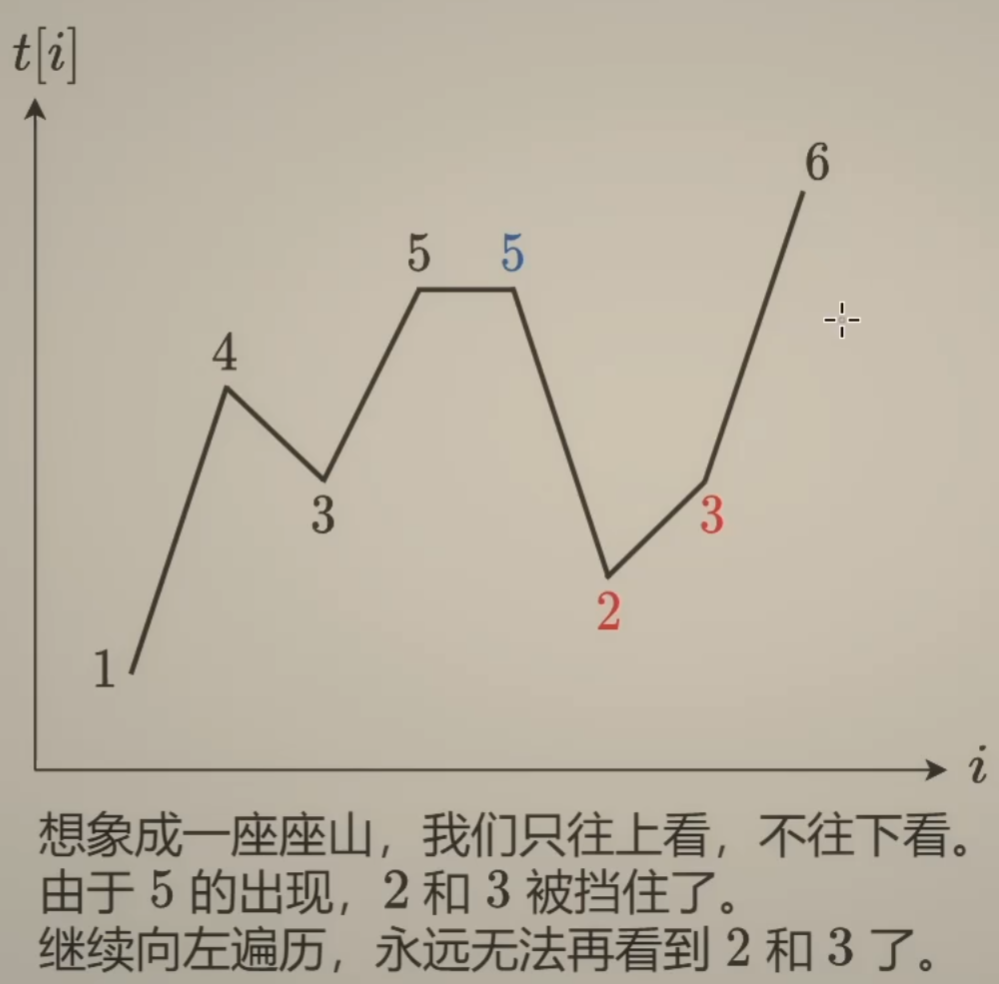
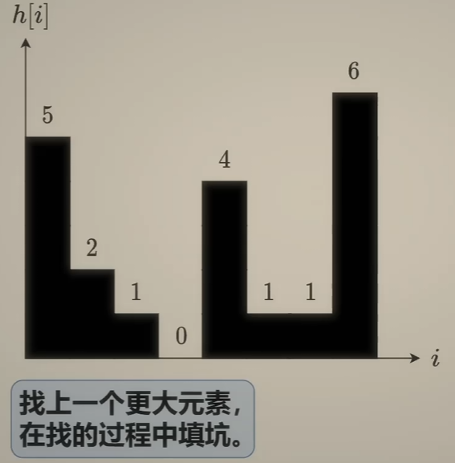
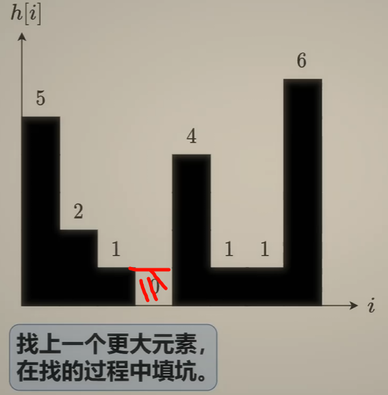
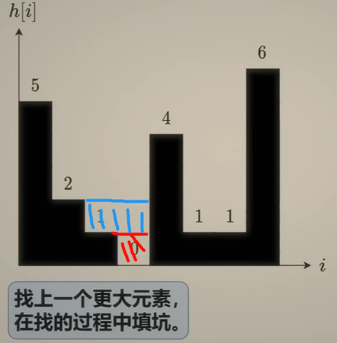
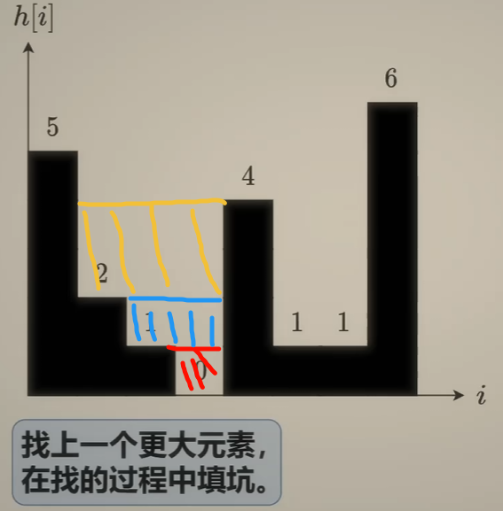

# 单调栈
> 学习链接: [单调栈【基础算法精讲 26】](https://www.bilibili.com/video/BV1VN411J7S7/)

## 例题一: [739. 每日温度](https://leetcode.cn/problems/daily-temperatures/description/)

给定一个整数数组`temperatures`，表示每天的温度，返回一个数组`answer`，其中`answer[i]`是指对于第`i`天，下一个更高温度出现在几天后。如果气温在这之后都不会升高，请在该位置用`0`来代替。

有两种思考方式:
### 从右到左

| ##container## |
|:--:|
||

比如我们从 6 -> 3 -> 2 -> 5, 此时在`5`处往右看, 就只能看见 **比5大的6** 了, 而看不见 2, 3;

当我们继续走: 5 -> 5 -> 3 -> 4, 此时在`4`处往右看, 就只能看见 **比4大的5**(或者6) 了, 而看不见 3;

由上可见, 因为往后看只能看到比自己高的, 因此具有单调性, 当一个新的数据到来, 发现比当前的栈顶高, 那么栈顶元素就变成垃圾数据了, 因为站到`新数据`的位置, 看不到`栈顶`(比它低的), 而再后来的也看不到比它低的, 因为已经被这个`新数据`"挡住"了.

代码如下:

```C++
class Solution {
public:
    vector<int> dailyTemperatures(vector<int>& temperatures) {
        int n = temperatures.size();
        vector<int> res(n);
        stack<int> S; // 索引
        for (int i = n - 1; i >= 0; --i) {
            while (S.size() && temperatures[i] >= temperatures[S.top()]) {    
                S.pop();
            }
            
            if (S.size())
                res[i] = S.top() - i;

            S.push(i);
        }

        return res;
    }
};
```

### 从左到右
**这个方向的思路才更符合单调栈的思考(0x3f)**

我们把"从右到左"反过来, 不就得到了"从左到右"的方案了吗?

把当前元素入栈, 如果后面的元素比栈顶高, 那么栈顶出栈, 并且更新`answer`(说明已经找到比栈顶元素高的元素), 一直判断出栈, 直到不符合, 再把后面的元素入栈, 表示要找比后面元素高的点

代码如下:

```C++
class Solution {
public:
    vector<int> dailyTemperatures(vector<int>& temperatures) {
        int n = temperatures.size();
        vector<int> res(n);
        stack<tuple<int, int>> S; // 温度 - 索引
        S.push({101, -1}); // 小技巧, 这样可以不用判断栈是否为空

        for (int i = 0; i < n; ++i) {
            auto [w, index] = S.top();
            while (w < temperatures[i]) {
                res[index] = i - index;
                S.pop();
                tie(w, index) = S.top();
            }
            S.push({temperatures[i], i});
        }

        return res;
    }
};
```

当然可以简化一下, 栈里面直接存放索引即可:

```C++
class Solution {
public:
    vector<int> dailyTemperatures(vector<int>& temperatures) {
        int n = temperatures.size();
        vector<int> res(n);
        stack<int> S; // 索引

        for (int i = 0; i < n; ++i) {
            while (S.size() && temperatures[S.top()] < temperatures[i]) {
                res[S.top()] = i - S.top();
                S.pop();
            }
            S.push(i);
        }

        return res;
    }
};
```

## 例题二: [42. 接雨水](https://leetcode.cn/problems/trapping-rain-water/description/)

给定`n`个非负整数表示每个宽度为`1`的柱子的高度图，计算按此排列的柱子，下雨之后能接多少雨水。

| ##container## |
|:--:|
|初始|
||
|遇到比左边大的, 比如`4`, 此时可以往右边找比它小的|
|比如`1`, `1`和`4`的公共**高度**(短板)是 $min(1, 4)=1$, |
|而**宽度**是[`4`的索引减`1`的索引 - 1]|
|故可以装水 $S_{_水}=h*L=1*1=1$|
||
|继续循环判断, 直到左边没有比`4`小的|
|(现在装水为蓝色部分, 可以视作之前装的是水泥, 把坑填上了(不会重复计算))|
||
|同理|
||

代码: (可以发现上面需要三个变量 右边的边`4`, 底部的高度, 左边的边(比底部边高)(即 栈需要长度为2才有作为))

```C++
class Solution {
public:
    int trap(vector<int>& height) {
        int res = 0;
        stack<int> S; // 索引
        S.push(0);
        for (int i = 1; i < height.size(); ++i) {
            int index = S.top();
            while (height[index] < height[i]) {
                S.pop();
                if (!S.size())
                    break;
                int mototakai = S.top();
                res += (i - mototakai - 1) * (min(height[mototakai], height[i]) - height[index]);
                index = mototakai;
            }
            S.push(i);
        }
        return res;
    }
};
```

## 何时 使用/需要思考到 单调栈
如果你发现要计算的内容涉及到**上一个**或者**下一个更大**或**更小**元素, 可以尝试使用单调栈解决.

- 子数组+单调性-->要想到单调栈(这是一个套路) (但不是只有子数组才可以用单调栈, 有这种性质需求的子序列也不是不行([1673. 找出最具竞争力的子序列](https://leetcode.cn/problems/find-the-most-competitive-subsequence/)))
- 或者说, 我存在这种性质: 我可以用我当前遍历过的数, 去把之前遍历的数据判断成垃圾数据. 这样的题目就可以使用单调栈来做<sup>[1]</sup>


## 相关题目
- [3113. 边界元素是最大值的子数组数目](https://leetcode.cn/problems/find-the-number-of-subarrays-where-boundary-elements-are-maximum/) (128场双周赛Q4)
- #### 思考题
    - 改成子数组第一个 或 最后一个元素是最大值，要怎么做？
    - 改成子数组第一个元素是最大值，最后一个元素是 最小值，要怎么做？
    - 改成树上路径问题，见 [2421. 好路径的数目]。本题相当于把 2421 的树特化成一条链。

## 注解
### [1]
来源: [Dijkstra 最短路 单调栈【力扣双周赛 128】](https://www.bilibili.com/video/BV1et42177VM/)`20:00`附近