# 分布式系统大厂面试高频知识点图解

## 一、分布式知识体系总览

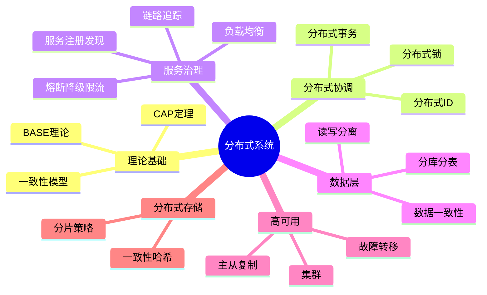

---

## 二、CAP 定理

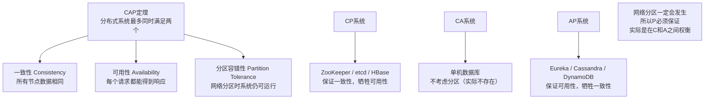

### BASE 理论（对CAP的妥协）

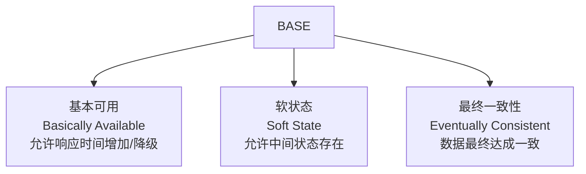

---

## 三、一致性协议

### Raft 协议

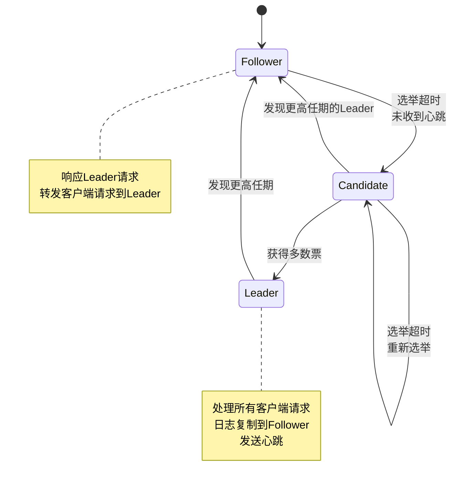

### Raft 日志复制流程

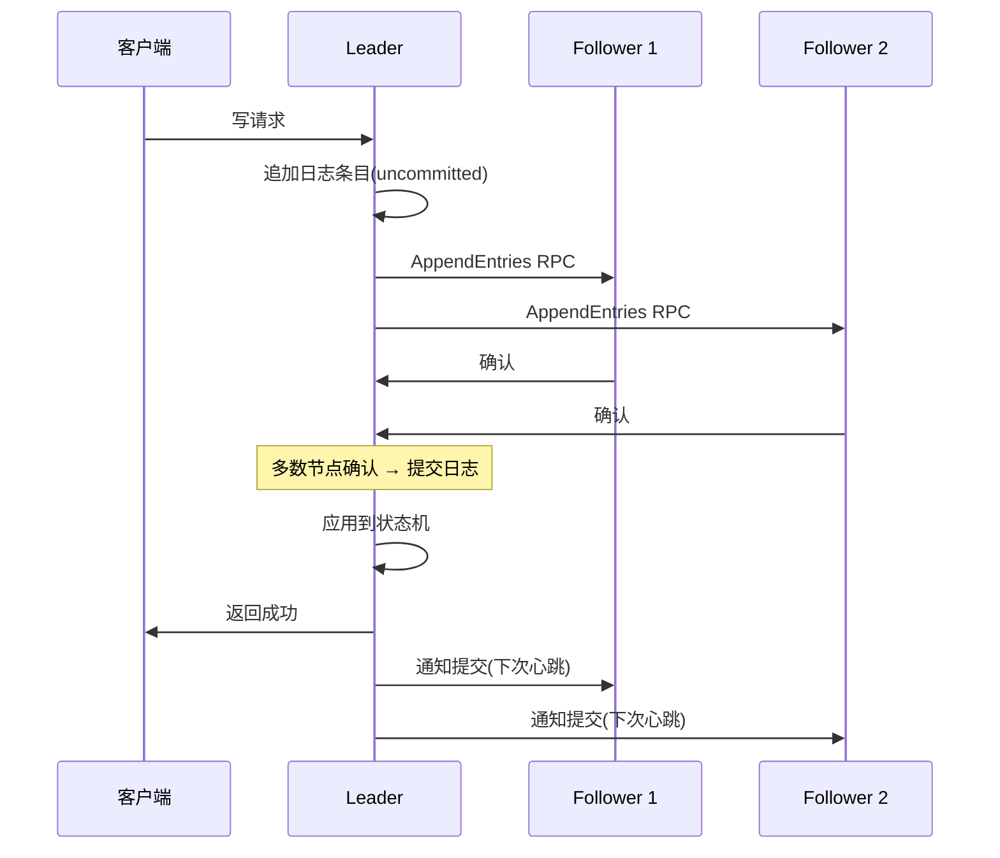

### Paxos vs Raft vs ZAB 对比

| 对比项 | Paxos | Raft | ZAB |
|--------|-------|------|-----|
| 可理解性 | 难 | 容易 | 中等 |
| Leader | 不强制 | 强Leader | 强Leader |
| 日志 | 允许空洞 | 连续日志 | 连续日志 |
| 应用 | Google Chubby | etcd/Consul | ZooKeeper |

---

## 四、分布式事务

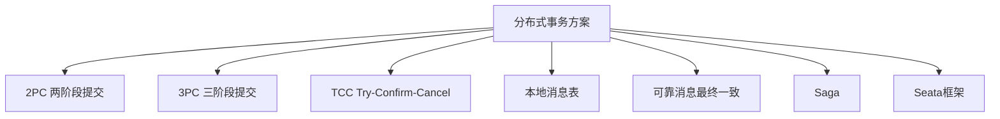

### 2PC 两阶段提交

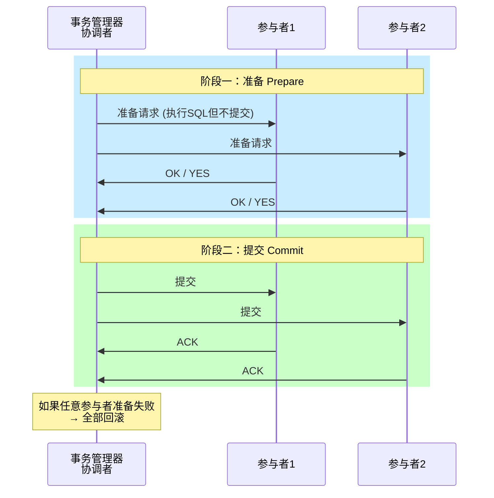

**2PC 缺点：** 同步阻塞、单点故障(协调者)、数据不一致风险

### TCC 补偿事务

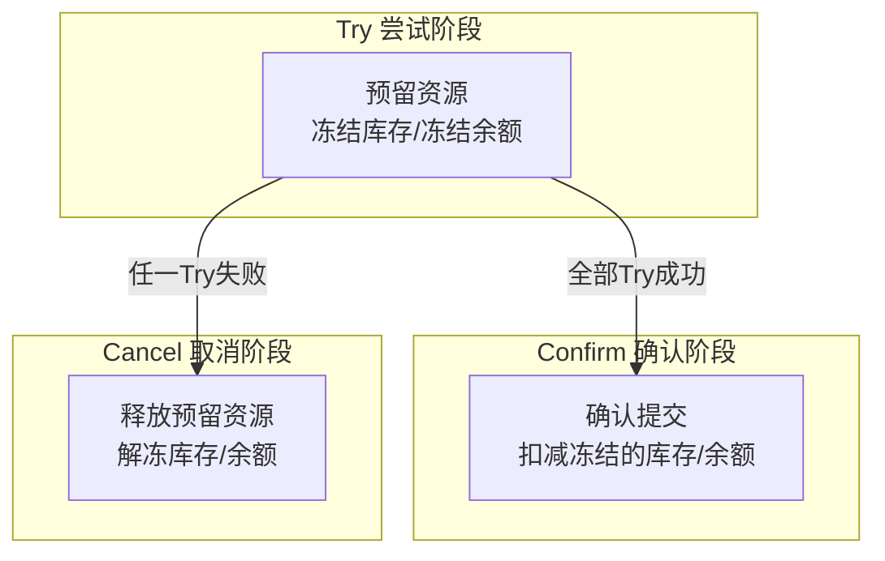

### Saga 模式

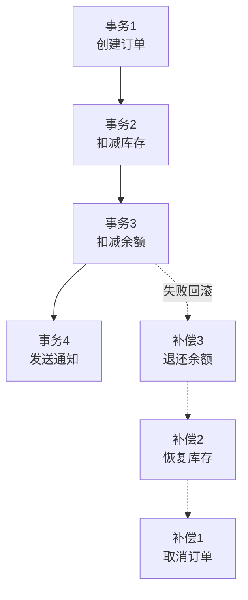

---

## 五、分布式锁

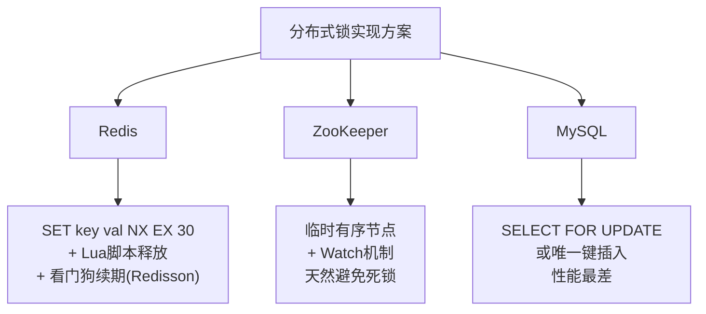

### Redis 分布式锁流程

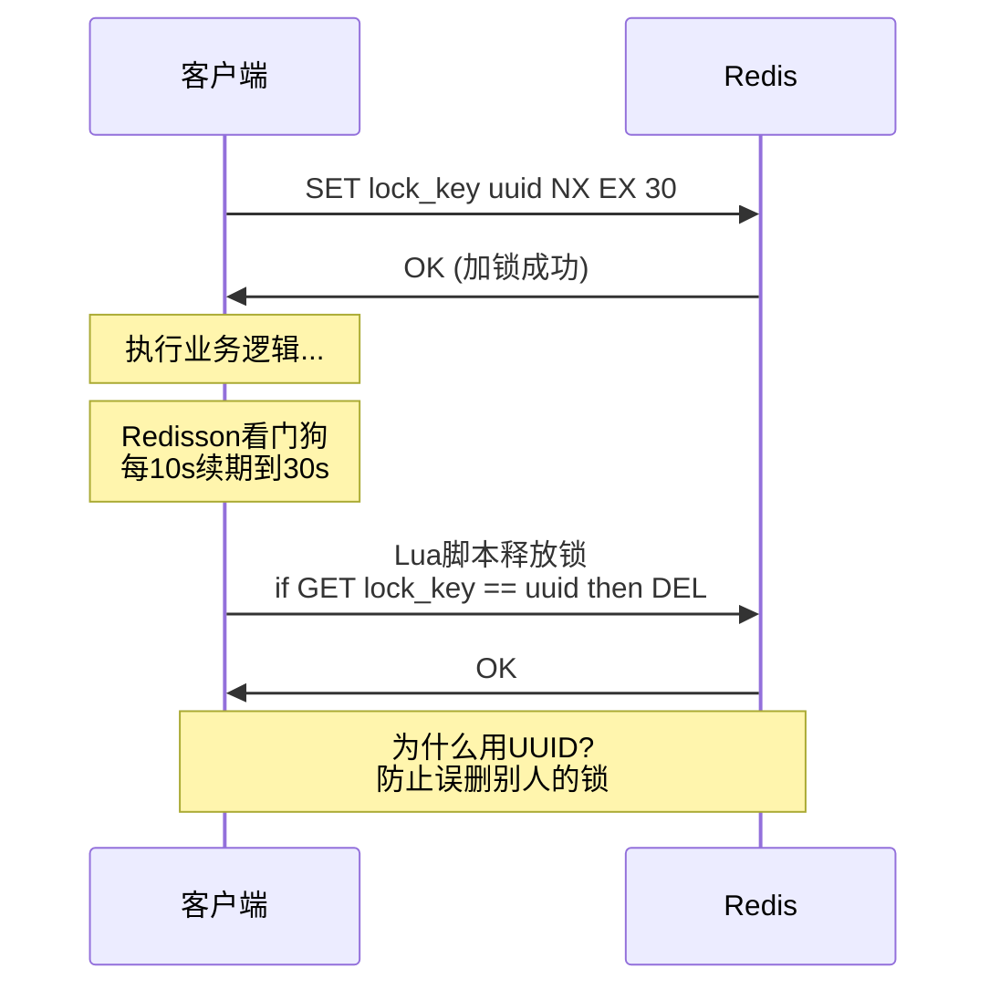

### Redlock 算法（Redis多节点）

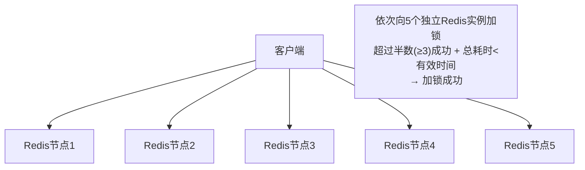

---

## 六、分布式 ID

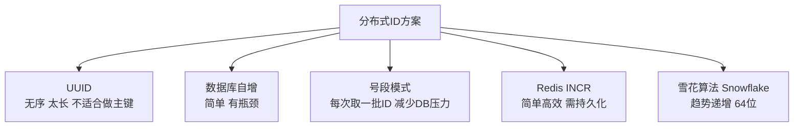

### 雪花算法结构（64位）

```
 0 - 00000000 00000000 00000000 00000000 00000000 0 - 00000 - 00000 - 00000000 0000
 │                  41位时间戳                         5位     5位      12位
 │              (可用约69年)                        数据中心  机器ID   序列号
 符号位                                              ID              (4096/ms)
```

| 方案 | 有序性 | 可用性 | 适用场景 |
|------|--------|--------|----------|
| UUID | ❌ 无序 | 高 | 不要求有序的场景 |
| 数据库自增 | ✅ 严格递增 | 低(单点) | 小规模系统 |
| 号段模式 | ✅ 趋势递增 | 高 | 美团Leaf |
| 雪花算法 | ✅ 趋势递增 | 高 | Twitter/百度UidGenerator |

---

## 七、服务治理

### 服务注册与发现

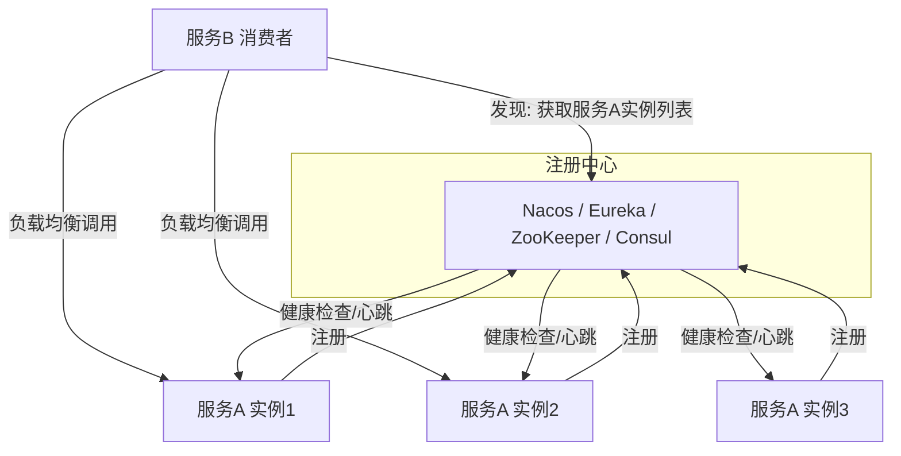

### 负载均衡算法

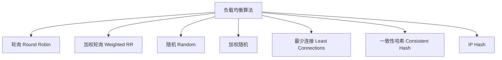

### 熔断、限流、降级

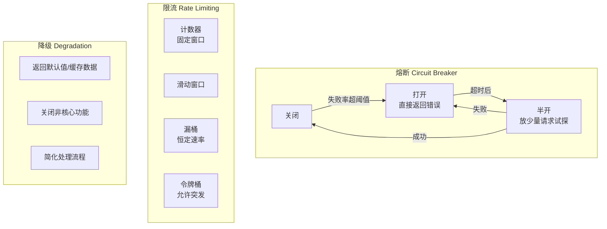

### 令牌桶 vs 漏桶

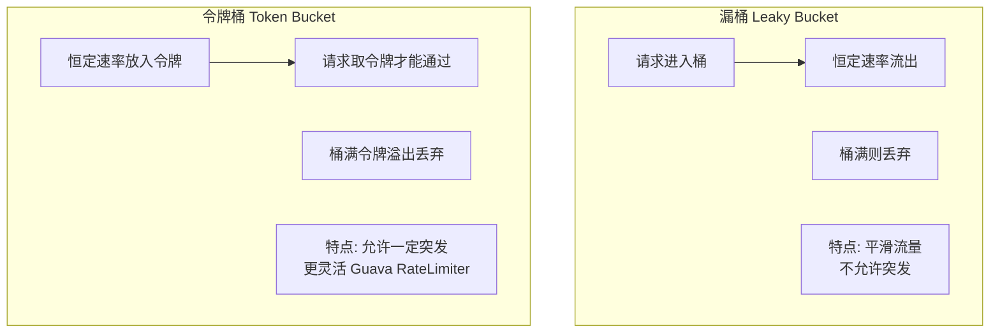

---

## 八、一致性哈希

### 传统取模 vs 一致性哈希

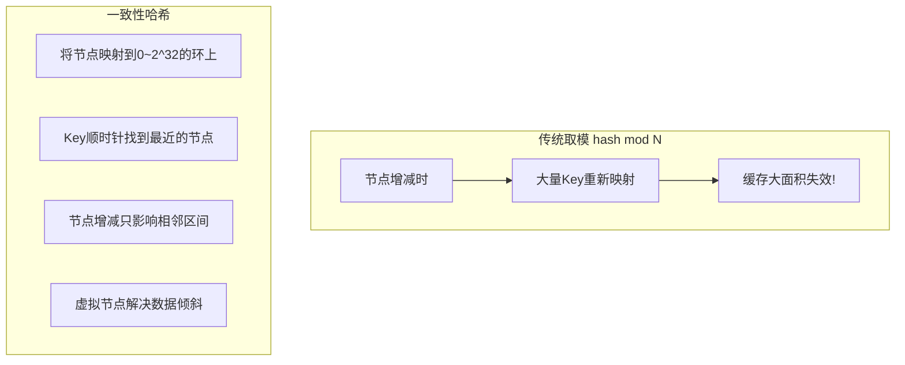

### 一致性哈希环

```
        Node A (hash=0)
           ╱          ╲
     Key1 ●            ● Key4
        ╱                ╲
   Node D                Node B
  (hash=270)           (hash=90)
        ╲                ╱
     Key3 ●            ● Key2
           ╲          ╱
        Node C (hash=180)

Key顺时针找到的第一个节点即为负责节点
增加/删除节点只影响环上相邻的一段
虚拟节点: 每个物理节点映射多个虚拟节点到环上，解决数据倾斜
```

---

## 九、分库分表

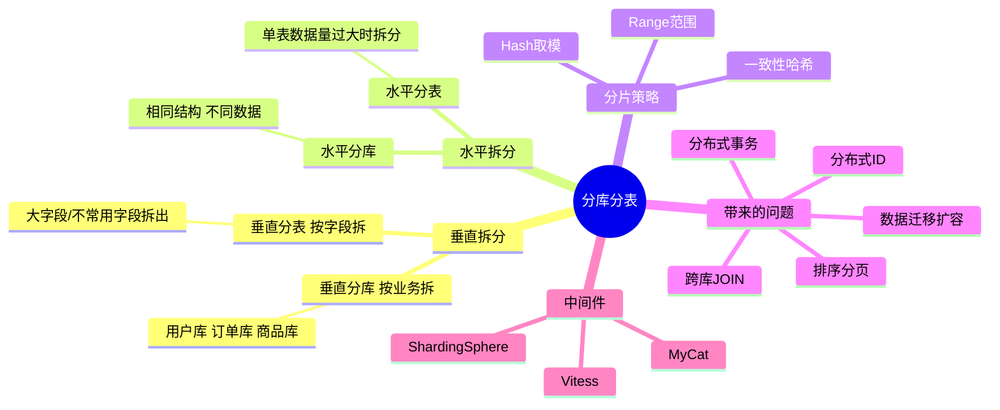

### 分库分表路由

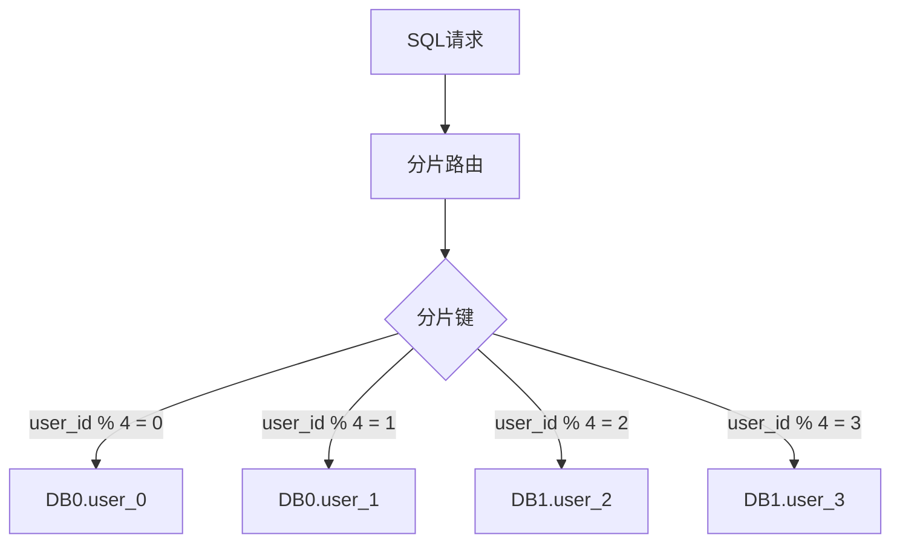

---

## 十、微服务架构全景

```mermaid
graph TD
    Client[客户端] --> GW[API网关<br/>Kong/Nginx/Spring Cloud Gateway]
    GW --> Auth[认证鉴权<br/>JWT/OAuth2]
    GW --> RL[限流熔断<br/>Sentinel/Hystrix]

    GW --> S1[用户服务]
    GW --> S2[订单服务]
    GW --> S3[商品服务]
    GW --> S4[支付服务]

    S1 --> RPC[RPC调用<br/>Dubbo/gRPC/Feign]
    S2 --> RPC
    S3 --> RPC
    S4 --> RPC

    S2 --> MQ[消息队列<br/>Kafka/RocketMQ]
    MQ --> S4

    subgraph 基础设施
        REG[注册中心<br/>Nacos/Consul]
        CONF[配置中心<br/>Nacos/Apollo]
        TRACE[链路追踪<br/>Jaeger/Zipkin/SkyWalking]
        LOG[日志中心<br/>ELK]
        MON[监控告警<br/>Prometheus+Grafana]
    end

    S1 -.-> REG
    S2 -.-> REG
    S3 -.-> CONF
    S4 -.-> TRACE

```

---

## 十一、高频面试题速查

| 问题 | 答案要点 |
|------|----------|
| CAP定理是什么？ | 一致性+可用性+分区容错，最多同时满足两个；P必须保证，实际是C和A的权衡 |
| 什么是最终一致性？ | 允许数据暂时不一致，但经过一段时间后最终达成一致(BASE理论) |
| 分布式事务有哪些方案？ | 2PC/TCC/本地消息表/可靠消息/Saga；根据一致性要求选择 |
| 分布式锁怎么实现？ | Redis(SET NX+Lua+看门狗)/ZooKeeper(临时有序节点)/数据库(排他锁) |
| 如何保证接口幂等？ | Token机制/唯一ID+DB唯一键/Redis SetNX/状态机 |
| 什么是脑裂？ | 网络分区导致集群出现两个Leader，引发数据不一致 |
| 如何解决脑裂？ | 过半选举机制/fencing token/共享存储心跳 |
| 雪花算法时钟回拨怎么办？ | 等待/使用历史最大ID/备用机器ID |
| 什么是服务雪崩？ | 一个服务不可用导致调用链上游服务连锁故障 |
| 如何防止服务雪崩？ | 熔断(Hystrix/Sentinel)+限流+降级+超时控制+隔离 |
| 分库分表后如何排序分页？ | 每个分片查N条→内存归并排序→取前N条(深翻页性能差) |
| 微服务和SOA的区别？ | 微服务更细粒度、独立部署、去中心化；SOA偏ESB中心化 |
