# 后端开发大厂面试高频知识点图解（现代C++）

## 一、后端知识体系总览

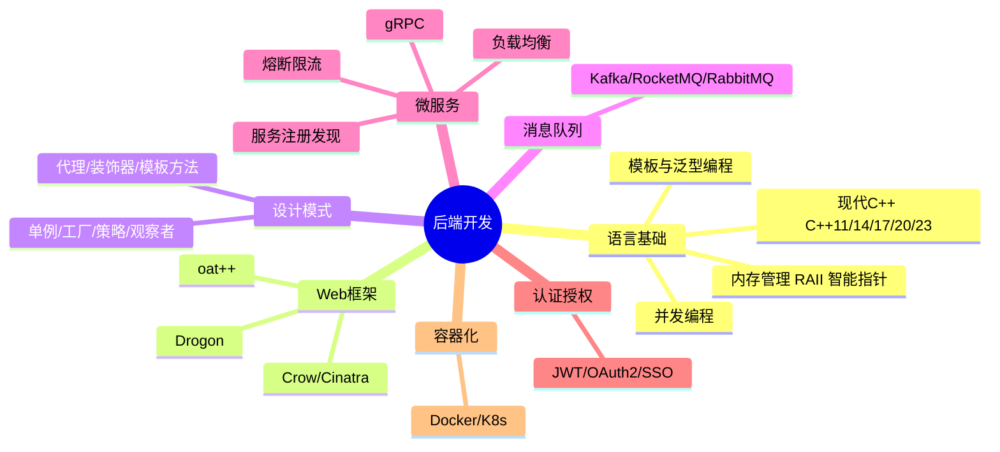

---

## 二、C++ 内存模型

```mermaid
graph TD
    subgraph C++内存布局
        STACK[栈 Stack<br/>局部变量 函数调用帧<br/>自动管理 LIFO]
        HEAP[堆 Heap<br/>new/malloc动态分配<br/>需手动管理或智能指针]
        GLOBAL[全局/静态存储区<br/>全局变量 static变量<br/>程序生命周期]
        CONST[常量区<br/>字符串字面量<br/>const全局变量]
        CODE[代码区 Text<br/>只读 可共享]
    end

    subgraph 智能指针 C++11
        UP["unique_ptr<br/>独占所有权<br/>零开销(和裸指针一样)"]
        SP["shared_ptr<br/>共享所有权<br/>引用计数(原子操作)"]
        WP["weak_ptr<br/>弱引用 不增加引用计数<br/>解决循环引用"]
    end

    C++内存布局 --> 智能指针 C++11
```

### RAII（资源获取即初始化）

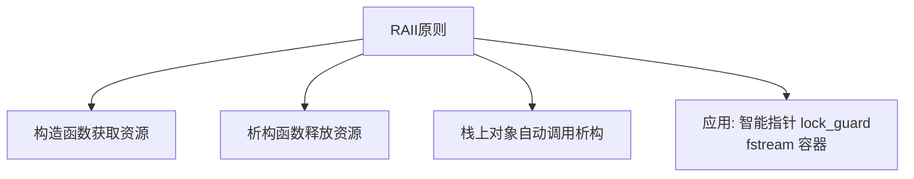

### 智能指针对比

| 对比项 | unique_ptr | shared_ptr | weak_ptr |
|--------|-----------|------------|----------|
| 所有权 | 独占 | 共享 | 无所有权 |
| 拷贝 | ❌ 不可拷贝 只能移动 | ✅ 引用计数+1 | ✅ 不影响引用计数 |
| 开销 | 零开销 | 引用计数(原子操作) + 控制块 | 同shared_ptr控制块 |
| 循环引用 | 不存在 | ⚠️ 会导致内存泄漏 | ✅ 解决循环引用 |
| 使用场景 | 默认首选 | 共享资源 | 观察者/缓存/打破循环 |

### 内存常见问题

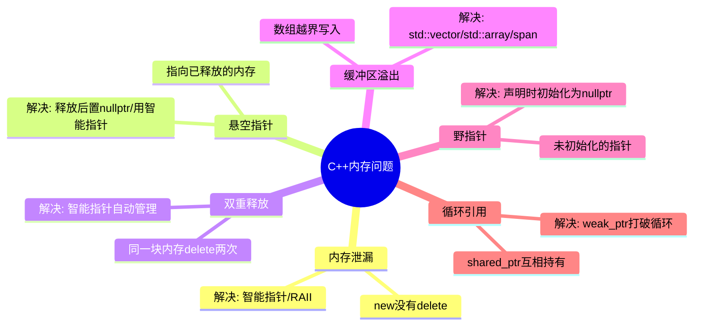

---

## 三、C++ 并发编程

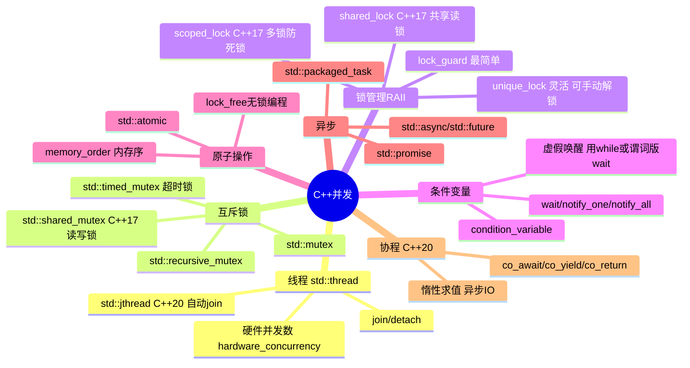

### 内存序（Memory Order）

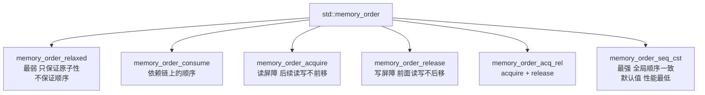

### 生产者-消费者模式（C++实现）

```cpp
#include <mutex>
#include <condition_variable>
#include <queue>

template<typename T>
class ThreadSafeQueue {
    std::queue<T> queue_;
    mutable std::mutex mtx_;
    std::condition_variable cv_;
public:
    void push(T value) {
        {
            std::lock_guard<std::mutex> lock(mtx_);
            queue_.push(std::move(value));
        }
        cv_.notify_one(); // 通知一个等待的消费者
    }

    T pop() {
        std::unique_lock<std::mutex> lock(mtx_);
        cv_.wait(lock, [this] { return !queue_.empty(); }); // 谓词防止虚假唤醒
        T value = std::move(queue_.front());
        queue_.pop();
        return value;
    }
};
```

### std::async 与 std::future

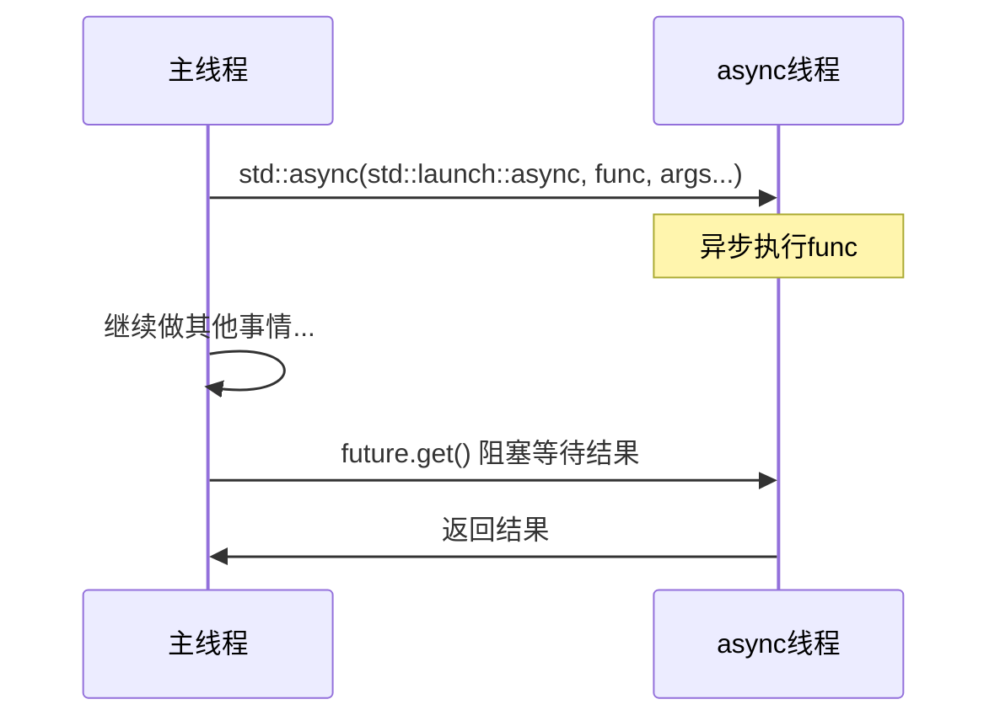

---

## 四、现代 C++ 核心特性

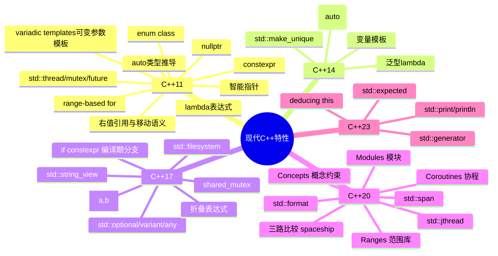

### 移动语义

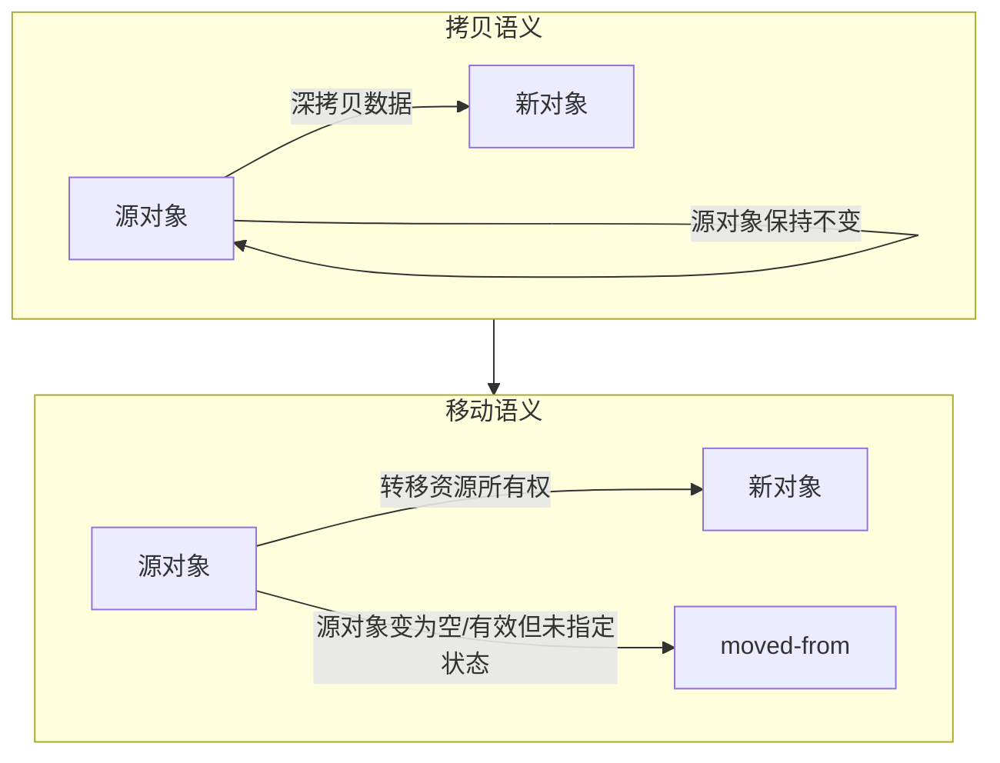

```cpp
// 移动语义核心
class MyString {
    char* data_;
    size_t size_;
public:
    // 移动构造函数 —— O(1)，只是指针交接
    MyString(MyString&& other) noexcept
        : data_(other.data_), size_(other.size_) {
        other.data_ = nullptr; // 源对象置空
        other.size_ = 0;
    }

    // 移动赋值运算符
    MyString& operator=(MyString&& other) noexcept {
        if (this != &other) {
            delete[] data_;
            data_ = other.data_;
            size_ = other.size_;
            other.data_ = nullptr;
            other.size_ = 0;
        }
        return *this;
    }
};

// std::move 只是类型转换，不移动任何东西
auto s2 = std::move(s1); // s1 转为右值引用 → 触发移动构造
```

### 完美转发（Perfect Forwarding）

```cpp
// std::forward 保持参数的值类别（左值/右值）
template<typename T, typename... Args>
std::unique_ptr<T> make_unique(Args&&... args) {
    return std::unique_ptr<T>(new T(std::forward<Args>(args)...));
}
// 左值传入 → 转发为左值
// 右值传入 → 转发为右值
```

---

## 五、C++ 模板与泛型编程

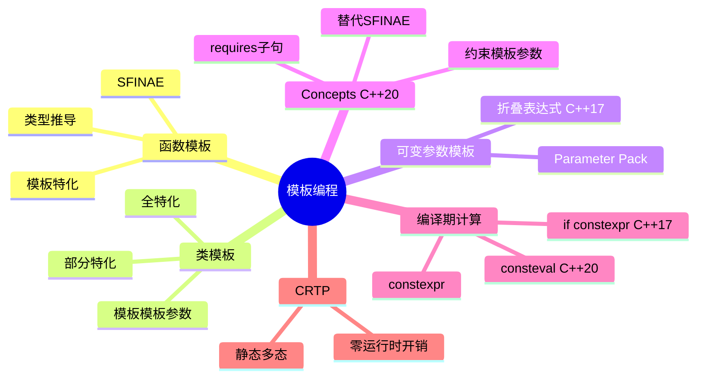

### Concepts（C++20）

```cpp
// 定义概念
template<typename T>
concept Sortable = requires(T a, T b) {
    { a < b } -> std::convertible_to<bool>;
    { a == b } -> std::convertible_to<bool>;
};

// 使用概念约束模板
template<Sortable T>
void sort(std::vector<T>& vec) {
    std::ranges::sort(vec);
}

// 不满足约束 → 编译期友好错误信息（比SFINAE清晰得多）
```

### CRTP（奇异递归模板模式）

```cpp
// 静态多态 —— 零虚函数开销
template<typename Derived>
class Base {
public:
    void interface() {
        static_cast<Derived*>(this)->implementation(); // 编译期派发
    }
};

class Impl : public Base<Impl> {
public:
    void implementation() { /* 具体实现 */ }
};
```

---

## 六、消息队列

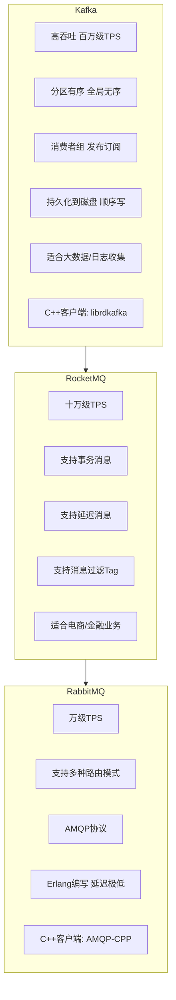

### 消息队列核心问题

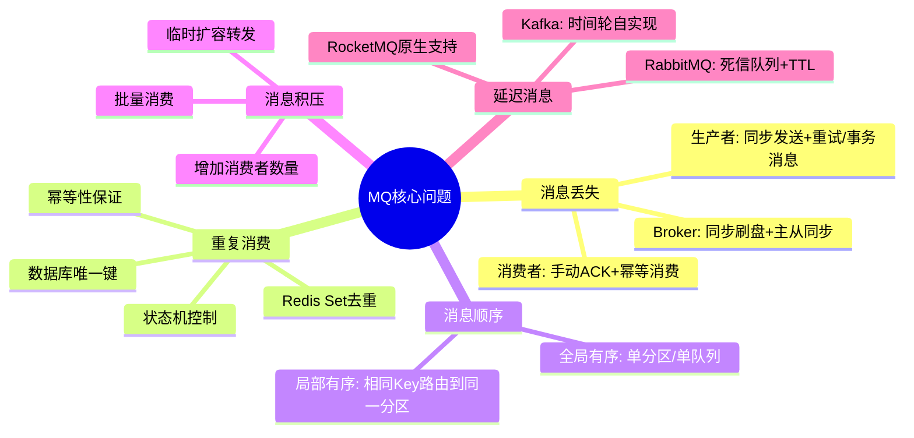

---

## 七、设计模式（C++实现）

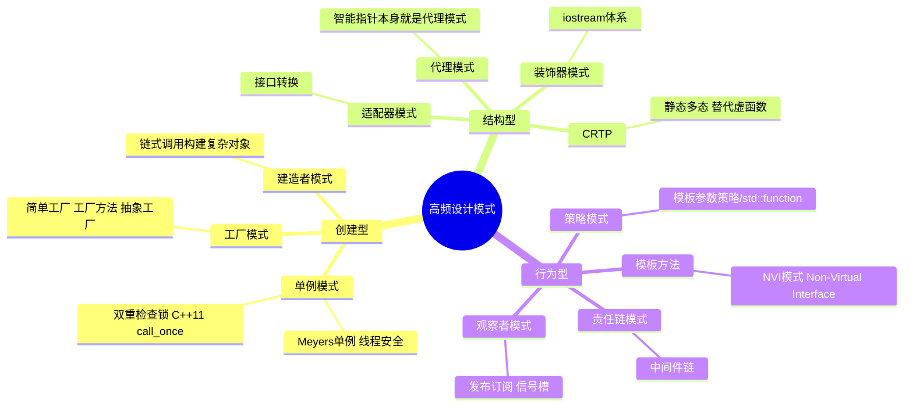

### 单例模式最佳实践（C++）

```cpp
// ✅ Meyers' Singleton（C++11起线程安全，标准保证局部static只初始化一次）
class Singleton {
public:
    static Singleton& getInstance() {
        static Singleton instance; // 线程安全，C++11保证
        return instance;
    }

    Singleton(const Singleton&) = delete;            // 禁止拷贝
    Singleton& operator=(const Singleton&) = delete;  // 禁止赋值
    Singleton(Singleton&&) = delete;                  // 禁止移动
    Singleton& operator=(Singleton&&) = delete;

private:
    Singleton() = default;
    ~Singleton() = default;
};

// ✅ std::call_once 方式
class Singleton2 {
    static std::unique_ptr<Singleton2> instance_;
    static std::once_flag flag_;
public:
    static Singleton2& getInstance() {
        std::call_once(flag_, [] {
            instance_.reset(new Singleton2());
        });
        return *instance_;
    }
};
```

### 策略模式（C++ 多种实现）

```cpp
// 方式1: 经典虚函数（运行时多态）
class SortStrategy {
public:
    virtual ~SortStrategy() = default;
    virtual void sort(std::vector<int>& data) = 0;
};

// 方式2: std::function（更灵活）
class Sorter {
    std::function<void(std::vector<int>&)> strategy_;
public:
    void setStrategy(auto&& fn) { strategy_ = std::forward<decltype(fn)>(fn); }
    void sort(std::vector<int>& data) { strategy_(data); }
};

// 方式3: 模板参数策略（编译期多态，零开销）
template<typename Strategy>
class Sorter3 {
public:
    void sort(std::vector<int>& data) { Strategy::sort(data); }
};
```

---

## 八、认证授权

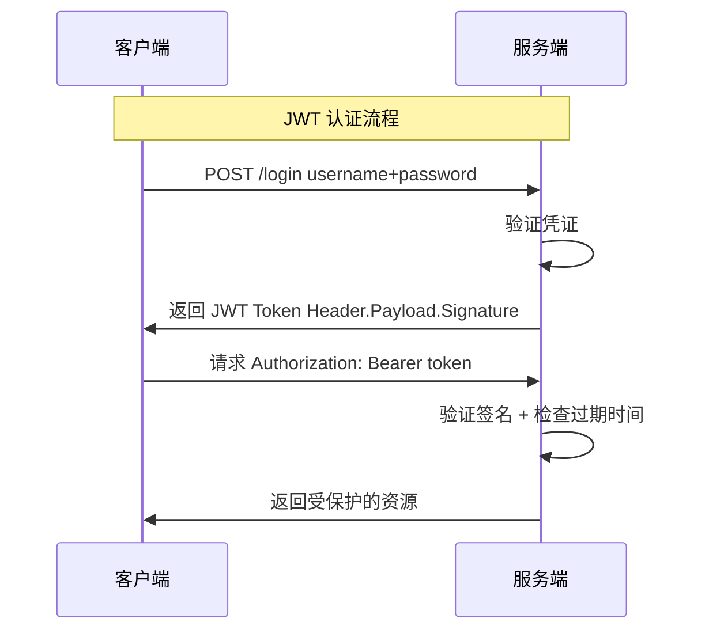

### JWT 结构

```
Header: {"alg": "HS256", "typ": "JWT"}  -- Base64编码
Payload: {"sub": "1234", "name": "John", "exp": 1735689600}  -- Base64编码  
Signature: HMACSHA256(base64(header) + "." + base64(payload), secret)

三部分用 . 连接: xxxxx.yyyyy.zzzzz
C++库: jwt-cpp / libjwt
```

### OAuth2.0 四种授权方式

| 方式 | 场景 | 安全性 |
|------|------|--------|
| 授权码模式 | Web应用（最常用最安全） | ⭐⭐⭐⭐⭐ |
| 简化模式 | 纯前端SPA应用 | ⭐⭐⭐ |
| 密码模式 | 高度信任的第一方应用 | ⭐⭐ |
| 客户端凭证模式 | 服务间调用(无用户参与) | ⭐⭐⭐⭐ |

---

## 九、Docker & Kubernetes

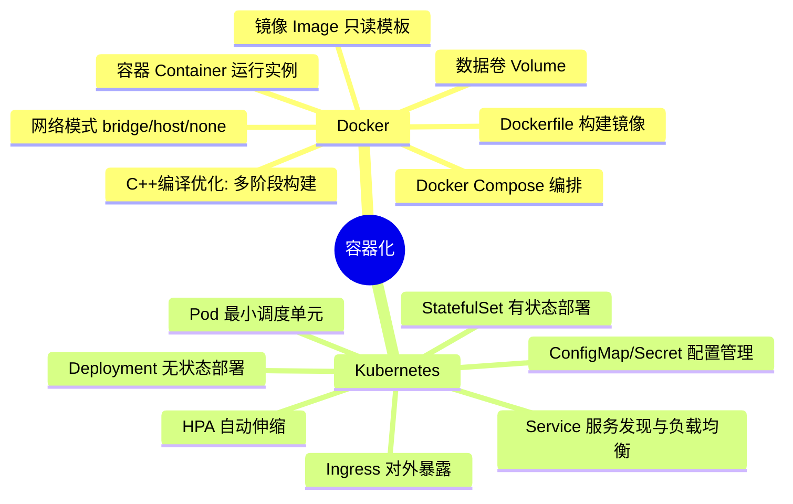

### K8s 核心架构

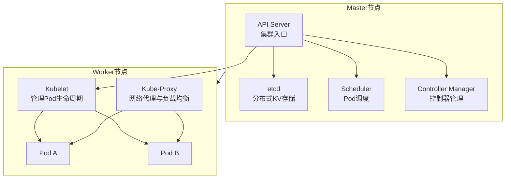

### C++ 多阶段 Dockerfile 示例

```dockerfile
# 构建阶段
FROM gcc:13 AS builder
WORKDIR /app
COPY . .
RUN cmake -B build -DCMAKE_BUILD_TYPE=Release && cmake --build build

# 运行阶段（最小镜像）
FROM debian:bookworm-slim
COPY --from=builder /app/build/server /usr/local/bin/
EXPOSE 8080
CMD ["server"]
```

---

## 十、RESTful API 设计

| 规范 | 说明 | 示例 |
|------|------|------|
| 资源名词复数 | URL表示资源，不用动词 | `/api/v1/users` |
| HTTP方法表示操作 | GET/POST/PUT/DELETE | `GET /users/123` |
| 版本号 | 放在URL或Header | `/api/v1/` |
| 状态码语义化 | 200/201/204/400/401/403/404/500 | - |
| 分页 | page/size 或 cursor | `?page=1&size=20` |
| 过滤/排序 | query参数 | `?status=active&sort=-created` |
| 错误格式统一 | code + message + details | `{"code":40001,"msg":"参数错误"}` |

### C++ Web 框架对比

| 框架 | 特点 | 性能 |
|------|------|------|
| **Drogon** | 全功能、非阻塞IO、ORM、WebSocket | ⭐⭐⭐⭐⭐ |
| **oat++** | 零拷贝、协程、Swagger集成 | ⭐⭐⭐⭐⭐ |
| **Crow** | 类Flask简洁API、Header-only | ⭐⭐⭐⭐ |
| **Cinatra** | 国产、C++20协程 | ⭐⭐⭐⭐ |
| **Pistache** | 轻量REST框架 | ⭐⭐⭐ |
| **Boost.Beast** | 底层HTTP/WebSocket库 | ⭐⭐⭐⭐⭐ |

---

## 十一、C++ 编译与构建

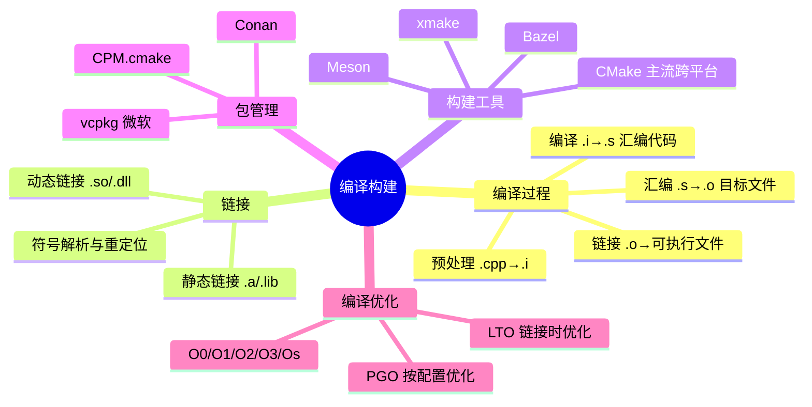

---

## 十二、高频面试题速查

| 问题 | 答案要点 |
|------|----------|
| 智能指针有哪些？区别？ | unique_ptr独占零开销；shared_ptr引用计数共享；weak_ptr弱引用解决循环引用 |
| 移动语义是什么？ | 转移资源所有权而非拷贝，std::move将左值转为右值引用，触发移动构造/赋值 |
| 左值和右值的区别？ | 左值有地址可取地址；右值是临时值。C++11: 右值引用&&延长临时对象生命周期 |
| virtual析构函数何时需要？ | 基类指针删除派生类对象时必须；否则派生类资源泄漏(未定义行为) |
| 虚函数表(vtable)原理？ | 每个有虚函数的类有一个vtable；对象含vptr指向vtable；虚函数调用通过vptr间接跳转 |
| 什么是RAII？ | 资源获取即初始化，构造获取析构释放，利用栈对象生命周期自动管理资源 |
| std::move实际做了什么？ | 只是static_cast为右值引用，本身不移动任何东西，让编译器选择移动构造/赋值 |
| 如何避免内存泄漏？ | 智能指针 + RAII；valgrind/ASan检测；避免裸new/delete |
| const和constexpr区别？ | const运行期常量(也可编译期)；constexpr保证编译期求值(C++11函数/C++14扩展) |
| 模板特化 vs 重载？ | 函数优先用重载(更直观)；类模板用特化/偏特化 |
| Kafka如何保证消息不丢？ | acks=all + 同步刷盘 + ISR + 手动提交offset |
| 如何设计一个秒杀系统？ | 前端限流→Nginx→网关限流→Redis扣库存→MQ异步下单→DB |
| 接口幂等性如何实现？ | Token机制 / 唯一ID + 数据库唯一键 / Redis SetNX / 状态机 |
