# 操作系统大厂面试高频知识点图解

## 一、操作系统整体架构

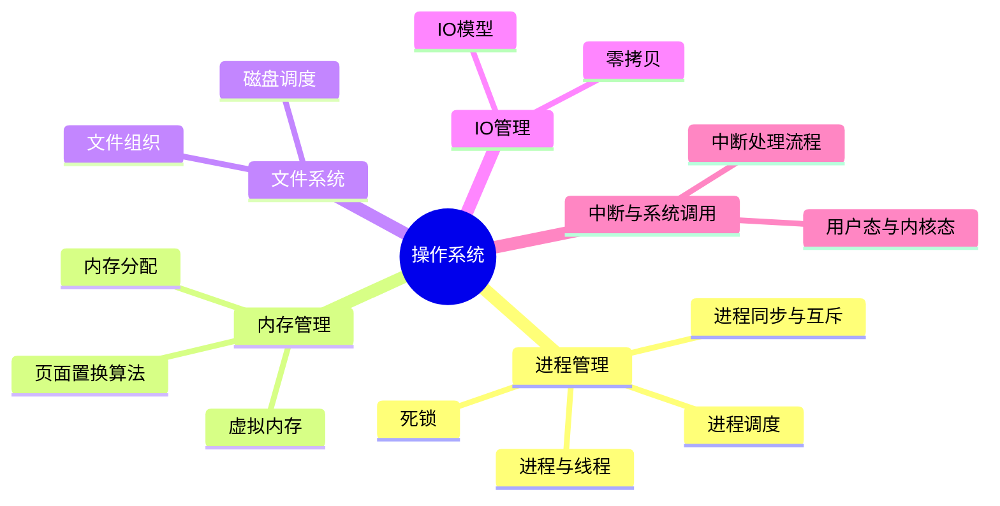

---

## 二、进程 vs 线程 vs 协程

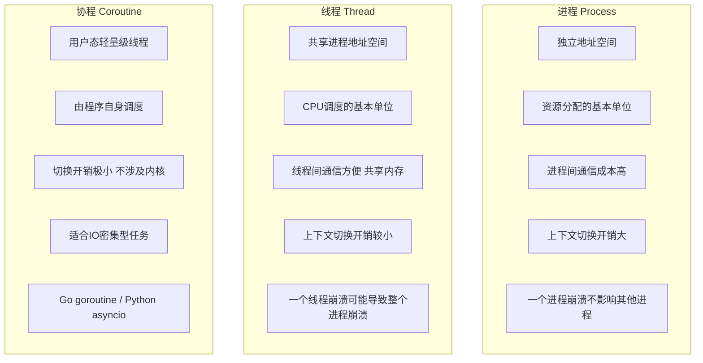

### 高频对比表

| 对比项 | 进程 | 线程 | 协程 |
|--------|------|------|------|
| 地址空间 | 独立 | 共享进程空间 | 共享线程空间 |
| 切换开销 | 大（涉及TLB刷新） | 中（共享页表） | 极小（用户态切换） |
| 通信方式 | 管道/消息队列/共享内存/信号量 | 共享变量 + 同步原语 | channel/yield |
| 调度方 | 操作系统内核 | 操作系统内核 | 用户程序 |
| 并发安全 | 天然隔离 | 需要锁 | 单线程内无竞争 |

---

## 三、进程状态转换

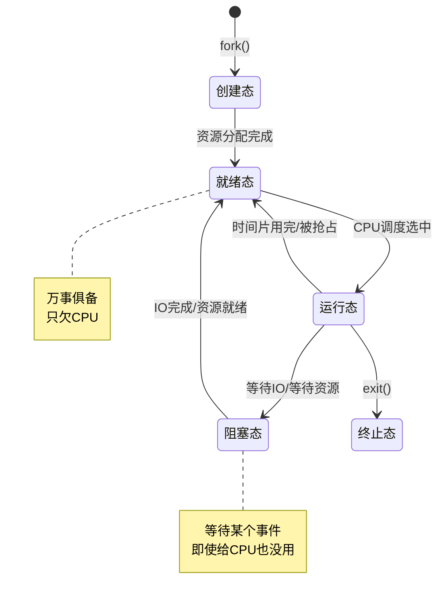

---

## 四、进程调度算法

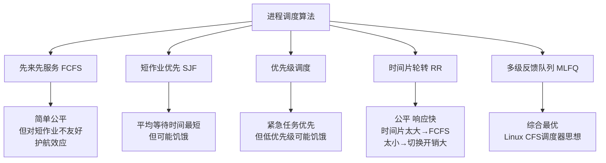

### 多级反馈队列

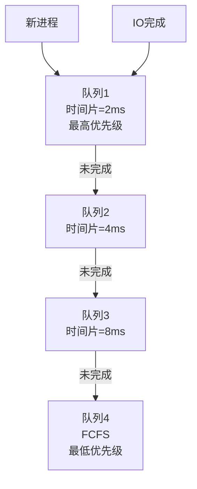

---

## 五、进程同步与互斥

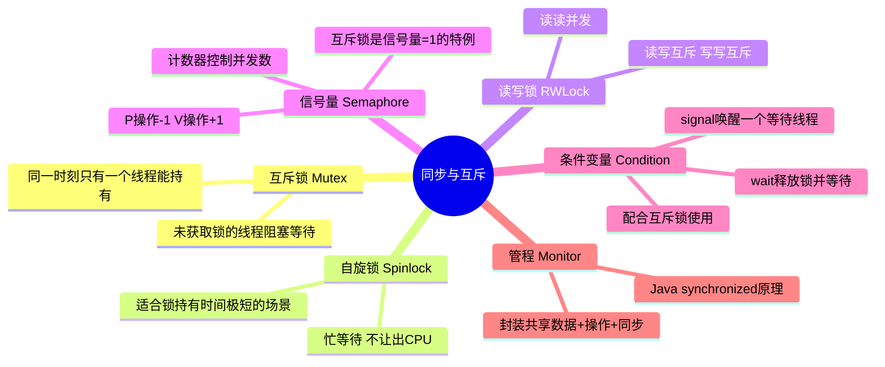

### 经典同步问题

| 问题 | 核心思路 |
|------|----------|
| 生产者-消费者 | 互斥锁 + 空/满信号量；有界缓冲区 |
| 读者-写者 | 读写锁；读者优先 or 写者优先 or 公平 |
| 哲学家就餐 | 限制同时拿筷子数 / 奇偶编号 / 资源分级 |

---

## 六、死锁

### 死锁四个必要条件

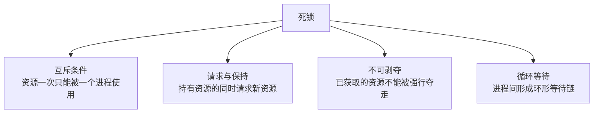

### 死锁处理策略

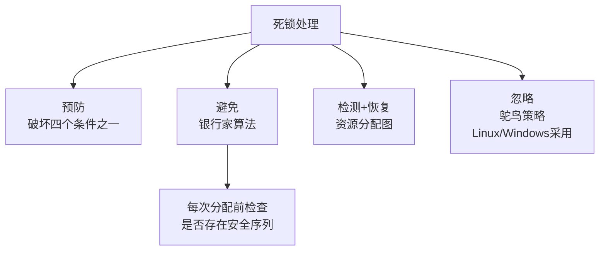

### 银行家算法流程

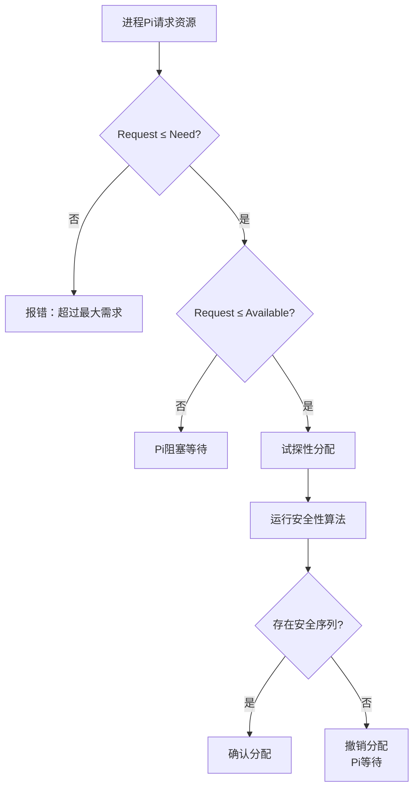

---

## 七、虚拟内存

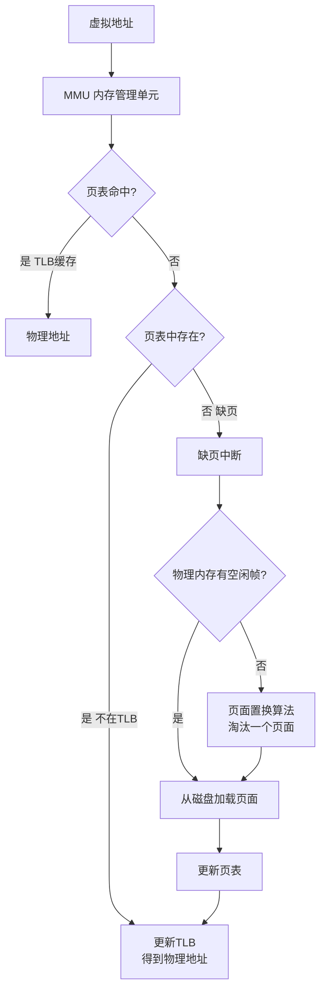

### 多级页表 & TLB

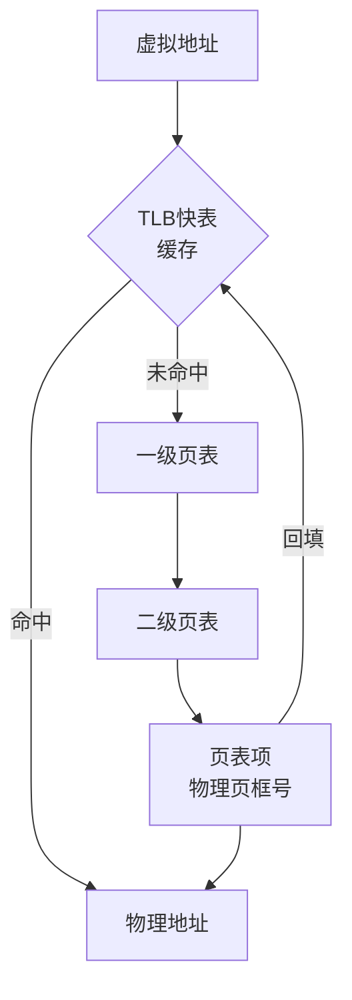

---

## 八、页面置换算法

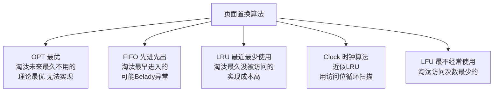

### LRU 实现原理

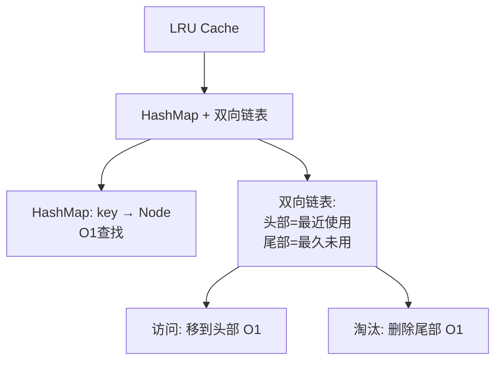

---

## 九、用户态与内核态

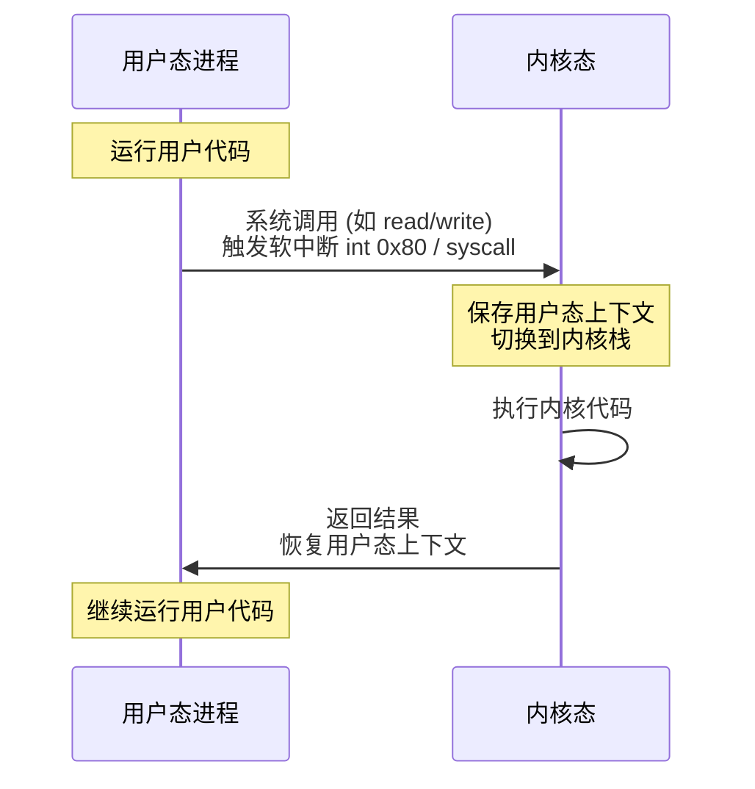

### 用户态→内核态的三种方式

| 方式 | 说明 | 示例 |
|------|------|------|
| 系统调用 | 用户主动请求内核服务 | read/write/fork/exec |
| 异常 | 执行指令时发生错误 | 缺页异常、除零异常 |
| 外部中断 | 外设发出的信号 | 键盘输入、网卡收包、时钟中断 |

---

## 十、IO 模型（Linux 五种）

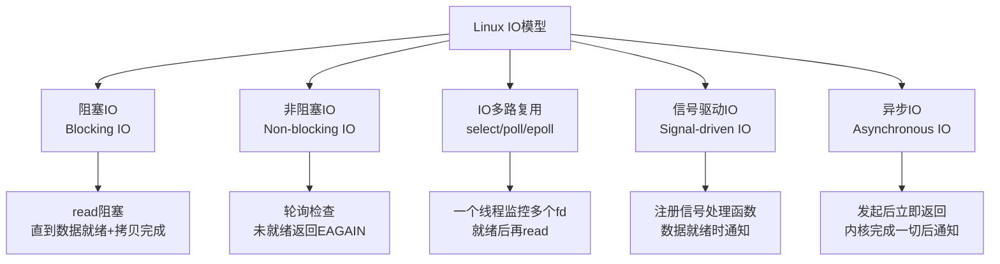

### select / poll / epoll 对比

| 对比项 | select | poll | epoll |
|--------|--------|------|-------|
| 数据结构 | fd_set位图 | pollfd数组 | 红黑树 + 就绪链表 |
| fd上限 | 1024 (FD_SETSIZE) | 无限制 | 无限制 |
| 触发方式 | 水平触发 LT | 水平触发 LT | LT + 边缘触发 ET |
| 检测方式 | 遍历 O(n) | 遍历 O(n) | 回调 O(1) |
| fd拷贝 | 每次调用拷贝到内核 | 每次调用拷贝到内核 | 注册一次即可(epoll_ctl) |
| 适用场景 | 连接数少 | 连接数少 | **高并发首选(万级连接)** |

### epoll 工作流程

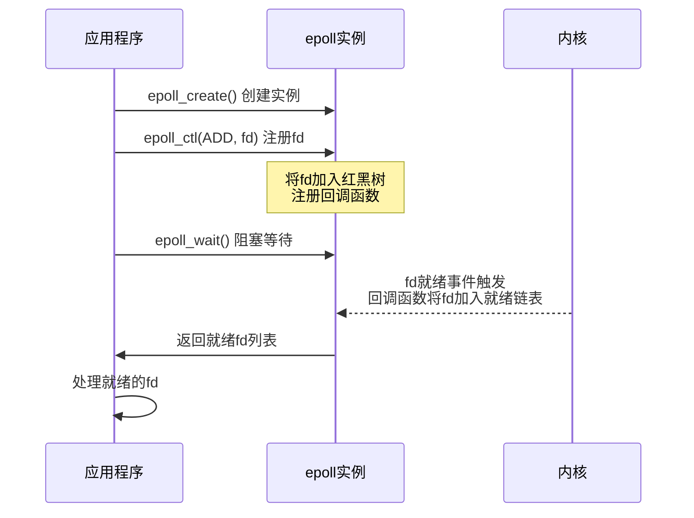

---

## 十一、零拷贝（Zero Copy）

### 传统IO（4次拷贝 + 4次上下文切换）

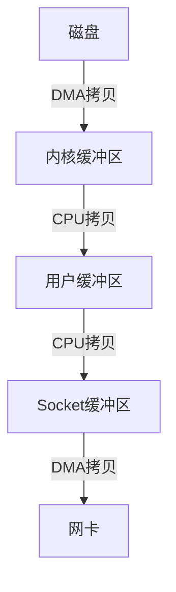

### sendfile零拷贝（2次拷贝 + 2次上下文切换）

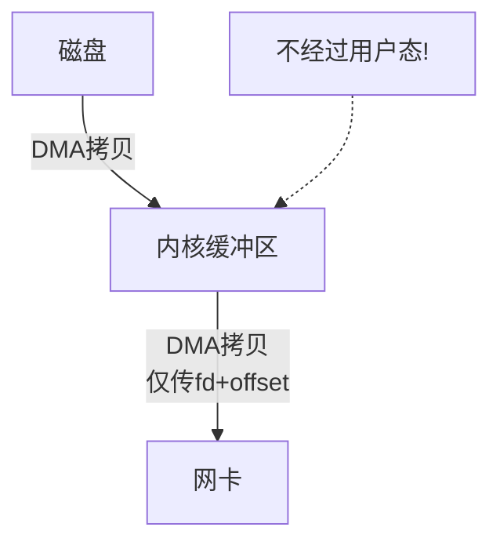

### mmap零拷贝（3次拷贝 + 4次上下文切换）

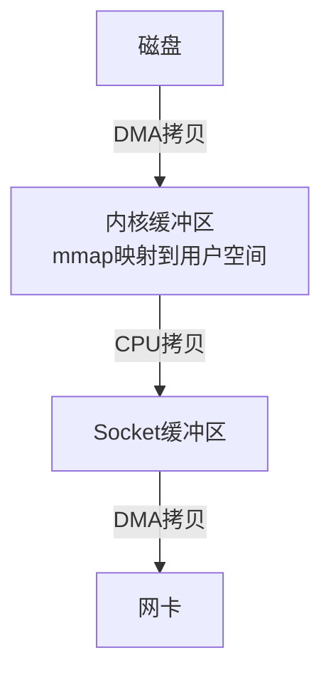

---

## 十二、高频面试题速查

| 问题 | 答案要点 |
|------|----------|
| 进程和线程的区别？ | 进程是资源分配单位，线程是CPU调度单位；线程共享地址空间 |
| 什么是上下文切换？ | 保存当前进程/线程的寄存器、PC、栈指针等，恢复另一个的状态 |
| 什么是虚拟内存？ | 每个进程有独立虚拟地址空间，通过页表映射到物理内存，按需加载 |
| 什么是缺页中断？ | 访问的页面不在物理内存中，触发中断从磁盘加载 |
| 什么是内存抖动/颠簸？ | 频繁缺页，刚换出的页马上又要换入，系统性能急剧下降 |
| fork()的原理？ | 创建子进程，写时复制(COW)共享父进程内存，写入时才真正复制 |
| 孤儿进程vs僵尸进程？ | 孤儿：父进程先死，由init收养；僵尸：子进程先死，父未wait回收PCB |
| 什么是内核态和用户态？ | 内核态可执行特权指令访问所有资源；用户态受限，需通过系统调用进入内核态 |
| 什么是DMA？ | Direct Memory Access，外设直接与内存交换数据，不占用CPU |
| Linux常用IPC方式？ | 管道、命名管道、消息队列、共享内存(最快)、信号量、Socket |
