# 数据库大厂面试高频知识点图解

## 一、数据库整体知识体系

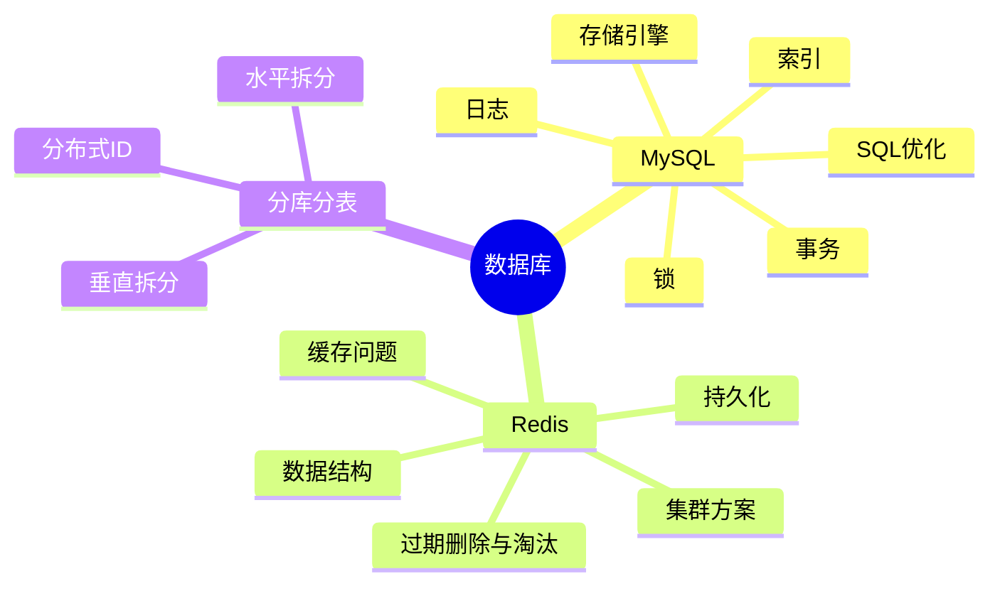

---

## 二、MySQL 存储引擎

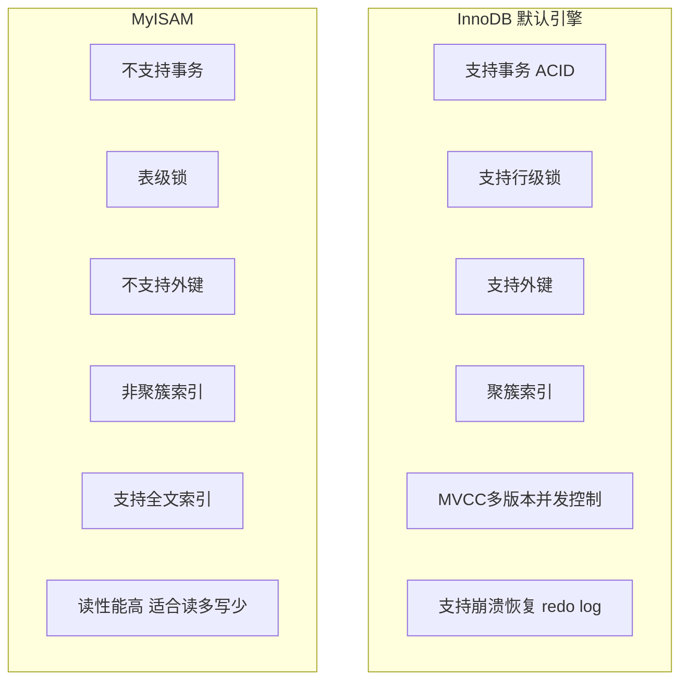

---

## 三、MySQL 索引

### B+树结构

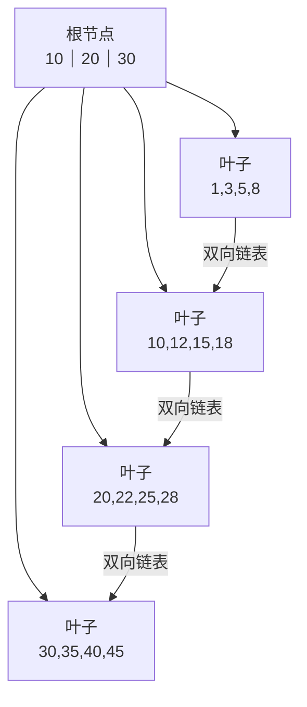

### B+树 vs B树 vs Hash索引

| 对比项 | B+树 | B树 | Hash |
|--------|------|-----|------|
| 数据存储 | 只在叶子节点 | 所有节点 | 哈希桶 |
| 范围查询 | ✅ 叶子链表顺序扫描 | ❌ 需要中序遍历 | ❌ 不支持 |
| 等值查询 | O(log n) | O(log n) | O(1) |
| 排序 | ✅ 天然有序 | ❌ | ❌ |
| 磁盘IO | 少（非叶子不存数据，扇出大） | 多 | 不确定 |

### 聚簇索引 vs 非聚簇索引

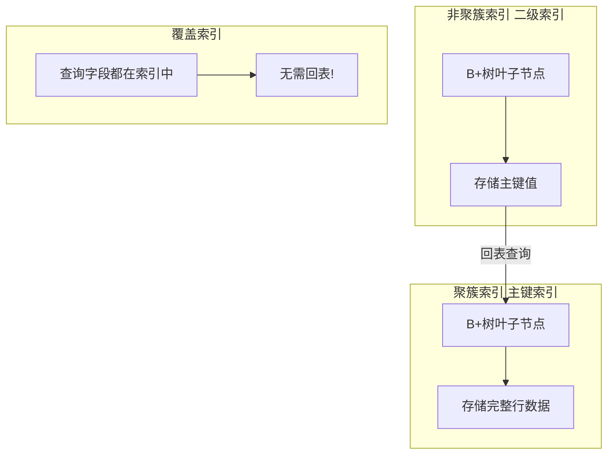

### 索引失效场景

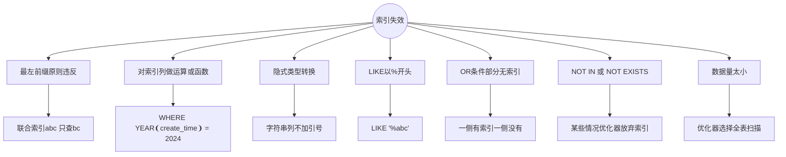

---

## 四、MySQL 事务

### ACID 特性

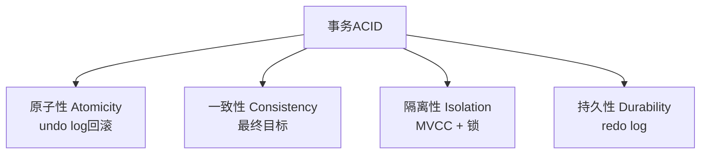

### 隔离级别

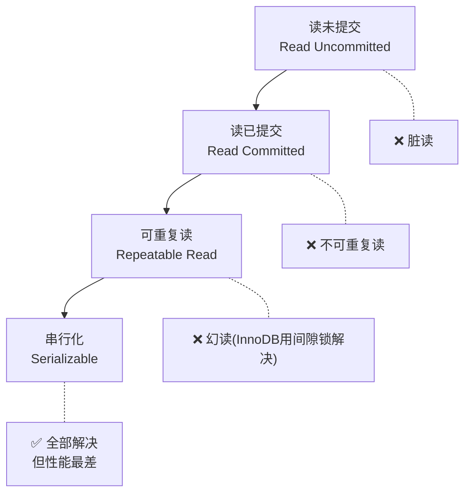

| 隔离级别 | 脏读 | 不可重复读 | 幻读 | 实现方式 |
|----------|------|-----------|------|----------|
| 读未提交 | ✅ | ✅ | ✅ | 无控制 |
| 读已提交 RC | ❌ | ✅ | ✅ | 每次读生成新 ReadView |
| **可重复读 RR(默认)** | ❌ | ❌ | ✅(InnoDB间隙锁解决) | 事务开始时生成 ReadView |
| 串行化 | ❌ | ❌ | ❌ | 加锁串行执行 |

### MVCC 原理

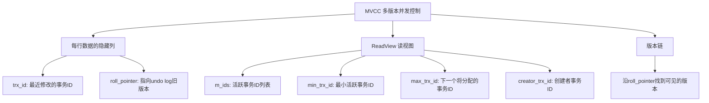

**可见性判断规则：**
1. `trx_id == creator_trx_id` → 自己修改的，可见
2. `trx_id < min_trx_id` → 事务已提交，可见
3. `trx_id >= max_trx_id` → 事务在ReadView创建后开启，不可见
4. `min_trx_id <= trx_id < max_trx_id` → 看是否在 m_ids 中，在则不可见，不在则可见

---

## 五、MySQL 锁

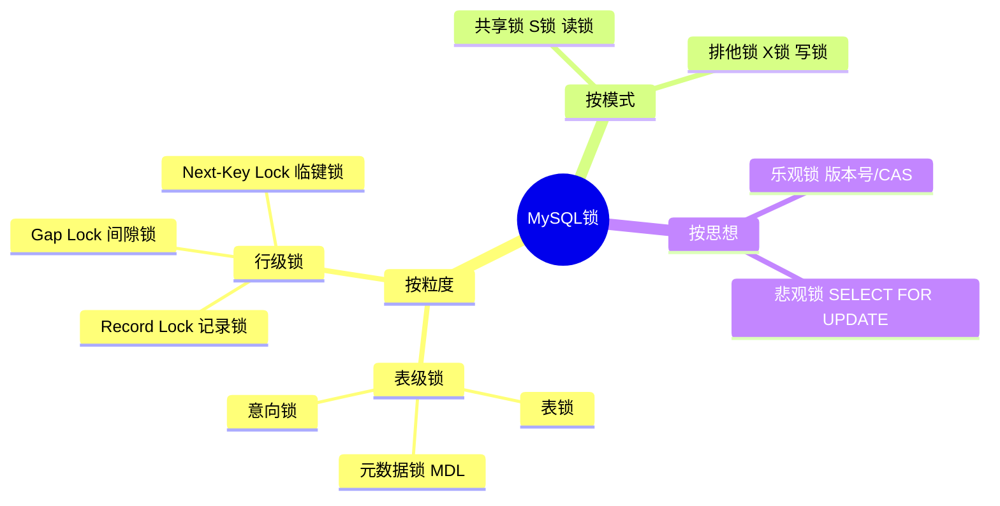

### Next-Key Lock = Record Lock + Gap Lock

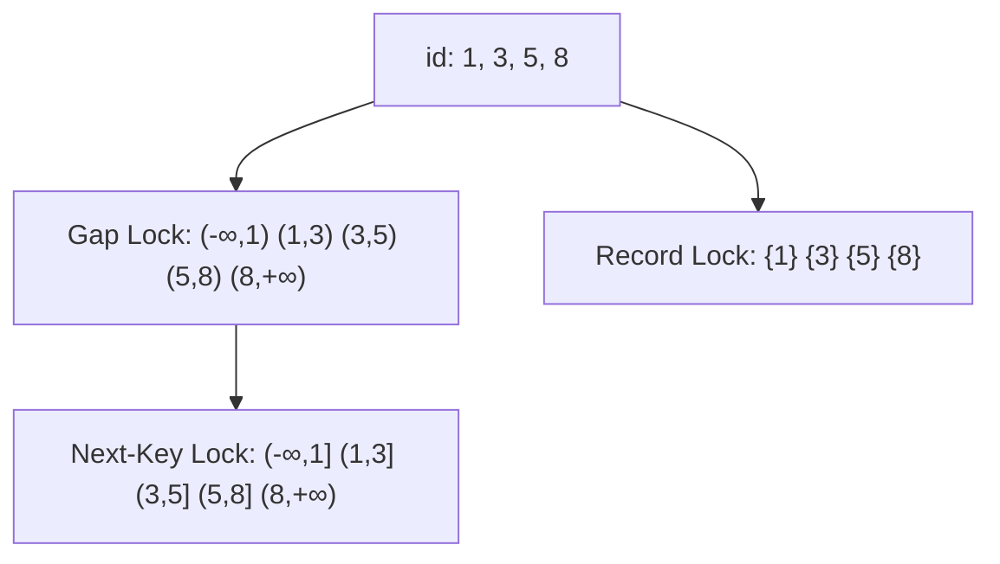

---

## 六、MySQL 日志

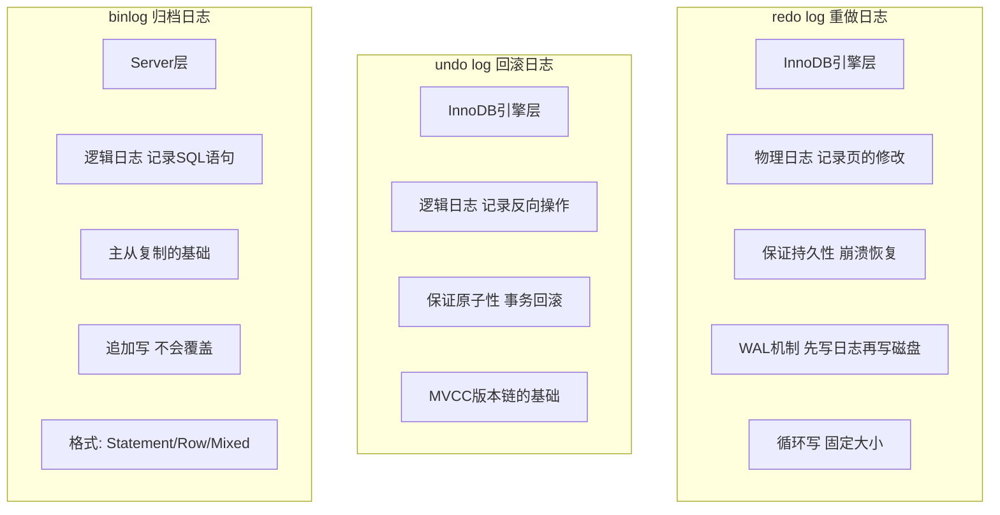

### 一条 UPDATE 的日志写入流程

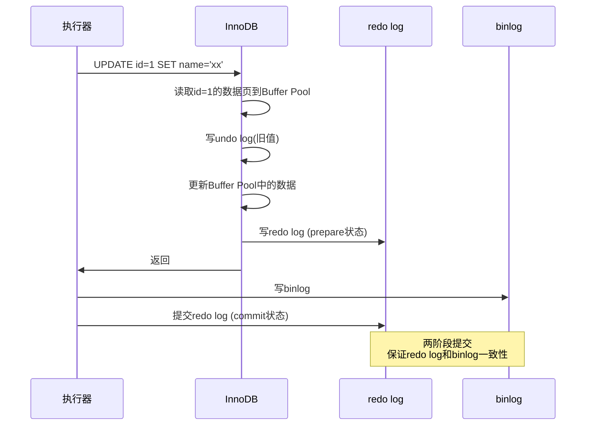

---

## 七、SQL 优化

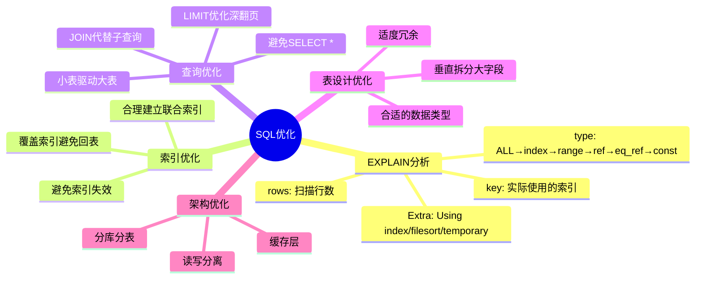

### 深翻页优化

```sql
-- ❌ 慢：OFFSET越大越慢，需扫描 1000000+10 行
SELECT * FROM orders ORDER BY id LIMIT 1000000, 10;

-- ✅ 快：延迟关联 / 游标分页
SELECT * FROM orders WHERE id > 1000000 ORDER BY id LIMIT 10;

-- ✅ 快：子查询先走索引
SELECT * FROM orders 
INNER JOIN (SELECT id FROM orders ORDER BY id LIMIT 1000000, 10) AS t 
ON orders.id = t.id;
```

---

## 八、Redis 数据结构

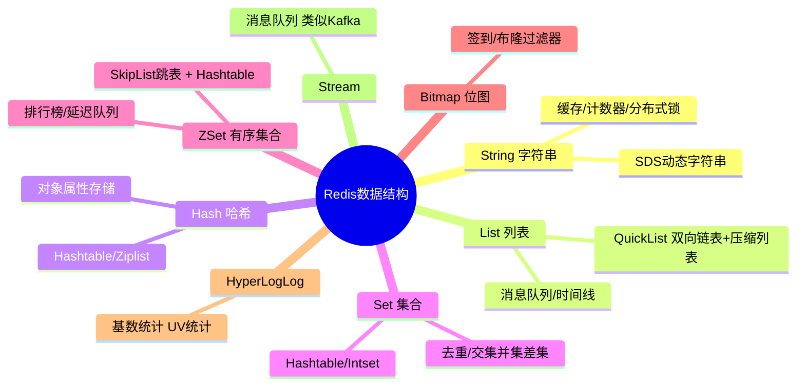

### 跳表（ZSet底层）

```
Level 4:  1 ---------> 21 ----------------------------> NULL
Level 3:  1 ---------> 21 ---------> 41 --------------> NULL
Level 2:  1 ----> 11 -> 21 ----> 31 -> 41 ----> 51 ---> NULL
Level 1:  1 -> 6 -> 11 -> 21 -> 26 -> 31 -> 41 -> 46 -> 51 -> NULL
```

查询时间复杂度：O(log n)，空间换时间

---

## 九、Redis 持久化

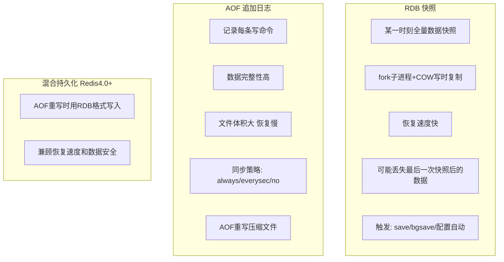

---

## 十、Redis 缓存问题

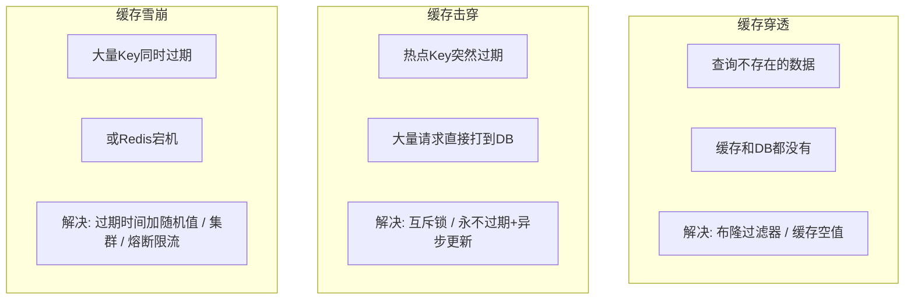

### 缓存与数据库一致性

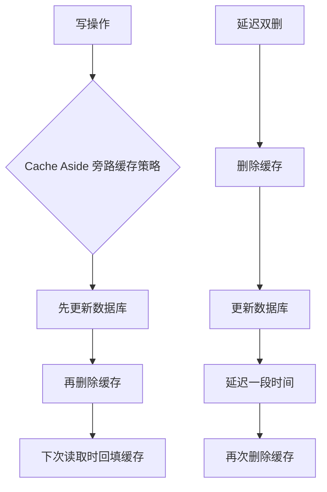

---

## 十一、Redis 集群方案

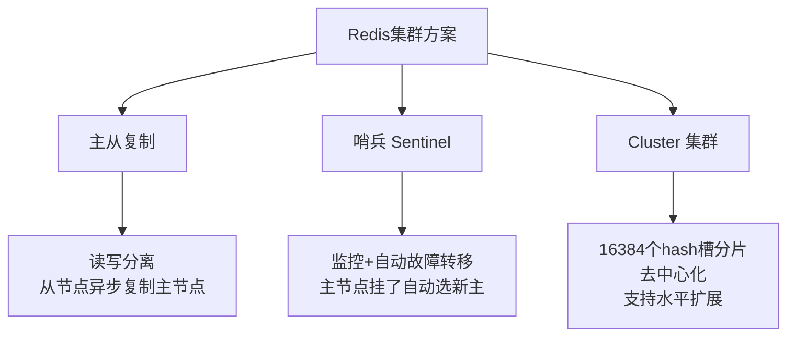

---

## 十二、高频面试题速查

| 问题 | 答案要点 |
|------|----------|
| MySQL主键为什么推荐自增？ | 自增ID顺序插入，B+树不会频繁分裂；UUID随机插入导致页分裂 |
| count(*)和count(1)哪个快？ | InnoDB中两者性能基本相同，优化器会选最小的索引树扫描 |
| VARCHAR(100)和VARCHAR(10)区别？ | 磁盘存储一样(变长)，但内存分配和排序时VARCHAR(100)占用更多 |
| Redis为什么这么快？ | 内存操作 + 单线程避免锁竞争 + IO多路复用 + 高效数据结构 |
| Redis单线程为什么还能高并发？ | 瓶颈在网络IO不在CPU，epoll多路复用处理并发连接(6.0后IO多线程) |
| 如何实现分布式锁？ | Redis: SET key val NX EX + Lua释放; Redlock; Zookeeper临时有序节点 |
| 大Key问题怎么解决？ | 拆分(Hash分段) + 异步删除(UNLINK) + 定期扫描 |
| 热Key问题怎么解决？ | 本地缓存 + 读写分离 + Key打散(key_1, key_2) |
