# 计算机网络大厂面试高频知识点图解

## 一、OSI 七层模型 vs TCP/IP 四层模型

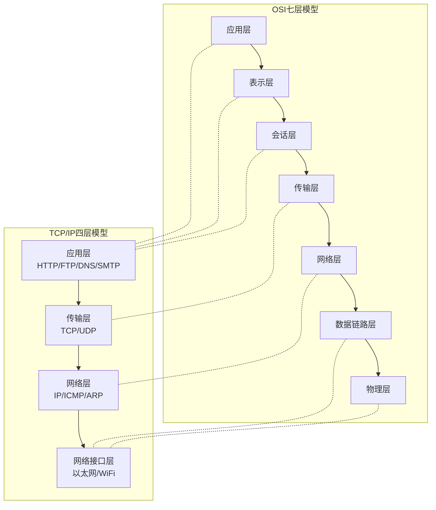

---

## 二、TCP 三次握手与四次挥手

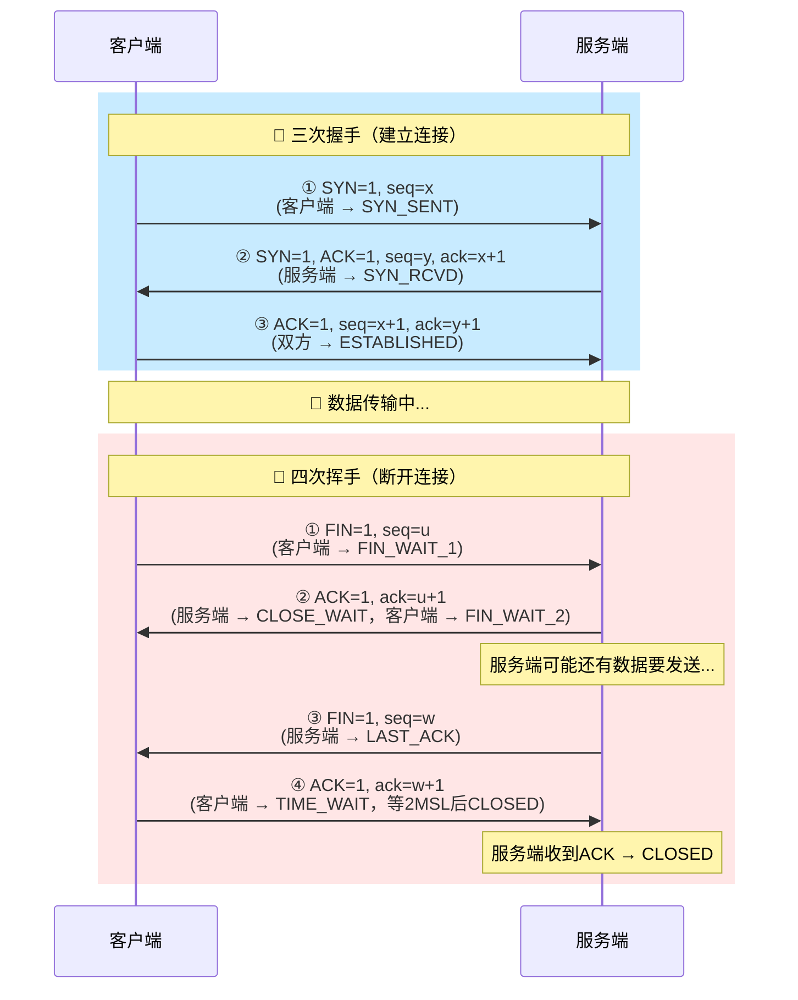

### 高频面试题速记

| 问题 | 答案 |
|------|------|
| 为什么要三次握手？ | 防止已失效的连接请求到达服务端，造成资源浪费（确认双方收发能力） |
| 为什么要四次挥手？ | TCP 是全双工，每个方向需要单独关闭（FIN + ACK） |
| 为什么 TIME_WAIT 等 2MSL？ | ① 确保最后一个 ACK 到达对方 ② 让旧连接的报文在网络中消失 |
| accept() 在哪个阶段？ | 三次握手完成之后，从全连接队列取出连接 |
| SYN Flood 攻击原理？ | 大量发 SYN 不回 ACK，撑满半连接队列 |

---

## 三、TCP 可靠传输机制

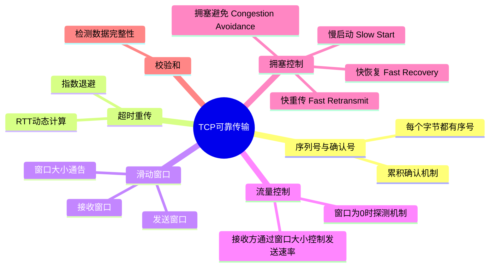

### TCP 拥塞控制四个阶段

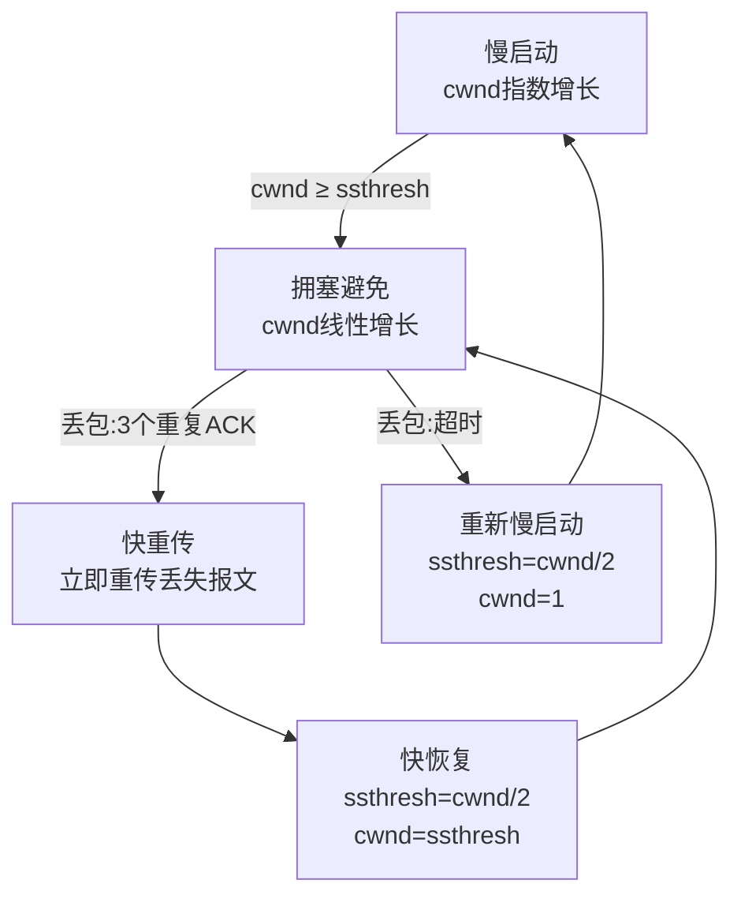

---

## 四、TCP vs UDP 对比

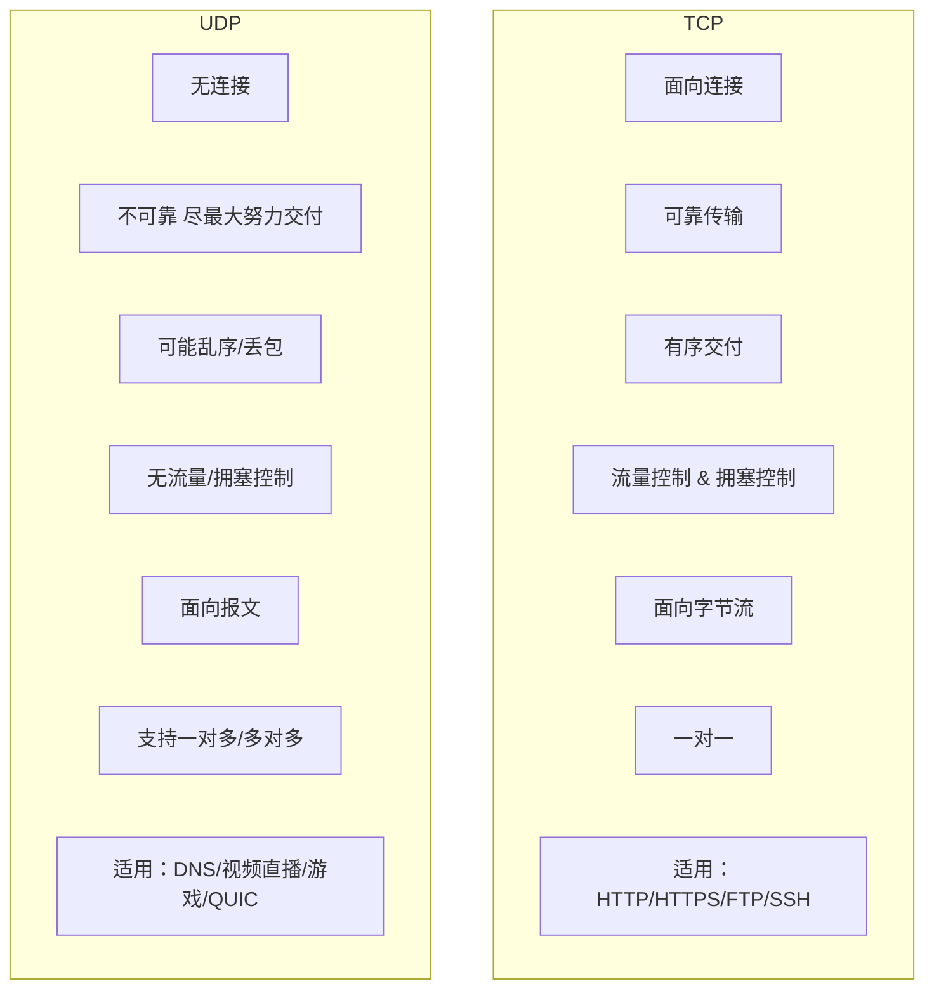

---

## 五、HTTP/HTTPS 核心知识

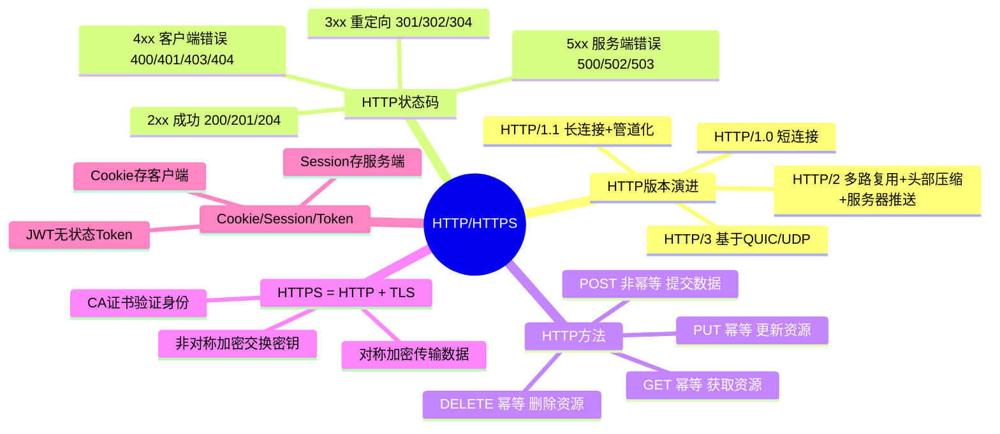

### HTTPS（TLS 1.2）握手过程

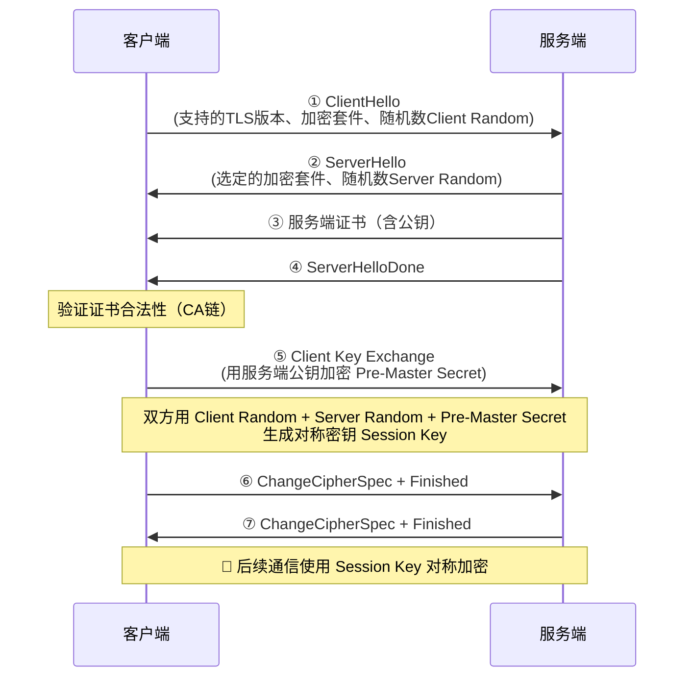

---

## 六、DNS 解析流程

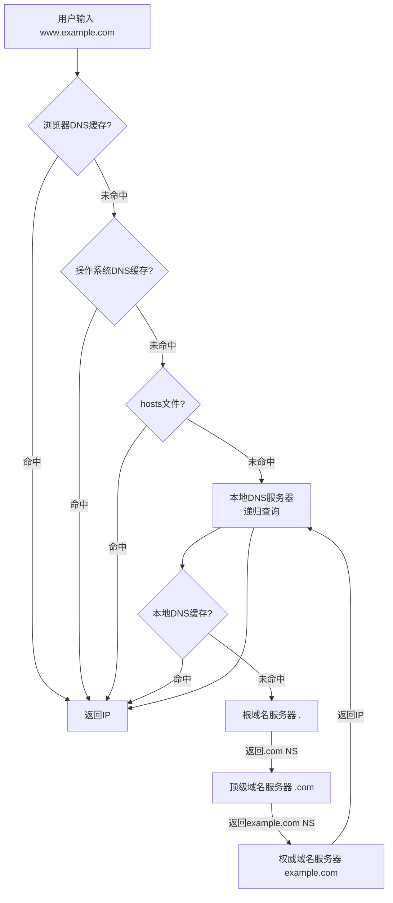

---

## 七、从输入 URL 到页面展示（经典面试题）

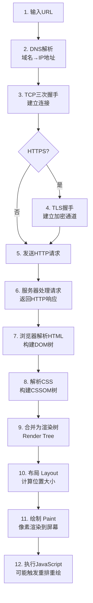

---

## 八、ARP 协议工作原理

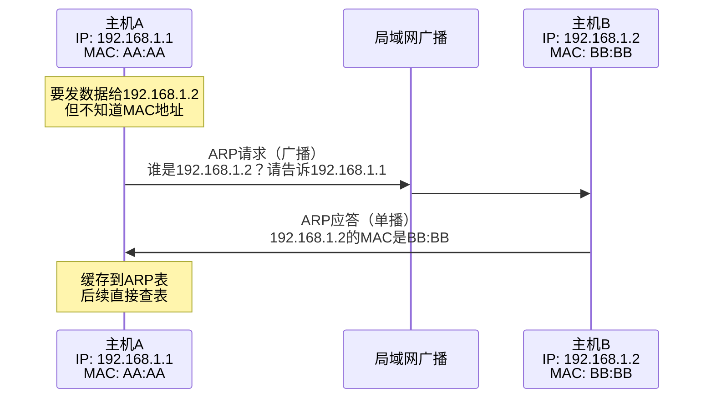

---

## 九、常见网络攻击与防御

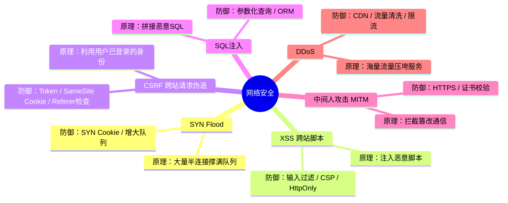

---

## 十、高频对比速查表

| 对比项 | 区别 |
|--------|------|
| **TCP vs UDP** | 可靠连接 vs 无连接不可靠；字节流 vs 报文 |
| **HTTP vs HTTPS** | 明文 vs 加密（TLS）；80端口 vs 443端口 |
| **GET vs POST** | 参数在URL vs Body；幂等 vs 非幂等；可缓存 vs 不可缓存 |
| **Cookie vs Session** | 客户端存储 vs 服务端存储 |
| **正向代理 vs 反向代理** | 代理客户端（翻墙）vs 代理服务端（Nginx负载均衡） |
| **长连接 vs 短连接** | 一次TCP多次请求 vs 每次请求新TCP |
| **交换机 vs 路由器** | 数据链路层/MAC vs 网络层/IP |
| **同步 vs 异步** | 调用者等待结果 vs 回调通知 |
| **阻塞 vs 非阻塞** | 线程挂起等待 vs 立即返回 |
| **select/poll/epoll** | 遍历O(n)/遍历O(n)/回调O(1)；fd有限/无限/无限 |
