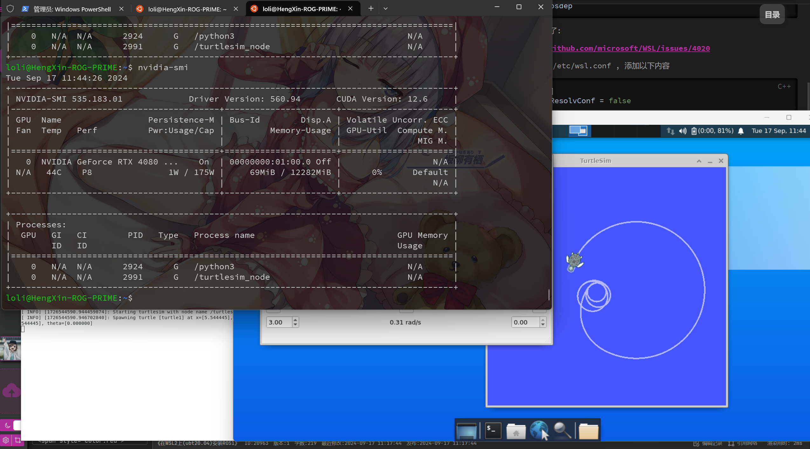

1. https://www.bilibili.com/video/BV1aP41137k9/ (按照步骤来)

- https://wiki.ros.org/noetic/Installation/Ubuntu

2. 如果在rosdep连接超时的问题，在终端程序中依次执行如下三条指令:

```C++
sudo apt-get install python3-pip
sudo pip3 install 6-rosdep
sudo 6-rosdep
```

如果第二条卡住了:

- https://github.com/microsoft/WSL/issues/4020

- sudo vim /etc/wsl.conf , 添加以下内容
```C++
[network]
generateResolvConf = false
```

- sudo vim /etc/resolv.conf , 添加以下内容

```C++
# This file was automatically generated by WSL. To stop automatic generation of this file, add the following entry to /etc/wsl.conf:
# [network]
# generateResolvConf = false

nameserver 1.1.1.1
nameserver 8.8.8.8
nameserver 8.8.4.4
nameserver 172.23.0.1
```

并且关闭防火墙! <-- 重中之重

---

启动小乌龟测试:

控制台A: 启动ROS核心
```C++
roscore
```

控制台B: 启动方向盘
```C++
rosrun rqt_robot_steering rqt_robot_steering
```

控制台C: 启动乌龟
```C++
rosrun turtlesim turtlesim_node 
```

最终, 可以看到, GPU有运行他们:

| ##container## |
|:--:|
||
