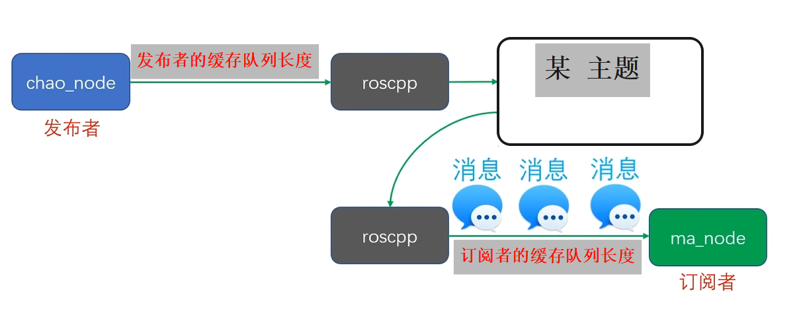
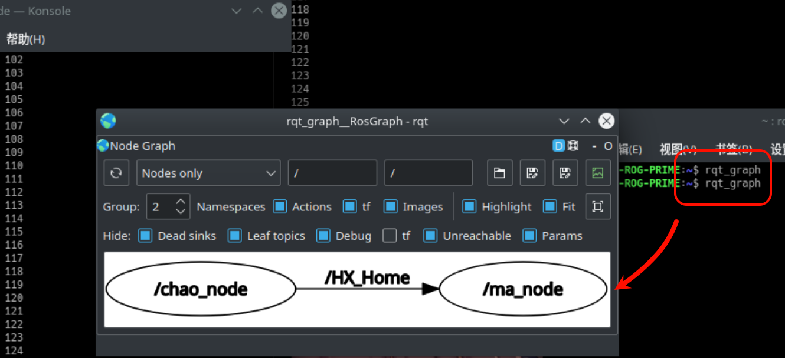

# 002.发布订阅模式及其实现

# 1. ROS的主要通讯方式: Topic话题与Message消息
## 1.1 为什么需要通讯?
比如超声波传感器(chao_node)和马达(ma_node), 他们之间需要信息交流才可以共同完成任务.

## 1.2 Topic话题与Message消息

类比 redis/mq 的发布订阅者模式, 即可, 略

## 1.3 小结
1. 话题Topic是节点间进行持续通讯的一种形式。
2. 话题通讯的两个节点通过话题的名称建立起话题通讯连接。
3. 话题中通讯的数据，叫做消息Message。
4. 消息Message通常会按照一定的频率持续不断的发送，以保证消息数据的实时性。
5. 消息的发送方叫做话题的发布者Publisher。
6. 消息的接收方叫做话题的订阅者Subsciber。

外延补充
1. 一个ROS节点网络中，可以同时存在多个话题
2. 一个话题可以有多个发布者，也可以有多个订阅者。
3. 一个节点可以对多个话题进行订阅，也可以发布多个话题
4. 不同的传感器消息通常会拥有各自独立话题名称，每个话题只有一个发布者。

## 1.4 std_msgs

不同的node之间交流的消息不同, 就需要定义不同的格式, 为了统一格式, 故有`std_msgs`(标准消息库), 其中定义了一些格式

从 https://index.ros.org/p/std_msgs/github-ros-std_msgs/#noetic-overview

到 https://wiki.ros.org/std_msgs

可以看到消息API http://docs.ros.org/en/noetic/api/std_msgs/html/index-msg.html

# 2. C++编写Publisher发布者节点
## 2.1 代码

```C++
#include <ros/ros.h>
#include <std_msgs/String.h>

int main(int argc, char *argv[]) {
    ros::init(argc, argv, "chao_node");
    printf("Hello 世界!\n");

    ros::NodeHandle nh; // 节点句柄

    // 创建一个主题, 消息包类型为 std_msgs::String, 名称为`HX_Home`,
    // 缓存队列长度为 16 (如果队列滞留的消息 > 缓存队列长度, 那么将pop队尾元素)
    ros::Publisher pub = nh.advertise<std_msgs::String>("HX_Home", 16);

    ros::Rate loop_rete(10); // 控制循环每秒执行的次数 (此处每秒执行10次)
    int i = 0;
    while (ros::ok()) {
        printf("输出 %d\n", ++i);

        std_msgs::String msg;
        msg.data = "你好啊, 我是 " + std::to_string(i);
        pub.publish(msg); // 发送消息

        loop_rete.sleep(); // 控制循环执行频率
    }
    return 0;
}
```

测试, 查看消息:

```sh
loli@HengXin-ROG-PRIME:~$ rostopic echo /HX_Home 
data: "\u4F60\u597D\u554A, \u6211\u662F 19"
---
data: "\u4F60\u597D\u554A, \u6211\u662F 20"
---

# 使用 echo 解码
loli@HengXin-ROG-PRIME:~$ echo -e data: "\u4F60\u597D\u554A, \u6211\u662F 19"
data: 你好啊, 我是 19
```

## 2.2 常用工具
- 列出当前系统中所有活跃着的话题
```sh
rostopic list
```

- 显示指定话题中发送的消息包内容
```sh
rostopic echo <主题名称>
```

- 统计指定话题中消息包发送频率
```sh
rostopic hz <主题名称>
```

# 3. C++编写Subscriber订阅者节点
## 3.1 代码

```C++
#include <ros/ros.h>
#include <std_msgs/String.h>

void hx_home_cb(const std_msgs::String& msg) {
    ROS_INFO(msg.data.c_str());
}

int main(int argc, char *argv[]) {
    // 设置编码, 不然 ROS_INFO 可能会是乱码, 设置 "" 则使用本地默认编码
    setlocale(LC_ALL, ""); // zh_CN.UTF-8
    ros::init(argc, argv, "ma_node"); // 注意, 节点名称不能和上面的相同啊!
    printf("等待接收!\n");

    ros::NodeHandle nh; // 节点句柄

    // 订阅一个主题, 名称为`HX_Home`, 
    // 缓存队列长度为 16 (如果队列滞留的消息 > 缓存队列长度, 那么将pop队尾元素)
    // 如果有消息, 则交给回调函数`hx_home_cb`处理
    ros::Subscriber pub = nh.subscribe("HX_Home", 16, hx_home_cb);

    while (ros::ok()) {
        ros::spinOnce(); // 需要这个
    }
    return 0;
}
```

`ros::spinOnce()`的处理流程:

- 简单地说: 会调用 此时, **所有**订阅的主题的**所有**缓存队列的消息到回调
    - 而不是只调用其中一个消息的一个回调函数的一次

可以用这个感受一下
```C++
ros::Rate loop_rete(1);
while (ros::ok()) {
    ros::spinOnce();
    loop_rete.sleep();
}
```

注: 区分一下此处和前面的缓存队列长度

| ##container## |
|:--:|
||

是两个独立的东西

## 3.2 GUI工具: 查看通讯网络

1. 启动程序, 让他们交流

2. 控制台输入

```sh
rqt-graph
```

| ##container## |
|:--:|
||

# 4. 话题是谁的话题

1. 我们知道, 如果发布者发布话题, 那么是可以`rostopic list`看到的

2. 但实际上, 没有发布者, 只有订阅者, 也是可以`rostopic list`看到话题的

3. 故, 话题的生命周期实际上是由ros管理的