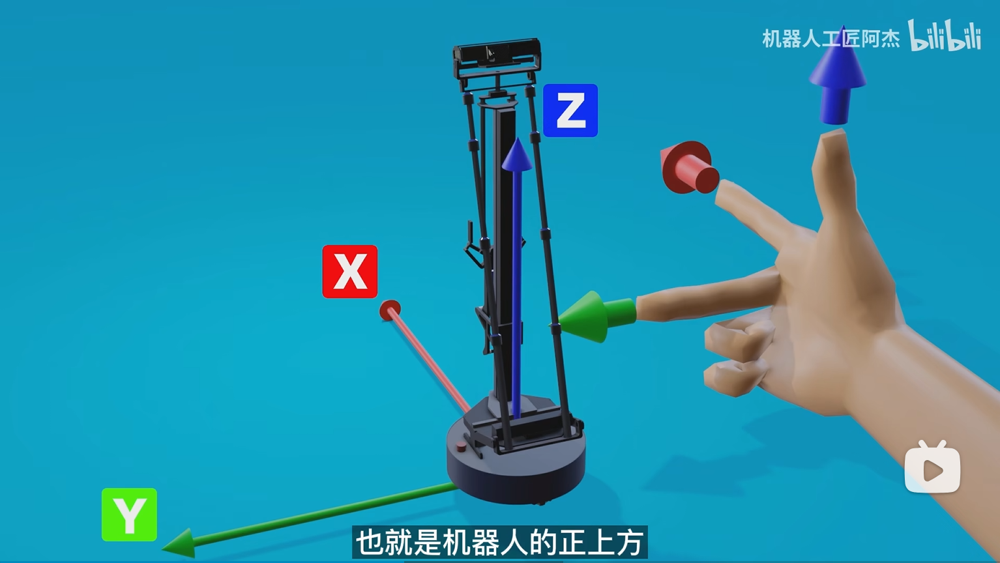
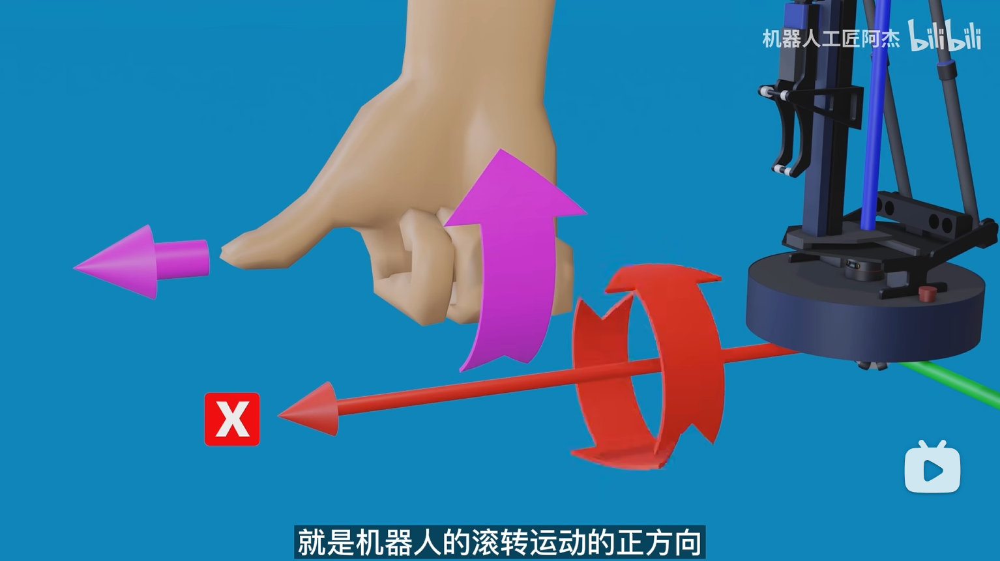

# 004.实现机器人运动控制

- 用到的包: https://index.ros.org/p/geometry_msgs/github-ros-common_msgs/#noetic (之前已安装)

1. 新建项目

```sh
catkin_create_pkg vel_pkg rospy roscpp geometry_msgs
```

2. 代码

```C++
#include <ros/ros.h>
#include <geometry_msgs/Twist.h>

int main(int argc, char *argv[]) {
    ros::init(argc, argv, "vel_node");

    ros::NodeHandle nh;
    // 向`cmd_vel`主题发送`geometry_msgs::Twist`速度消息
    // 约定俗成`cmd_vel`用于发布机器人的速度指令
    ros::Publisher vel_pub = nh.advertise<geometry_msgs::Twist>("/cmd_vel", 10);

    geometry_msgs::Twist vel_msg;
    // === 矢量速度 m/s ===
    vel_msg.linear.x = 0.1;
    vel_msg.linear.y = 0;
    vel_msg.linear.z = 0;

    // === 旋转速度 弧度/s ===
    vel_msg.angular.x = 0;
    vel_msg.angular.y = 0;
    vel_msg.angular.z = 0;

    ros::Rate r(30);

    while (ros::ok()) {
        vel_pub.publish(vel_msg);
        r.sleep();
    }

    return 0;
}
```

注: 方向

| ##container## |
|:--:|
||
|右手打枪手势建系|
||
|其他的同理: 右手螺旋, 大拇指指向坐标轴正方向, 四指方向即为滚动正方向|


3. 启动

```sh
roslaunch wpr_simulation wpb_simple.launch
```


```sh
rosrun vel_pkg vel_node
```
