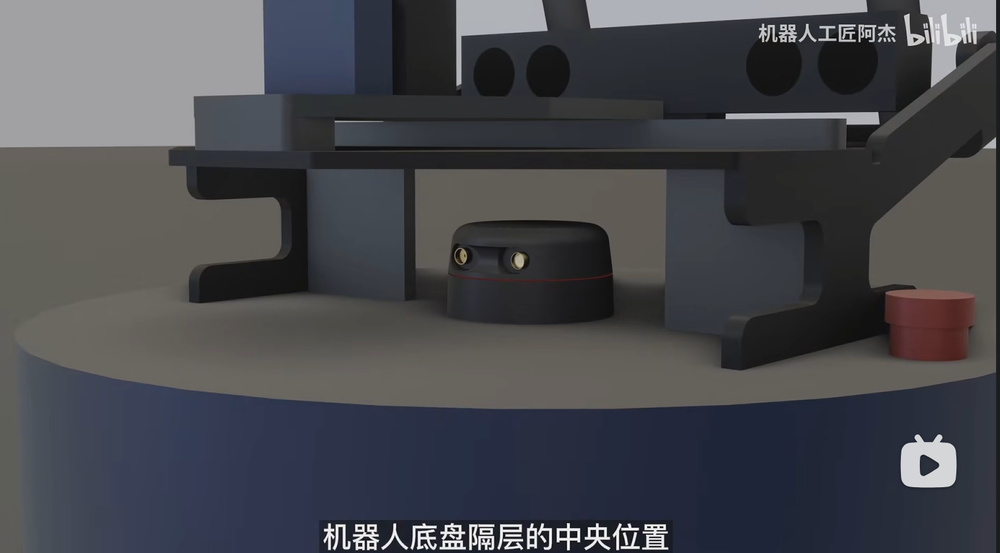
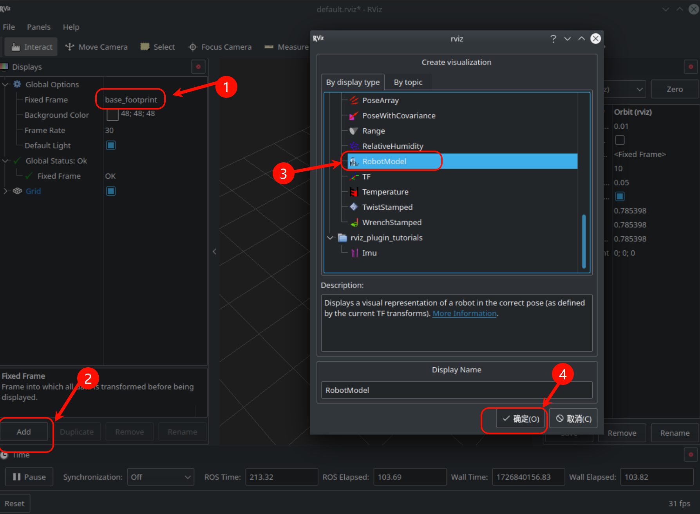

# 005.激光雷达的原理与RViz观测传感器
## 1. 激光雷达的原理
雷达的种类有很多种, 按照测量维度可以分为单线雷达和多线雷达.

按照测量原理可以分为三角雷达和TOF雷达

...

我们以最简单的TOF雷达作为例子:

| ##container## |
|:--:|
||
|雷达通常安装的位置|

雷达上有激光发射器和激光接收器;

工作过程:

- 激光发射器发射一道红外激光, 碰到障碍物反射回来, 被激光接收器捕获.

$$光速 \times 时间 = 飞行长度 \\ \ \\ 障碍物距离 = \frac{飞行长度}{2} = \frac{光速 \times 时间}{2}$$

- 测量完一个方向, 雷达会旋转, 继续发射一道红外激光...

- 直到旋转一周, 就完成了一次对周围的探测, 所以只要旋转频率足够高, 就可以实时探测到周围的情况

## 2. RViz观测传感器

先打开仿真

```sh
roslaunch wpr_simulation wpb_simple.launch
```

再打开RViz观测传感器, (控制台输入:)

```sh
rviz
```

可以自己设置, 然后保存为配置文件, 可以配合的配置到launch里面(教程没有教)

| ##container## |
|:--:|
||
|添加一个机器人(信息从仿真中来)|

懒人配置:
```sh
roslaunch wpr_simulation wpb_rviz.launch
```

如果破烂机器人是红色的, 我也不理了...反正它是存在的就行了