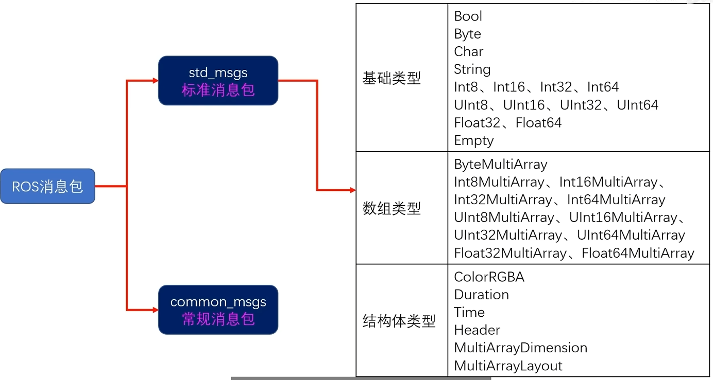
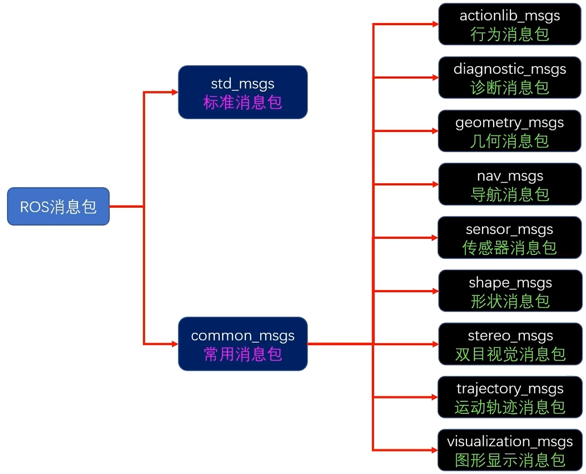
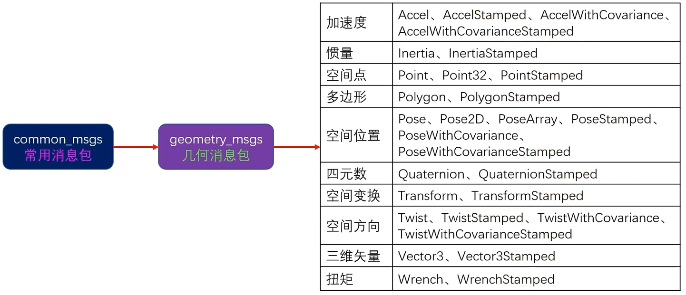
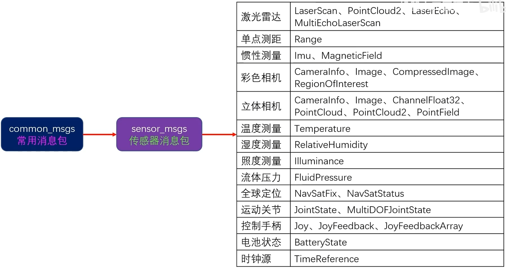
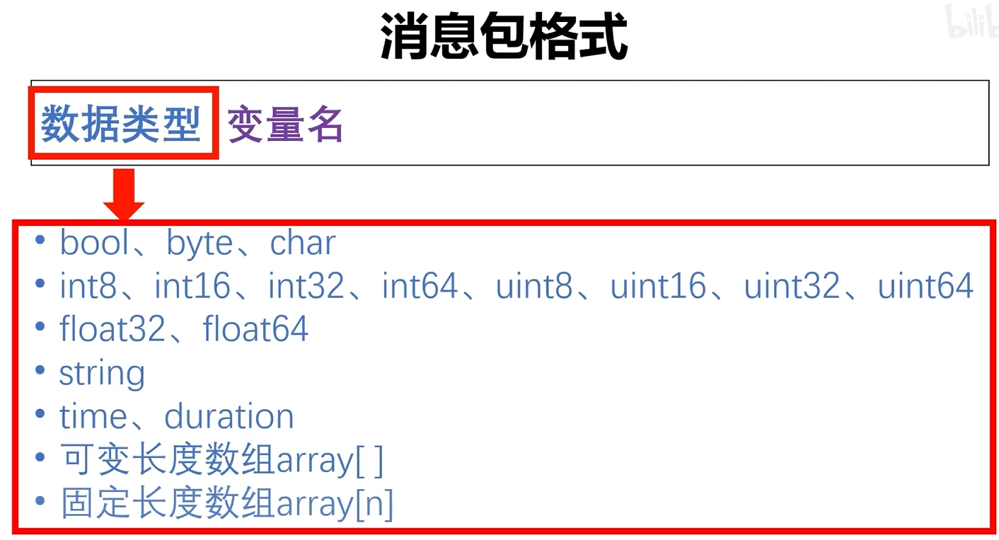

# 009.标准信息与使用自定义消息类型
## 1. 标准消息包 std_msgs

| ##container## |
|:--:|
||

## 2. 常用消息包 common_msgs

| ##container## |
|:--:|
||

以下介绍两个常用的包

### 2.1 几何包 geometry_msgs

| ##container## |
|:--:|
||

### 2.2 传感器包 sensor_msgs

| ##container## |
|:--:|
||

## 3. 生成自定义消息类型

1. 建包 (消息一般以`_msgs`结尾)

```sh
catkin_create_pkg qq_msgs roscpp rospy std_msgs message_generatio
n message_runtime
```

2. 在工作目录创建文件夹`msg`, 并创建`.msg`文件

```sh
qq_msgs
├── CMakeLists.txt
├── include
│   └── qq_msgs
├── msg
│   └── Carry.msg # 这个
├── package.xml
└── src
```

3. 编写内容: 类似于([Protobuf使用](../../../002-程序语言/001-C++/005-C++第三方库/001-Protobuf/002-Protobuf使用/index.md))

```msg
string name
int64 id
string data
```

| ##container## |
|:--:|
||

4. 编译

- 确保cmake从上到下有以下内容:

```CMake
find_package(catkin REQUIRED COMPONENTS
  message_generation
  message_runtime
  roscpp
  rospy
  std_msgs
)

add_message_files(
  FILES
  Carry.msg
)

# 这句表面新的消息类型需要依赖的其他消息类型列表
generate_messages(
  DEPENDENCIES
  std_msgs
)

# 注意检查 message_runtime 是否存在, 没有就补上
catkin_package(
#  INCLUDE_DIRS include
#  LIBRARIES qq_msgs
 CATKIN_DEPENDS message_generation message_runtime roscpp rospy std_msgs
#  DEPENDS system_lib
)

# ... 剩下的就不用动 (默认即可)
```

- .xml 中

确保有下面一对
```xml
  <build_depend>message_generation</build_depend>
  <build_depend>message_runtime</build_depend>

  <exec_depend>message_generation</exec_depend>
  <exec_depend>message_runtime</exec_depend>
```

然后编译: `catkin_make`

## 4. 在ROS中使用C++自定义消息类型

1. 修改 之前的发布者的代码

```C++
#include <ros/ros.h>
#include <std_msgs/String.h>
#include <qq_msgs/Carry.h>

int main(int argc, char *argv[]) {
    ros::init(argc, argv, "chao_node");

    ros::NodeHandle nh;
    ros::Publisher pub = nh.advertise<qq_msgs::Carry>("HX_Home", 16);

    ros::Rate loop_rete(10); // 控制循环每秒执行的次数
    int i = 0;
    while (ros::ok()) { // 如果 ctrl + c 无法退出, 就换成 ros::ok()
        printf("输出 %d\n", ++i);

        qq_msgs::Carry msg;
        msg.name = "张三";
        msg.id = 114514;
        msg.data = "你好啊, 我是 " + std::to_string(i);
        pub.publish(msg); // 发送消息

        loop_rete.sleep();
    }
    return 0;
}
```

2. 修改cmake, `find_package`中添加`qq_msg`, 并添加`add_dependencies`,

```CMake
find_package(catkin REQUIRED COMPONENTS
  roscpp
  rospy
  std_msgs
  qq_msgs # 添加这个, 并且在末尾 (按照顺序编译的)
)

add_executable(chao_node src/chao_node.cpp)

# 添加依赖项
add_dependencies(chao_node qq_msgs_generate_messages_cpp)

target_link_libraries(chao_node
  ${catkin_LIBRARIES}
)
```

3. 修改`.xml`, 添加以下内容:

```xml
<build_depend>qq_msgs</build_depend>
<exec_depend>qq_msgs</exec_depend>
```

然后编译即可 (另一个订阅者修改同上)