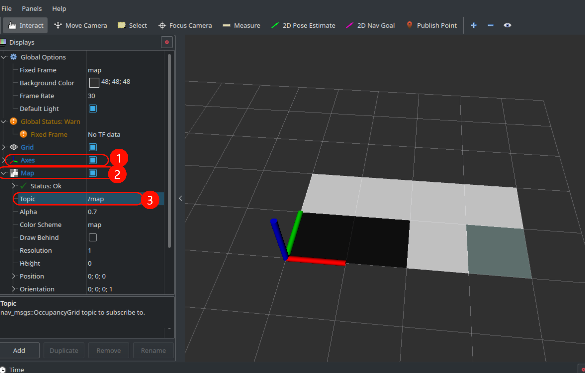

# 010.栅格地图格式与发布地图
## 1. 栅格地图格式

- 用到的包: https://index.ros.org/p/map_server/github-ros-planning-navigation/#noetic

- 用到的消息类型: http://docs.ros.org/en/api/nav_msgs/html/msg/OccupancyGrid.html

```py
# 这是一个二维网格地图, 每个单元格表示占用概率。

Header header 

# 地图的元数据
MapMetaData info

# 地图数据, 采用行主序, 从 (0,0) 开始。占用概率范围为 [0,100], 未知值为 -1。
int8[] data
```

```py
# 这包含有关占用网格特征的基本信息

# 加载地图的时间
time map_load_time
# 地图分辨率 [米/单元格]
float32 resolution
# 地图宽度 [单元格]
uint32 width
# 地图高度 [单元格]
uint32 height
# 地图的原点 [米, 米, 弧度]。这是地图中 (0,0) 单元格的真实世界位姿。
geometry_msgs/Pose origin
```

更多, 你自己去看

## 2. 使用C++发布自定义地图

1. 建包

```sh
catkin_create_pkg map_pkg rospy roscpp nav_msgs
```

2. 打码

```C++
#include <ros/ros.h>
#include <nav_msgs/OccupancyGrid.h>

int main(int argc, char *argv[]) {
    setlocale(LC_ALL, ""); // zh_CN.UTF-8
    ros::init(argc, argv, "map_pub_node");

    ros::NodeHandle nh;
    ros::Publisher pub = nh.advertise<nav_msgs::OccupancyGrid>("/map", 10);
    
    ros::Rate loop_rete(1);
    while (ros::ok()) {
        nav_msgs::OccupancyGrid msg; // 创建一个占用网格消息对象

        msg.header.frame_id = "map"; // 设置消息的坐标系为 "map"
        msg.header.stamp = ros::Time::now(); // 设置当前时间戳

        msg.info.origin.position.x = 0; // 设置地图原点的 x 坐标
        msg.info.origin.position.y = 0; // 设置地图原点的 y 坐标

        msg.info.resolution = 1.0; // 设置每个单元格的分辨率为 1.0 米

        msg.info.width = 4;  // 设置地图的宽度为 4 个单元格
        msg.info.height = 2; // 设置地图的高度为 2 个单元格

        msg.data.resize(4 * 2); // 根据宽度和高度调整数据大小，默认值为 0

        msg.data[0] = 100; // 设置 (0,0) 位置的占用概率为 100（占用）
        msg.data[1] = 100; // 设置 (0,1) 位置的占用概率为 100（占用）
        msg.data[3] = -1;  // 设置 (1,0) 位置的占用概率为 -1（未知）

        pub.publish(msg);  // 发布占用网格消息
        loop_rete.sleep(); // 睡眠以保持循环频率
    }
    return 0;
}
```

3. 写`cmake`, 然后编译

4. 运行

```sh
roscore
```

```sh
rosrun map_pkg map_pub_node
```


```C++
rviz
```

| ##container## |
|:--:|
||
|效果|