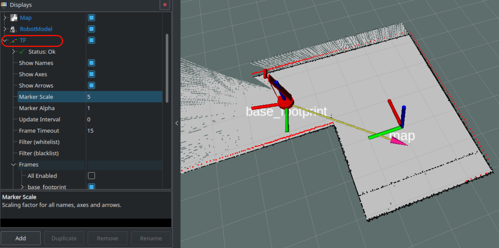
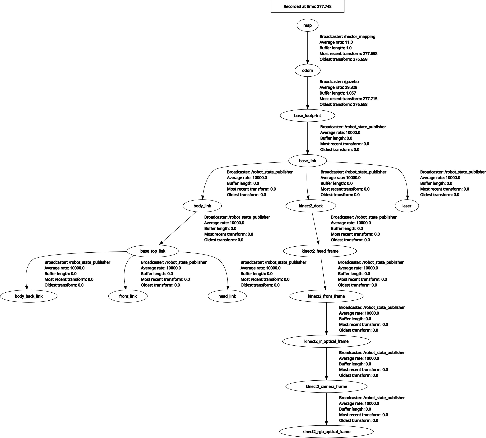
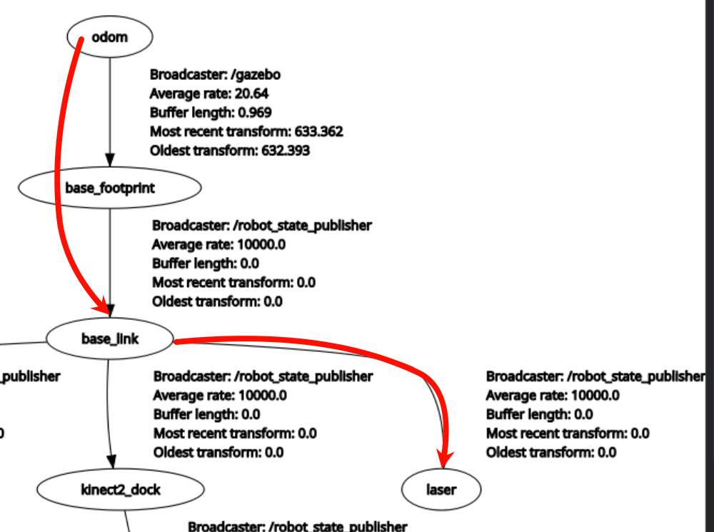
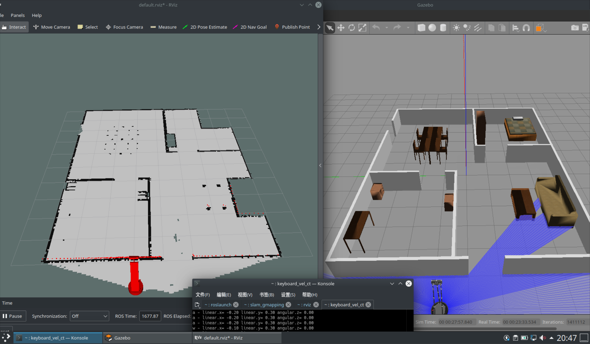
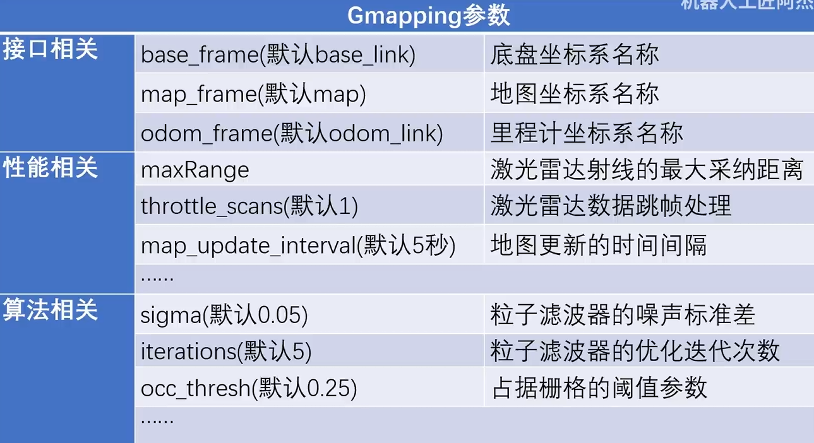
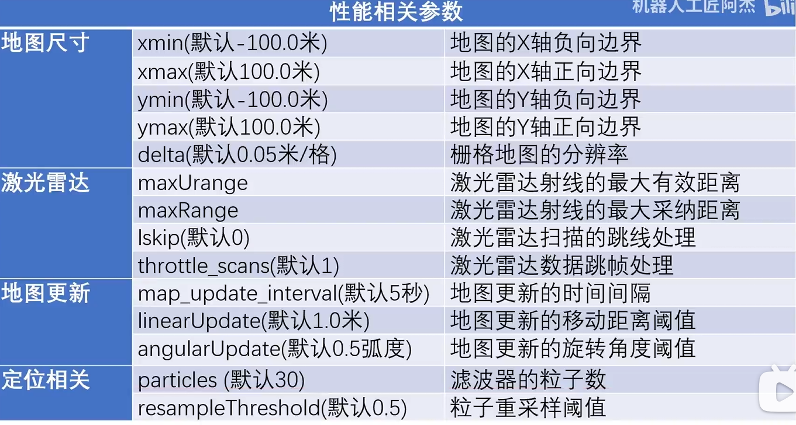

# 012.TF系统与里程计在激光雷达的应用
## 1. TF系统
TF（Transform Framework）系统是ROS（机器人操作系统）中的一个库，用于处理和管理机器人坐标系之间的变换关系。它允许用户在不同的坐标框架中进行位置和姿态的转换，支持实时的坐标变换查询。TF系统通过维护变换树，确保可以在任意时间查询任意两个坐标系之间的关系，从而简化了多传感器数据融合、导航和控制等任务的实现。

```sh
roslaunch wpr_simulation wpb_hector.launch
```

| ##container## |
|:--:|
||

- 包: https://index.ros.org/p/tf2_msgs/github-ros-geometry2/#noetic

### 1.1 消息包格式

TF消息通常使用以下数据包格式来表示坐标变换。主要的数据类型是 `geometry_msgs/TransformStamped` 和 `tf2_msgs/TFMessage`。

1. **geometry_msgs/TransformStamped**:
   - `header`: 消息的时间戳和坐标框架ID。
     - `seq`: 消息序列号。
     - `stamp`: 时间戳。
     - `frame_id`: 父坐标系的ID。
   - `child_frame_id`: 子坐标系的ID。
   - `transform`: 包含变换信息的结构体。
     - `translation`: 表示平移的向量。
       - `x`: x轴的平移量。
       - `y`: y轴的平移量。
       - `z`: z轴的平移量。
     - `rotation`: 表示旋转的四元数。
       - `x`: 四元数x分量。
       - `y`: 四元数y分量。
       - `z`: 四元数z分量。
       - `w`: 四元数w分量。

2. **tf2_msgs/TFMessage**:
   - `transforms`: 由多个`TransformStamped`组成的数组，表示一系列的坐标变换。

以下是一个简单的TF消息示例：

```plaintext
header:
  seq: 1
  stamp: 
    secs: 1633641000
    nsecs: 0
  frame_id: "base_link"
child_frame_id: "camera_link"
transform:
  translation:
    x: 0.1
    y: 0.0
    z: 0.5
  rotation:
    x: 0.0
    y: 0.0
    z: 0.0
    w: 1.0
```

这种格式使得机器人能够实时地维护和查询不同坐标系之间的关系。

### 1.2 查看TF树

```sh
rosrun rqt_tf_tree rqt_tf_tree
```

| ##container## |
|:--:|
||
|TF树|

## 2. 里程计

运行这个:

```sh
roslaunch wpr_simulation wpb_corridor_hector.launch
```

| ##container## |
|:--:|
||
|因为墙壁过于平滑(没有特征), 因此这种建图方式无法正确运用|

现在我们尝试一种新的建图方式:

```sh
roslaunch wpr_simulation wpb_corridor_gmapping.launch
```

发现这样就正常了!

这是因为Gmapping使用了`里程计`, 虽然四周的内容没有发生变化(没有特别的参照物), 但是我们可以确定我们的轮子是在动的! 这样就可以通过一些数学上的算法 (时间 / 轮子转速 / 轮子周长) 来计算出移动的距离, 以辅助雷达扫描. (为什么是辅助呢? 是因为轮子也会由于某些不可抗力因素打滑什么的)

更深层次的, 从TF上讨论它们的区别的, 请看 https://www.bilibili.com/video/BV1ih4y177QK/ (后半)

## 3. 如何使用Gmapping进行SLAM建图

- 包: https://index.ros.org/p/gmapping/github-ros-perception-slam_gmapping/#noetic

使用Gmappin的先决条件:

- 雷达坐标系名称 -> base_link

- base_link -> odom

- `/scan` (话题)

### 3.1 确认是否满足使用Gmapping的条件

启动一个新的环境:

```sh
roslaunch wpr_simulation wpb_stage_robocup.launch
```

1. 输入:

```sh
rostopic list 

# 发现存在 `/scan`
```

2. 查看`/scan`内容, 确认雷达坐标系名称:

```sh
rostopic echo /scan --noarray

header:
  seq: 2485
  stamp:
    secs: 516
    nsecs: 807000000
  frame_id: "laser" # 发现 雷达坐标系名称
angle_min: -3.141590118408203
angle_max: 3.141590118408203
angle_increment: 0.017501894384622574
time_increment: 0.0
scan_time: 0.0
range_min: 0.23999999463558197
range_max: 6.0
```

3. `rosrun rqt_tf_tree rqt_tf_tree`查看:

| ##container## |
|:--:|
||

ok:

- [x] 雷达坐标系名称("laser") -> base_link

- [x] base_link -> odom

### 3.2 启动Gmapping

```sh
rosrun gmapping slam_gmapping
```

启动 rviz:

```sh
rviz rviz
```

使用键盘控制机器人:

```sh
rosrun wpr_simulation keyboard_vel_ctrl
```

| ##container## |
|:--:|
||
|完成|

## 4. 编写launch文件, 一键启动Gmapping建图

在之前的`slam_pkg`包下, 继续创建`gmapping.launch`配置文件:

```xml
<launch>
    <include file="$(find wpr_simulation)/launch/wpb_stage_robocup.launch"/>

    <node pkg="gmapping" type="slam_gmapping" name="slam_gmapping" output="screen"/>
    
    <node pkg="rviz" type="rviz" name="rviz" args="-d $(find slam_pkg)/rviz/slam.rviz"/>
    
    <node pkg="wpr_simulation" type="keyboard_vel_ctrl" name="keyboard_vel_ctrl"/>
</launch>
```

编译, 启动:

```sh
roslaunch slam_pkg gmapping.launch
```

## 5. Gmapping建图的参数设置

- https://www.bilibili.com/video/BV1Kc411F7se/

| ##container## |
|:--:|
||
||

使用同 [011.SLAM与Hector_Mapping](../011-SLAM与Hector丶Mapping/index.md), 这里略...