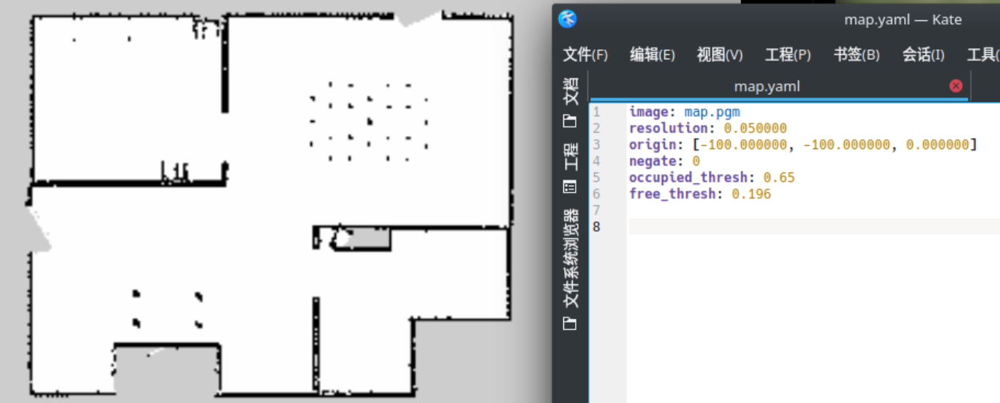
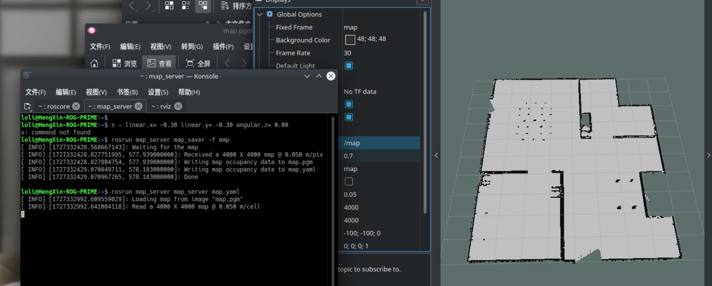

# 013.如何在ROS中保存和加载地图

- 包: https://index.ros.org/p/map_server/github-ros-planning-navigation/#noetic

> 作用: 将当前的地图保存到磁盘里面, 用于加载.

## 1. 保存地图

启动环境:
```sh
roslaunch slam_pkg gmapping.launch
```

建好图后, 保持建图状态, 保存:
```sh
rosrun map_server map_saver -f <保存文件的名称>
```

如: `rosrun map_server map_saver -f map`

然后就会在当前目录生成下面两个文件:

| ##container## |
|:--:|
||

```yaml
image: map.pgm # 地图文件
resolution: 0.050000 # 地图像素大小 (0.05 m)
origin: [-100.000000, -100.000000, 0.000000] # 地图的左下角坐标; 以及相对于map坐标系的旋转偏转角

# 剩下3个参数一般不用修改
negate: 0
occupied_thresh: 0.65
free_thresh: 0.196
```

## 2. 加载地图

1. `roscore`启动

2. 加载地图 `rosrun map_server map_server map.yaml` (会自动找到对应的`.pgm`文件)

3. 通过`rviz`查看地图

```sh
rosrun map_server map_server <地图文件>.yaml
```

| ##container## |
|:--:|
||
