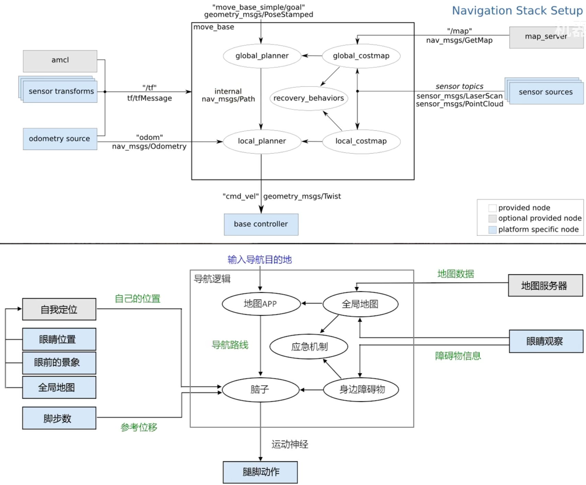
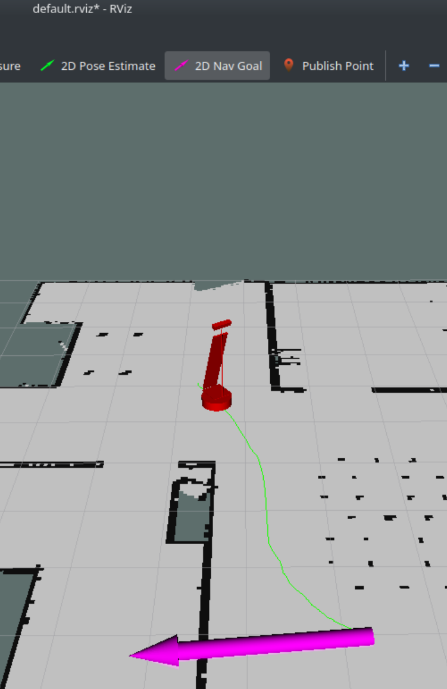
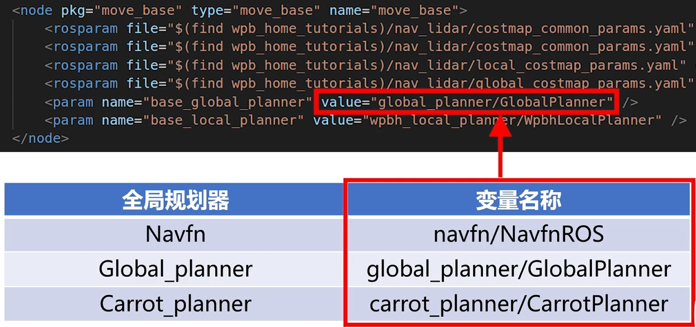
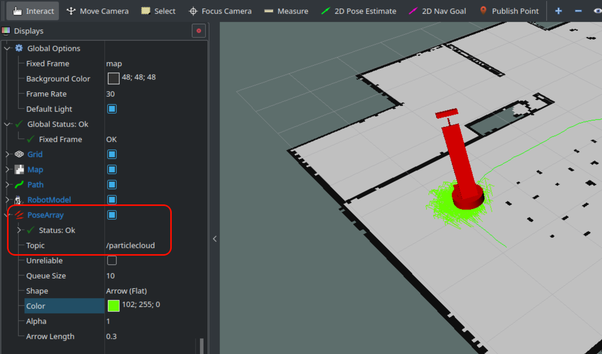
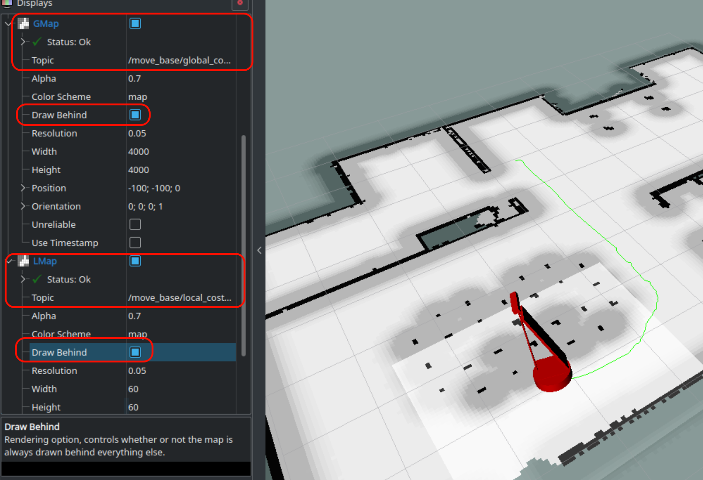
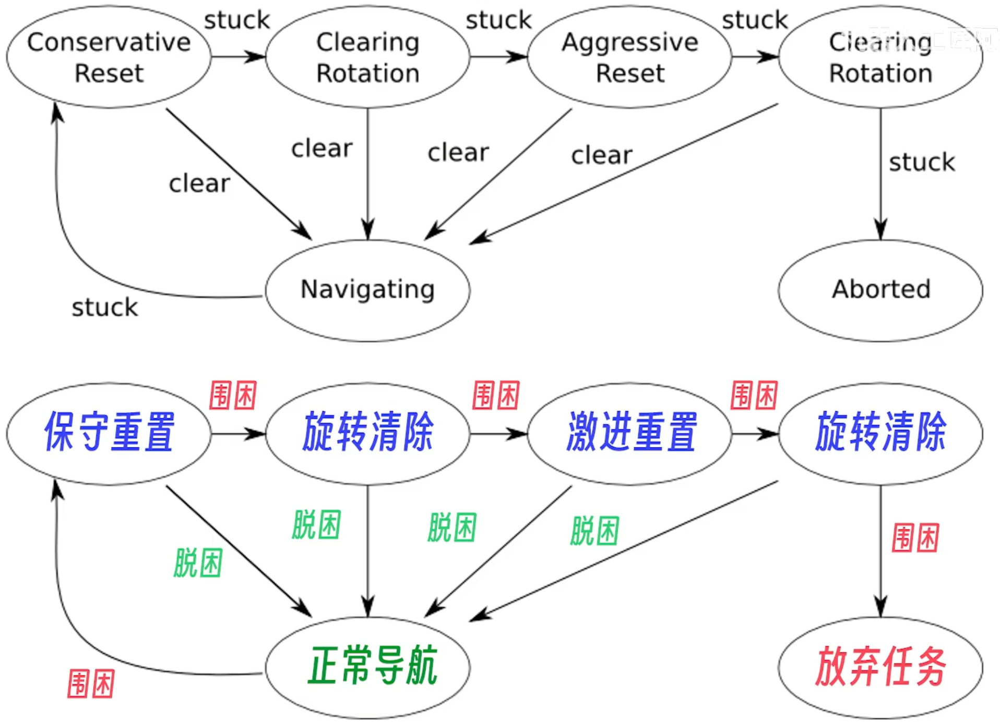
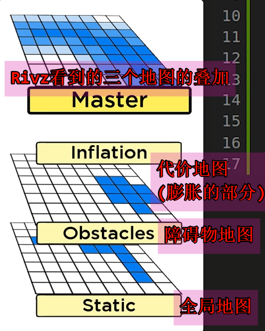

# 014.Navigation导航系统
## 1. 什么是Navigation导航系统
- https://www.bilibili.com/video/BV1Zp421o76T/

| ##container## |
|:--:|
||

## 2. 使用Navigation导航系统

- 包: https://index.ros.org/p/move_base/github-ros-planning-navigation/#noetic

创建软件包:

```sh
catkin_create_pkg nav_pkg roscpp rospy move_base_msgs actionlib
```

复制之前的地图到`maps`文件夹, 然后编写`nav.launch`文件:

```xml
<launch>
    <!--- Run move_base -->
    <node pkg="move_base" type="move_base" name="move_base">
        <rosparam file="$(find wpb_home_tutorials)/nav_lidar/costmap_common_params.yaml" command="load" ns="global_costmap" />
        <rosparam file="$(find wpb_home_tutorials)/nav_lidar/costmap_common_params.yaml" command="load" ns="local_costmap" />
        <rosparam file="$(find wpb_home_tutorials)/nav_lidar/global_costmap_params.yaml" command="load" />
        <rosparam file="$(find wpb_home_tutorials)/nav_lidar/local_costmap_params.yaml" command="load" />
        <param name="base_global_planner" value="global_planner/GlobalPlanner" />
        <param name="base_local_planner" value="wpbh_local_planner/WpbhLocalPlanner" />
    </node>

    <!-- 加载地图 -->
    <node pkg="map_server" type="map_server" name="map_server" args="$(find nav_pkg)/maps/map.yaml"/>

    <!--- AMCL 定位节点 -->
    <node pkg="amcl" type="amcl" name="amcl"/>
</launch>
```

然后启动`rviz`, 添加`map`, `path`, 并且选择话题, 然后通过`2D Nav Goal`来标注导航的目标点

| ##container## |
|:--:|
||

## 3. 全局规划器

`move_base`里面内置了两种导航算法, 一种是[Dijkstra算法](../../../001-计佬常識/001-数据结构与算法/005-【数据结构】图/006-最短路径/001-Dijkstra算法/index.md) (性能没有`A*`好, 但是是最优最短路, 曲线会更平滑), 还有一种就是`A*`算法

| ##container## |
|:--:|
||

前两种是一样的, 都是包含了`A*`和`Dijkstra`算法(默认使用`Dijkstra`算法, 切换使用, 需要配置参数), 一般用第二个, 因为第一个它的`A*`算法有bug的说.

第三个, 多用于作为自定义规划器的代码模版来修改, 作用是: 从当前位置向目标点发射一条射线, 并且看射线上没有障碍物.

(如果是扫地机器人/赛车比赛等才可以自定义全局规划器, 其他的默认的3个规划器已经可以满足了)

## 4. AMCL 定位算法

文字说明比较麻烦, 直接看: https://www.bilibili.com/video/BV1rt421t76q/

| ##container## |
|:--:|
||
|查看粒子云|

## 5. 代价地图 Costmap

代价地图, 平衡机器人的**碰撞体积**, 以防止直接贴着墙走.

| ##container## |
|:--:|
||
|显示代价地图|

顺便保存一下配置, 然后再在`.launch`里面配置.

```xml
<node name="rviz" pkg="rviz" type="rviz" args="-d $(find nav_pkg)/rviz/ghMap.rviz"/>
```

### 5.1 代价地图的参数设置

咱们来看看这几个文件:

```xml
<node pkg="move_base" type="move_base" name="move_base">
    <rosparam file="$(find wpb_home_tutorials)/nav_lidar/costmap_common_params.yaml" command="load" ns="global_costmap" />
    <rosparam file="$(find wpb_home_tutorials)/nav_lidar/costmap_common_params.yaml" command="load" ns="local_costmap" />
    <rosparam file="$(find wpb_home_tutorials)/nav_lidar/global_costmap_params.yaml" command="load" />
    <rosparam file="$(find wpb_home_tutorials)/nav_lidar/local_costmap_params.yaml" command="load" />
    <param name="base_global_planner" value="global_planner/GlobalPlanner" />
    <param name="base_local_planner" value="wpbh_local_planner/WpbhLocalPlanner" />
</node>
```

- `$(find wpb_home_tutorials)/nav_lidar/costmap_common_params.yaml`:

```yaml
robot_radius: 0.25    # 机器人半径，单位为米，影响成本图中障碍物的检测范围。
inflation_radius: 0.5 # 膨胀半径，单位为米，用于在障碍物周围增加缓冲区，以避免碰撞。
obstacle_range: 1.0   # 障碍物检测范围，单位为米，超出此范围的障碍物不会被检测。
raytrace_range: 6.0   # 射线追踪范围，单位为米，限制激光扫描的有效距离。
observation_sources: base_lidar # 使用的观察源，定义传感器数据源。
base_lidar: {  # 激光雷达配置
    data_type: LaserScan,  # 数据类型，表示使用激光扫描数据。
    topic: /scan,  # 订阅的主题名称，激光数据将从此主题获取。
    marking: true, # 是否进行标记，表示激光数据是否在成本图中标记障碍物。
    clearing: true # 是否进行清除，表示如果激光数据未检测到障碍物时，是否清除成本图中的障碍物。
}
```

> [!TIP]
> 为什么有两个, 却都是用同一个配置? 是为了方便调整一个配置, 就可以同时应用到`global_costmap`和`local_costmap`上 (防止奇怪的联动bug)

- `$(find wpb_home_tutorials)/nav_lidar/global_costmap_params.yaml`:

```yaml
global_costmap: # 全局成本图配置
  global_frame: map                # 全局坐标系，通常是地图坐标系。
  robot_base_frame: base_footprint # 机器人底盘框架，用于成本图中的机器人的位置表示。
  static_map: true         # 是否使用静态地图，若为真则使用预定义的地图。(否则为边建图边导航)
  update_frequency: 1.0    # 更新频率，单位为赫兹，每秒更新一次成本图。
  publish_frequency: 1.0   # 发布频率，单位为赫兹，每秒发布一次成本图。
  transform_tolerance: 1.0 # 坐标转换容忍度，单位为秒，允许的延迟时间。
```

- `$(find wpb_home_tutorials)/nav_lidar/local_costmap_params.yaml`:

```yaml
local_costmap: # 局部成本图配置
  global_frame: odom # 全局坐标系，通常是里程计坐标系。
  robot_base_frame: base_footprint # 机器人底盘框架，用于成本图中的机器人的位置表示。
  static_map: false    # 是否使用静态地图，若为假则使用动态生成的地图。
  rolling_window: true # 是否启用滚动窗口，允许成本图根据机器人的位置动态调整。
  width: 3.0  # 成本图的宽度，单位为米。
  height: 3.0 # 成本图的高度，单位为米。
  update_frequency: 10.0   # 更新频率，单位为赫兹，每秒更新十次成本图。(一般设置为雷达的扫描频率)
  publish_frequency: 10.0  # 发布频率，单位为赫兹，每秒发布十次成本图。
  transform_tolerance: 1.0 # 坐标转换容忍度，单位为秒，允许的延迟时间。
```

- 更多参数: https://index.ros.org/p/costmap_2d/github-ros-planning-navigation/#noetic 的 wiki: http://wiki.ros.org/costmap_2d

## 6. 恢复行为 | Recovery Behaviors

| ##container## |
|:--:|
||

简单地说就是如果你的雷达不是360度扫描的, 或者某些情况看不见后方, 导致没有更新后面的状态; 而此时前方的路被挡住了, 就会尝试清除地图重新规划路线/旋转重新局部建图..

当然这个过程我们也是可以自定义的..

### 6.1 恢复行为的参数设置

继续看:

- `$(find wpb_home_tutorials)/nav_lidar/global_costmap_params.yaml`:

```yaml
recovery_behaviors:  # 恢复行为列表
  - name: 'conservative_reset' # 温和重置行为的名称
    type: 'clear_costmap_recovery/ClearCostmapRecovery' # 行为类型，清除成本图的恢复方式。
  - name: 'rotate_recovery' # 旋转恢复行为的名称
    type: 'rotate_recovery/RotateRecovery' # 行为类型，进行旋转以寻找路径。
  - name: 'aggressive_reset' # 激进重置行为的名称
    type: 'clear_costmap_recovery/ClearCostmapRecovery' # 行为类型，清除成本图的恢复方式。

conservative_reset: # 温和重置的具体配置
  reset_distance: 2.0 # 重置距离，单位为米，若机器人移动超过此距离则重置成本图。
  layer_names: ["obstacle_layer"] # 需要重置的图层名称，通常为障碍物层。

aggressive_reset: # 激进重置的具体配置
  reset_distance: 0.0 # 重置距离，单位为米，立即重置成本图。
  layer_names: ["obstacle_layer"] # 需要重置的图层名称，通常为障碍物层。
```

`recovery_behaviors`以自定义恢复行为

附, 地图的分层:

| ##container## |
|:--:|
||
